# 데이터 / Data {#data}

## 새로운 데이터셋.../ New data set...

 
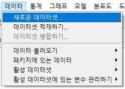

메뉴를 선택하면 다음과 같은 화면으로 넘어간다. 만들고자하는 데이터셋의 이름을 정하는 기능이다. Dataset 이라고 기본 설정되어 있다.

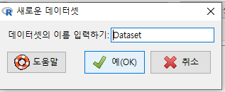

새롭게 만들고자하는 데이터셋의 구조가 나타난다. 변수는 V1, V2, V3 등으로 자동적으로 일련변호화된다.

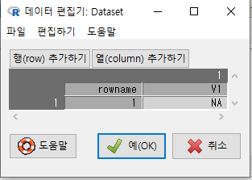

변수 3개(V1, V2, V3), 사례 3개(1, 2, 3) 등으로 열과 행을 추가할 수 있다.


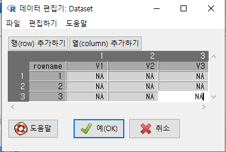

셀(Cell)에 마우스를 놓고, 마우스의 오른쪽 버튼을 누르면 선택사항의 메뉴가 등장한다.

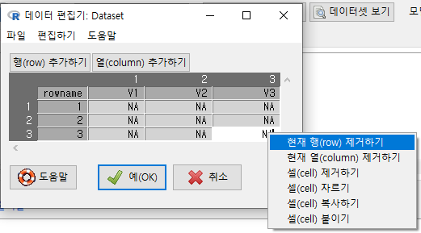

Tcl package 'Tktable' must be installed first 라는 오류 메세지가 뜰 수 있다. 
데이터셋을 만들기 위하여 추가적인 패키지가 필요하다는 뜻이다. (내가 지금 작업하는 우분투 18.04 리눅스에서 맞대고 있는 상황이다)


`sudo apt install tktable*`로 시스템에 추가 패키지를 설치하고, 다시 R 과 R Commander를 실행하면 테이블 형태의 새로운 데이터셋 (데이터프레임)을 만들 새로운 창이 뜬다. 행과 열을 추가하거나 지우고, 사례의 이름과 값을 넣고 지우는 방식으로 데이터셋을 만들 수 있다.

## 데이터셋 탑재하기... / Load data set...

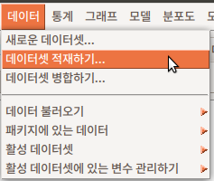
 
저장된 R 데이터 파일을 메모리로 불러오는 기능이다. 확장자 .RData, .RDA 등으로 저장된 파일을 찾는다.

 
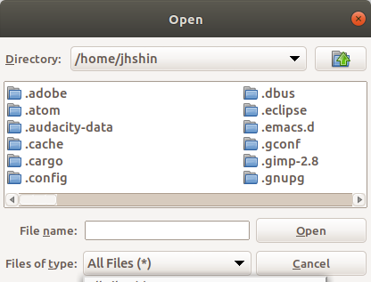

## 데이터 > 데이터셋 병합하기... / Merge data sets...


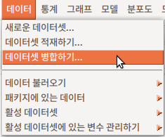 


두 개 이상의 데이터셋이 객체로서 메모리에 있는 경우 (R Commander에서 인식하는 경우), Merge data sets...라는 기능을 이용할 수 있다. 데이터셋이 없거나 하나인 경우, 회색의 불활성 메뉴로서 표시된다.

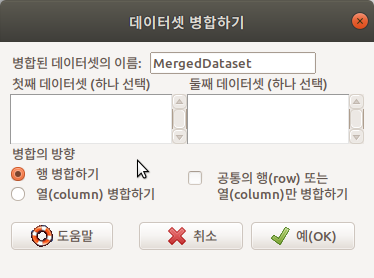  


- 행 병합하기는 두개의 데이터셋을 위, 아래로 이어 붙인다.
- 열 병합하기는 두개의 데이터셋을 왼쪽, 오른쪽으로 이어 붙인다.


'행 병합하기'를 하려면 동일한 변수들을 갖고 있어야 하며, '열 병합하기'를 하려면 동일한 사례들을 갖고 있어야 한다.

carData 패키지에 있는 Prestige 데이터셋으로 연습해보자. [Prestige 데이터셋](https://rcmdr.tistory.com/143)

Prestige 데이터셋의 하위셋 `Prestige.sub1`과 `Prestige.sub2` 두개를 만들자.

```{r prestige-merge}
data(Prestige, package="carData")    # Prestige 데이터셋 불러오기
Prestige.sub1 <- Prestige[-c(61:nrow(Prestige)),] 
                                     # Prestige 데이터셋에서 사례 지우기1 (61부터 끝까지)
Prestige.sub2 <- Prestige[-c(1:60),] # Prestige 데이터셋에서 사례 지우기2 (1부터 60까지)
```

[10. Remove row(s) from active data set...](https://rcmdr.tistory.com/48) <- 화면의 메뉴를 이용하여 사례 제거를 연습할 수 있다.

 
아래의 내용은 Prestige.sub1과 Prestige.sub2를 병합하고자 하는 연습이다. <첫째 데이터셋(하나 선택)>과 <둘째 데이터셋 (하나 선택)>에서 데이터셋을 하나씩 선택하고, 공통의 데이터 구조를 가진 두개의 데이터셋을 이어붙이는 <행 병합하기>의 병합 방향을 선택해보자.

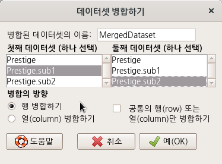  

```{r prestige-merge-cmd, eval = FALSE}
MergedDataset <- mergeRows(Prestige.sub1, Prestige.sub2, common.only=FALSE)
```

## 데이터 가져오기 / Import data

### 엑셀 파일 / from EXCEL file...


Microsoft사의 Office 제품에 포함된 EXCEL은 광범위하게 사용되는 수치정보 관리 및 시각화 툴이다. 관리/재무 정보를 다루는 수많은 기업과 개인이 사용하기 때문에 R 사용자가 엑셀의 .xls, 또는 .xlsx 파일을 불러오는 요구는 매우 크다. 관심사가 크기 때문일까, R에서 EXCEL파일을 불러오기 위해서 개발자들이 만든 기여패키자들도 많다. R Commander에서 EXCEL파일을 불러오기 위하여 사용하는 외부 패키지도 변해왔다. 2019년 5월 현재는 readxl 이라는 패키지이다.

- EXCEL은 다른 통계분석툴과 달리 sheet 개념이 있다. 따라서 불러올 데이터의 객체화 과정에서 EXCEL 파일의 어느 sheet를 불러올 것인가를 선택할 수 있다.

- EXCEL은 다른 통계분석툴과 달리 데이터 프레임화에 필요한 변수명에 대한 강한 규칙을 갖고 있지 않다. 따라서 R Commander의 기본 설정은 선택된 sheet의 첫 행의 정보를 변수 정보로 활용하는 것이다.

### STATA 데이터 / from STATA data set...


STATA는 사회과학분야의 고급통계문화에서 많이 사용하는 분석툴중 하나이다. SPSS처럼 문자 변수를 요인화시키는 것이 기본 설정이다. 
날짜를 R 형식으로 전환하는 것이 기본 설정이다. (추후 논의하겠다)

### 미니탭 데이터 / from Minitab data set...

### SAS 데이터 / from SAS b7dat file...

### SAS 데이터 / from SAS xport file...

### SPSS 데이터 / from SPSS data set...

- 데이터셋의 기본이름은 Dataset으로 되어있다. 원하는 (영문)이름으로 바꿀 수 있다.

- 기본설정으로 클릭되어 제공되는 선택사항이 'Convert character variables to factors'이다. 문자형 변수를 요인형 변수로 바꾼다는 것이다. 문자형을 요인형으로 바꾸는 것이 필요한가? 필요하지 않은가?  이 질문은 R을 이해하는 데 있어서 중요하다. 필요할 수 도 있고, 불필요하고 오히려 분석에 거추장스러울 수 있다. 하지만, R Commander에서 제공하는 대부분의 기능은 문자형을 요인형으로 만들어 처리한다.


SPSS라는 인기있는 GUI 사회과학 통계분석툴이 있다. 70년대 초반부터 발전해온 전산 통계툴이기 때문에, 대부분의 학자들에게 무척 친숙하다. SPSS 경험자들이 R을 배울 때 어색한 개념이 factor이다. R의 데이터 유형(Type) 중 하나인 factor는 흔히 '범주형(categorical)' 으로 SPSS 사용자들이 이해하고 있기 때문이다. 아울러 factor하면 요인분석에서 등장하는 개념으로 바로 넘어가는 경우가 흔하다.

요인형으로 바꾸는 이유는 시각화 작업과도 연관성이 크다. R에서 시각화되는 정보는 수치형과 요인형이다. 수치형은 연속형 자료로, 요인형은 이산형 자료로 시각화되기 때문에, plot()로 호출되는 방식이 크게 다르다. 문자형을 요인형으로 바꾼다는 것은 곧 시각화 준비를 마쳤다는 의미이기도 하다.


### 텍스트 파일, 클립보드 또는 URL에서.../ from text file, clipboard, or URL...

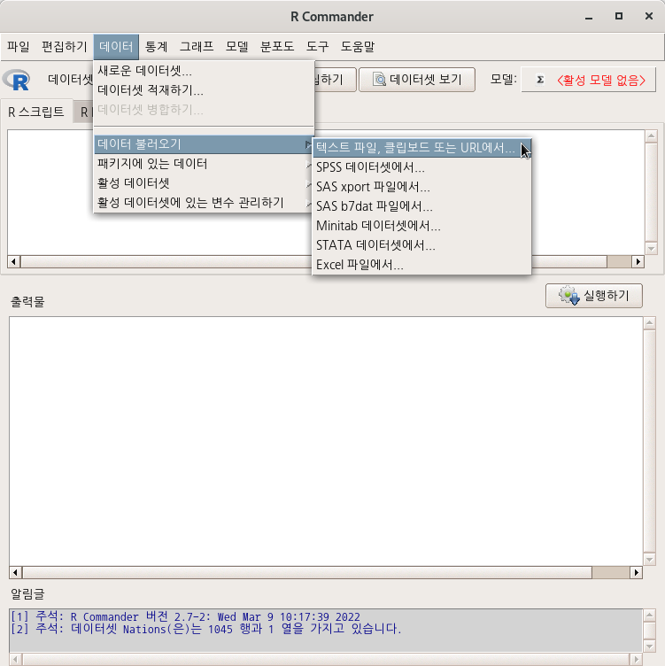

개인적인 경험과 판단이지만, R에서 외부 데이터 파일을 불러오는 것을 초급자들은 너무 어려워한다. 쉽지 않다. 분석과 시각화 작업을 하기에 앞서서 자료 불러오기가 어려우니, 많은 사람이 쉬운 GUI 분석도구로 되돌아가려고 한다. read.table() 계열 함수가 어렵다.

 
R Commander는 이러한 불편함을 최소화하기 위하여 인자들을 쉽게 선정하도록 화면 구성이 되어있다. 하지만, 먼저 알아야할 것이 있다. R Commander에서 불러오는 객체, 다시말해 외부 데이터 파일로부터 불러올 대상은 반드시 데이터 프레임 형식을 취한다. 변수이름을 갖고, 엑셀과 같은 스프레드시트 형식으로 사례값들이 배열되어 있는 것만 GUI 메뉴로 작업할 수 있다. 만약, 데이터프레임 형식이 아니라면, 일반 콘솔 환경과 같은 조건에서 Command Line 작업을 해야한다.

 
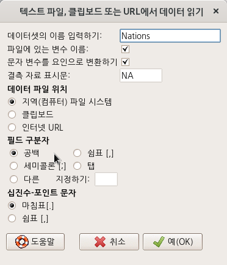


- data set의 기본이름은 Dataset이다. 원하는 것으로 이름을 바꿀 수 있다. 가급적 영문을 추천한다. 행여 다른 시스템에서 파일이름의 호환문제를 겪을 수 있기 때문이다. (위의 메뉴 창에서는 Nations라고 데이터셋의 이름을 변경했다.)

- 결측치 표시는 NA가 기본설정이다.

- 외부 파일을 불러올지, 메모리(clipboard)에서 불러올지, 외부인터넷 경로에서 내려받을 지를 선택할 수 있다.

- 필드 구분자를 선택할 수 있다. 사실, 필드 구분자가 초급자에게는 어렵다. 빈 공백, commas, 세미 콜론, 탭 등이 사용되기 때문에 혼란스러울 수 있다. 일반적으로 .txt로 되어 있는 것은 빈 공백, .csv로 되어 있는 파일은 comman인 경우가 흔하다. 하지만, 정확한 내부 규칙이 없기 때문에 어려개를 번갈아 선택해봐야할 수 있다.

- Decimal-Point의 경우, 한국은 미국스타일의 Period[.]를 관행적으로 쓰기 때문에 기본설정을 따르면 된다.

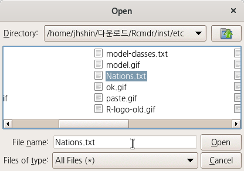 

```{r import-nation-cmd, eval = FALSE}
Nations <- read.table("/home/jhshin/다운로드/Rcmdr/inst/etc/Nations.txt", header=TRUE, 
  stringsAsFactors=TRUE, sep="", na.strings="NA", dec=".", strip.white=TRUE)
```

`Nations`라는 이름으로 불러온 데이터셋이 활성화되어 R Commander 에서 활용할 수 있는 환경이 시작된다.

---

사례를 하나 소개한다. libreOffice Calc에서 엑셀파일을 불러오고, 또 이것의 첫 시트를 clipboard에 복사하고, R Commander로 불러온다고 생각해보자.
 

- Locatioin of Data File에서 Clipboard를 선택하고,

- Field Separator에서 Tabs(탭)을 선택해야 한다. 기본설정을 바꿔야한다는 뜻이다.

한가지 유의해야할 것은 변수이름이 바뀌는 규칙이 있다는 점이다.

- R에서는 괄호를 변수이름에 넣을 수 없다. 앞뒤 괄호는 ..으로 바뀐다. '연락처(대표)'는 '연락처.대표.'로 바뀐다.

데이터 파일이 (어떤 규칙성에 의하여 성공적으로) 불러와지면, 상단의 R 아이콘 옆에 Data set:에 파란 색의 객체이름이 보인다. 기본설정이라면 Dataset이 될 것이다.

## 패키지 데이터 / Data in packages   

### 패키지의 데이터셋 목록 / List data sets in packages

 
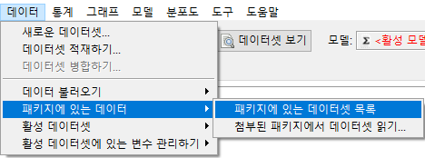

R과 Rcmdr에서 불러온 패키지에 담겨있는 데이터셋의 목록을 보여준다.

`data()` 함수를 사용한다. R이 시작될 때 기본 설정으로 함께 호출되는 Datasets 패키지, Rcmdr 패키지를 호출할 때 의존성을 갖는 carData, sandwish 패키지의 데이터셋 목록을 포함한다.

 
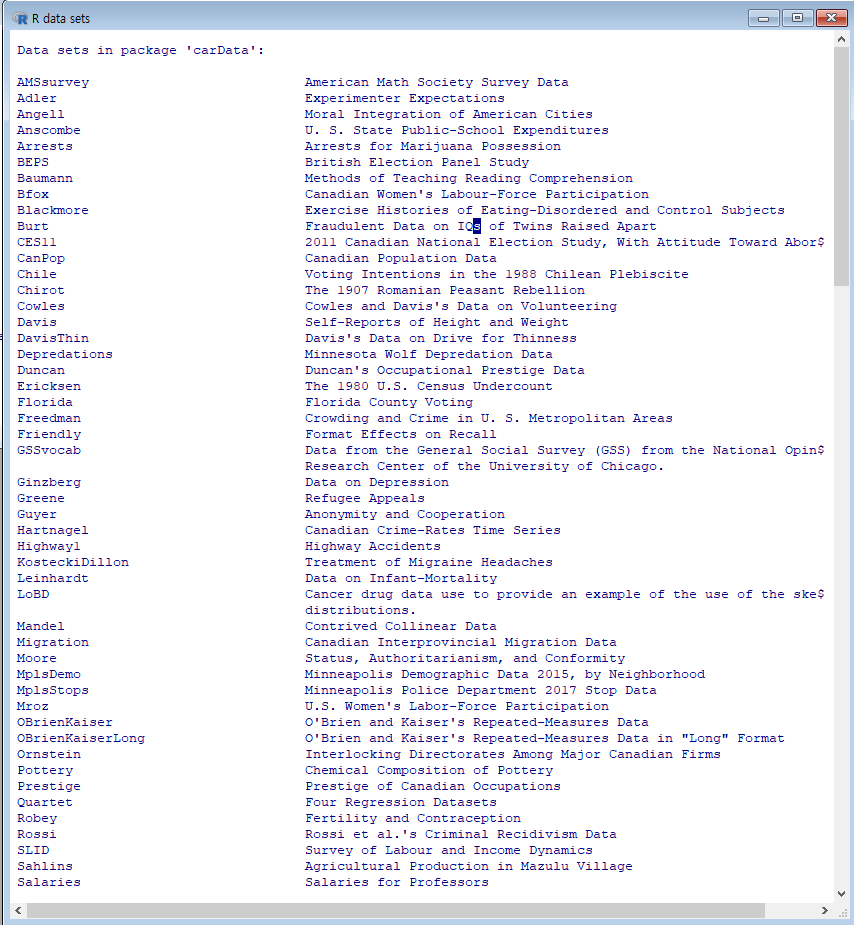

### 첨부된 패키지에서 데이터셋 읽기.../ Read data set from an attached package...

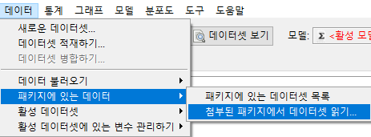 


R에는 많은 예제 데이터셋이 있다. 대부분의 패키지들에 예제 데이터셋이 담겨 있다. R과 R Commander를 사용하는 과정에서 불러온, 다른 말로 하면 메모리로 호출된 패키지들에 데이터셋이 포함되어 있을 수 있다. 예제로 포함된 데이터셋을 선택하여 메모리 안으로 불러들일 때, 이 기능을 사용한다. 주로 통계 방법론이나 함수 사용법을 연습할 때, 주로 활용하게 된다.

 

하나의 사례로서, carData 패키지의 Prestige 데이터셋을 선택한다. 

 
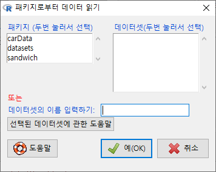 


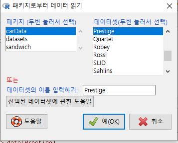  


출력 창을 보면, data() 함수가 사용됨을 알 수 있다:

`data(데이터셋이름, package="패키지이름")`

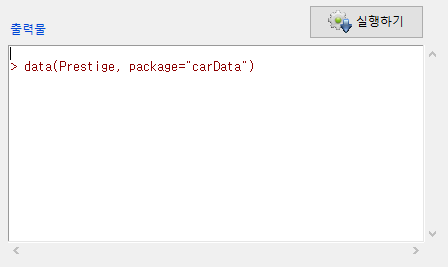 

## 데이터 활성 데이터셋 / Active data set ...

### 데이터 보기.../ View data...

메모리로 불러온 데이터의 내부 값들을 볼 때 사용한다.  데이터프레임화 된 객체 전체를 보거나, 일부 변수들만 추려서 볼 수도 있다.

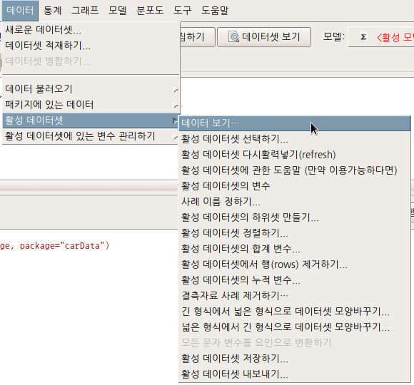 

기본 설정에는 '모든 변수 포함하기'가 선택되어 있다.

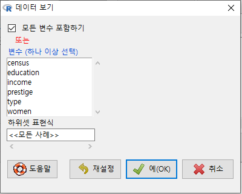 

데이터셋의 크기가 작거나, 변수의 갯수가 적은 경우는 크게 무리 없이 '모든 변수 포함하기'를 이용할 수 있다.

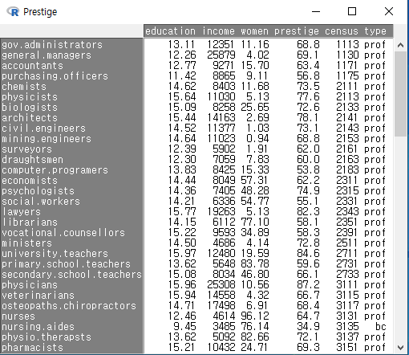 

데이터셋에 대한 이해가 깊어지고, 분석의 대상의 명확해지면서 소량의 변수를 중심으로 데이터를 살펴볼 경우도 있다. 이 때는 '모든 변수 포함하기' 설정을 해제하고 필요한 변수들만으로 제한할 수 있다.  Prestige 데이터셋에서 교육연수와 수입(연봉)이 직업의 권위에 대한 인식에 어떤 영향을 미치는가를 연구주제로 정했다고 하면, education, income, prestige 등의 변수로 제한할 수 있다:

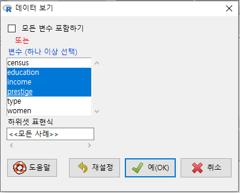  


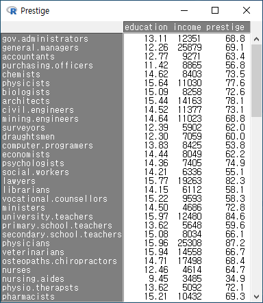  

```{r data-view, eval = FALSE}
relimp::showData()
```

---

조금 난이도가 있는 고민을 해보자. 데이터셋 내부를 보고자 한다. 그러나, 데이터셋에 대한 기초적인 이해를 확보한 이후, 범위를 좁혀서 통찰력을 키우기 위하여 다양한 방식으로 데이터셋 내부를 보고자 할 수 있다. 몇 개의 변수를 선택하고, 또 요인형 변수의 어느 수준으로 제한된 범위 안에서 데이터셋 내부를 볼 수 있다. 아래 화면에서 원하는 변수를 선택하고,  <하위셋 표현식>을 추가한 것을 볼 수 있다. type (직업 유형)에는 bc, prof, wc 라는 수준이 있다는 것을 미리 알고, white collar 직업군 내부의 정보를 보고자 type == "wc"로 제한하도록 하자.


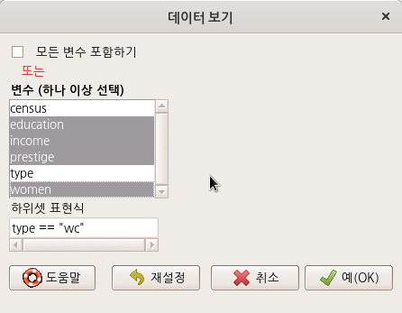  

아래의 데이터는 Prestige 데이터셋에서 white collar 직업군으로 제한하여, education, income, prestige, women 변수의 사례를 출력한 결과이다.

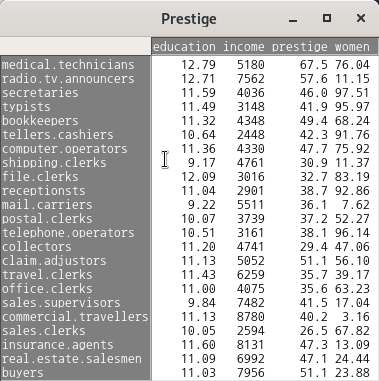  

### 활성화된 데이터셋 선택하기.../ Select active data set...


메모리에 여러개의 데이터셋이 올려져 있을 수 있다. 그 중 하나를 선택하는 기능이다. 여러 개의 데이터셋에서 하나를 선택한다는 것은 그 데이터셋을 갖고 분석 작업을 수행하겠다는 것으로 이해할 수 있다. 그 과정에서 매번 그 데이터셋을 지정할 필요가 없다는 것이다.

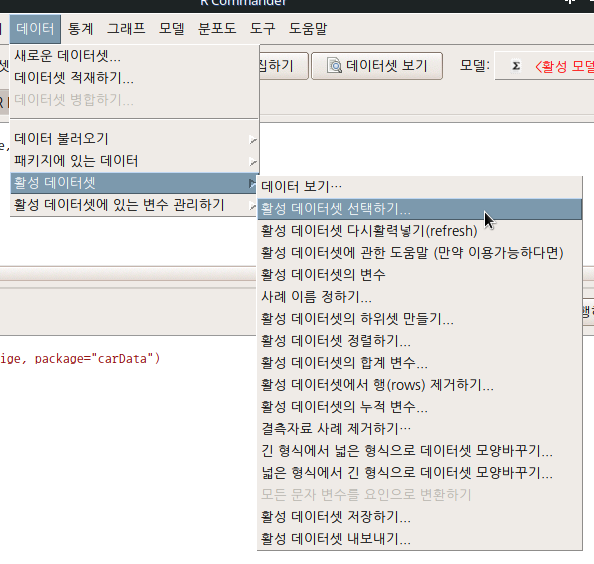

메모리에 탑재된 데이터셋이 하나인 경우 다음과 같은 경고문을 알림글에서 보게 된다. 

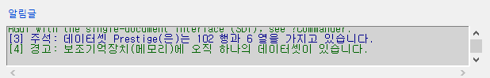

아래와 같이 두개의 데이터셋이 메모리에 있다고 가정하자. 이 경우 어느 데이터셋을 선택해서 자료처리와 분석을 진행할 것인가를 결정해야 한다.

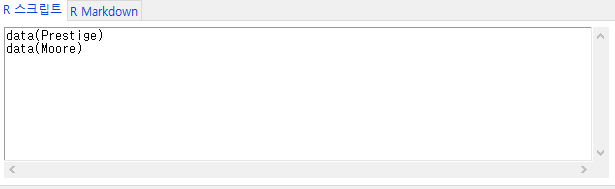

아래 화면은 Prestige 데이터셋이 선택된 상황이다. 예(OK)를 누른다.

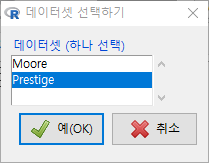

R Commander 화면에서 R 아이콘 옆에 '데이터셋: Prestige' 이 뜬다.

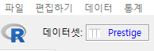

만약, Moore 데이터셋을 선택하면 '데이터셋: Moore'로 바뀐다.

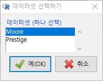

 

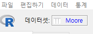

한편, 위와 같은 방식 (Pull-down)의 메뉴와 기능 선택을 거치지 않고, 바로 데이터셋을 바꿔가며 활성화시켜 작업하고자 할 때는 마우스를 이용하여 바로 버튼을 누를 수 있다. 파란색의 Prestige 버튼을 눌러보라: 

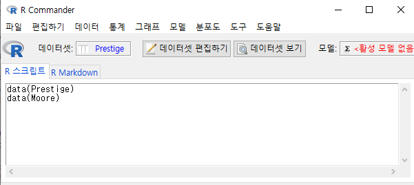

### 활성 데이터셋 다시활력넣기(refresh) / Refresh active data set


메모리에 올려진 데이터셋으로 작업하는 경우, 변수와 사례를 추가/삭제하는 경우가 빈번하게 발생한다. 줄여 말하면, 벡터를 만들거나 삭제할 수 있다. 이 경우, 작업이 진행된 객체의 '현재' 정보가 필요한 경우가 있다. 객체의 행과 열, 변수와 사례의 갯수를 업데이터해서 메세지로 알려준다.

 


### 활성 데이터셋에 관한 도움말 (만약 이용가능하다면) / Help on active data set (if available)

 

R에서 이용가능한 많은 패키지에는 예제용 데이터셋이 많이 포함되어 있다. 이러한 예제용 데이터셋은 대부분 도움말을 갖고 있다. 내장된 예제용 데이터셋을 활성 데이터로 불러온 경우는 이 명령을 유용하게 사용할 수 있다.

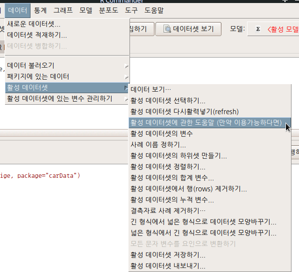 

carData 패키지의 Prestige 데이터셋이 활성화되었다면, 도움말을 볼 수 있다:

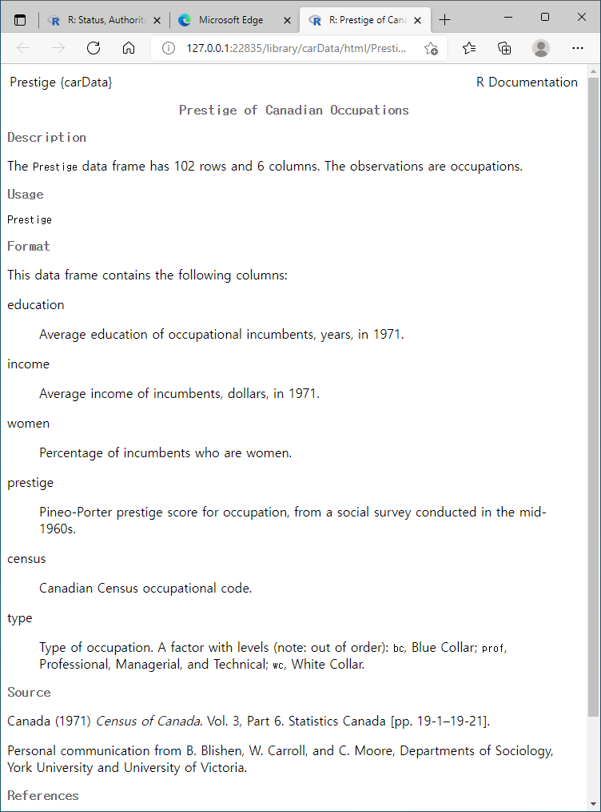 

 
```{r active-help, eval = FALSE}
help("Prestige")

help(Prestige)
```


`?(Prestige)` 등으로 입력창에 직접 입력할 수 도 있다.

`help("데이터셋이름")`

아래의 참고사항은 Prestige 데이터셋과 유사하게, carData 패키지에 담겨있는 DavisThin 데이터셋이다. 같은 방식으로 연습할 수 있다. [DavisThin 데이터셋](https://rcmdr.tistory.com/141)

### 활성 데이터셋의 변수 / Variables in active data set

활성 데이터셋으로 불러온 데이터프레임에는 사례값들을 가지는 변수가 있을 것이다. 변수이름을 목록화시켜 보여주는 기능이다. 예제용 데이터셋은 핵심적인 목적을 위하여 정제된 경우가 대부분이기 때문에 이 기능이 큰 효과를 가지지 않는다. 하지만, 백 개 이상의 변수를 가진 데이터들도 흔한 상황에서 분석을 위한 데이터셋을 불러온 경우, 그리고 변수들이 많은 경우, 이 기능은 효과적으로 사용될 수 있다.


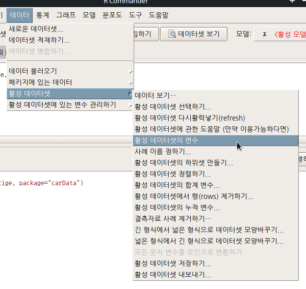 

활성 데이터셋에 있는 변수들의 목록이 출력된다. Prestige 데이터셋에는 있는 변수 목록은 다음과 같다:


```{r active-varname}
library(carData)
data("Prestige")
names(Prestige)
```

> `names(데이터셋)`

### 사례 이름 정하기... / Set case names...


활성 데이터셋으로 사용되는 데이터프레임은 행과 열을 갖는다. 변수이름이 열을 대표한다. 행의 경우, 일련번호로 사례를 대표하기도하고 고유한 이름을 붙이기도 한다. 이 기능은 행의 이름을 지정하는 것이다. 


그런데, 이 기능을 사용하기 위해서는 R의 특징을 알아야 한다. 첫째, 사례 이름은 유일해야 한다. 동일한 행의 이름을 넣을 수 없다는 것이다. 이 원칙은 행의 이름으로 사용하기 위해서 변수들에서 하나를 선택해야하는 이 기능 <사례 이름 정하기>에서 많은 변수들이 이 원칙을 위배하기 때문에 오류문을 생산하는 경우가 흔하다. 행이름은 흔히 key 값이라 부르는 고유성을 가져야 하는데, 이 고유성이 어느 변수의 사례값에서 발견되기는 쉽지 않다.

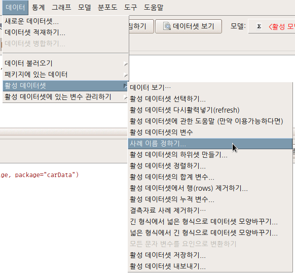

<사례 이름 설정하기> 메뉴창에서, Prestige의 어떤 변수를 선택하더라도 알림글에 '오류: 사례 이름은 유일해야 합니다.'는 메세지를 볼 것이다. 숫자 형태의 일련번호 또는 개별화된 문자형 사례 이름에는 중복되는 이름을 넣을 수 없다는 뜻이다. 

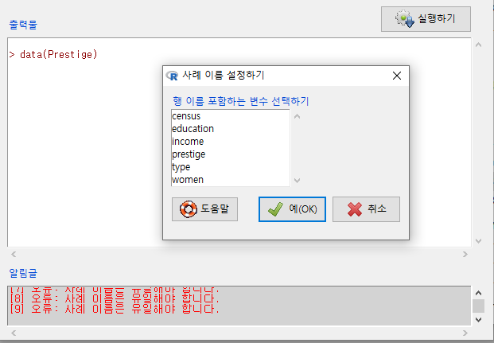

Prestige 데이터셋의 변수이름은 아래와 같이 문자형 정보를 담고 있다. 만약 숫자 형태의 일련번호가 있었다면, 직업 이름을 담고 있는 변수의 사례들을 행 이름으로 바꿀 수 있었을 것이다.

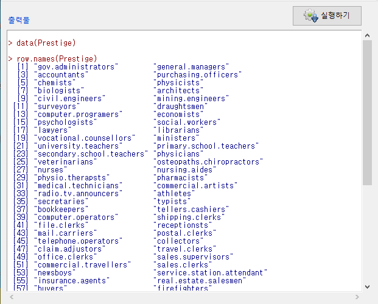


> `row.names(데이터셋이름)`

### 활성 데이터셋의 하위셋 만들기...

Data > Active Data set > Subset active data set...

 

데이터셋에 담긴 모든 변수를 분석에 활용하는 경우는 거의 없다. 분석을 위하여 데이터셋의 일부를 사용하는 경우가 일반적이다. 분석에 필요한 변수집단을 선택하여 하위셋을 만드는 기능이다.

 
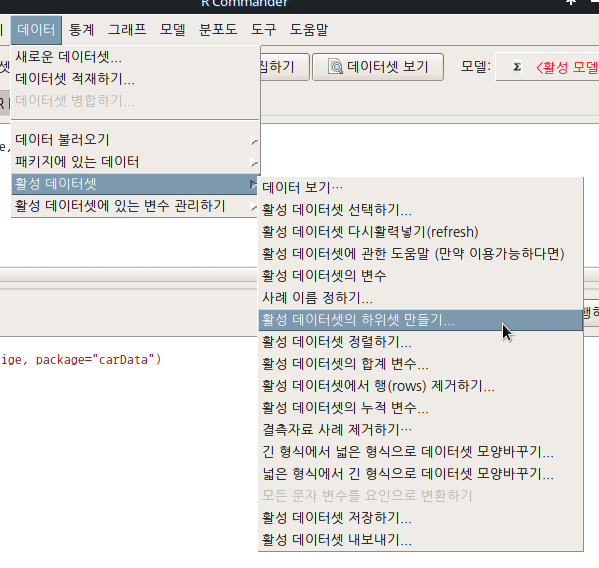
 

변수집단을 선택할 경우는 <모든 변수 사용하기>에 기본지정된 옵션을 해제해야 한다. 물론 변수일부를 선택하는 것과 별개로 사례값(행) 일부를 선택할 수도 있다. 이 경우는 사용자가 직접 <하위셋 표현식>에 스크립트를 입력해야 한다. 초보자는 당황할 수 있다. 

 
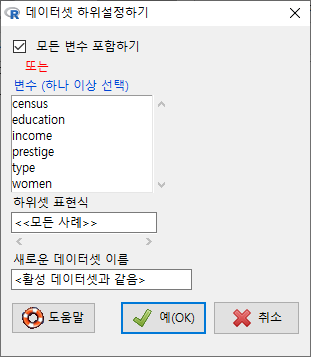


변수 일부나 행 일부를 선택한 후에는 새로운 데이터셋 이름을 입력해야 한다. 그렇지 않으면 기존 데이터셋 이름을 덮어쓰는 위험이 발생한다. 경험적으로 나는 하위데이터셋 이름은 데이터셋.sub1, 데이터셋.sub2 또는 sub1.데이터셋, sub2.데이터셋 등으로 사용하여 원데이터의 이름을 유지시킨다. 


Prestige 데이터셋에서 변수 네개를 선택한다고 하자. education, income, prestige, type 변수를 선택하고, sub1.Prestige라고 데이터셋의 이름을 붙였다고 하자.

 
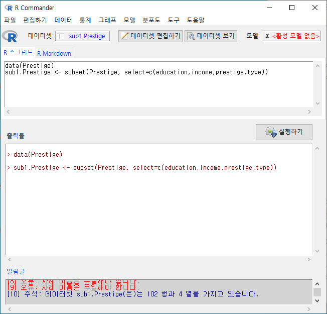

그런데, type 변수에는 "prof", "bc", "wc"라는 요인(factor)형 정보가 담겨있다. 이 중에서 전문직(prof)에 관한 데이터의 정보만 추출하려면 다음과 같이 조건을 지정해야 한다. 

 
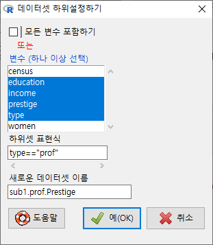


다음 화면의 입력창, 출력창, 알림글을 살펴보라. 활성 데이터셋의 이름이 sub1.prof.Prestige라고 바뀌었고, subset()의 인자가 추가되었으며, sub1.prof.Prestige 데이터셋의 행과 열 정보를 찾을 수 있다:

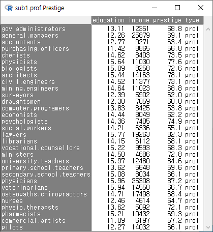

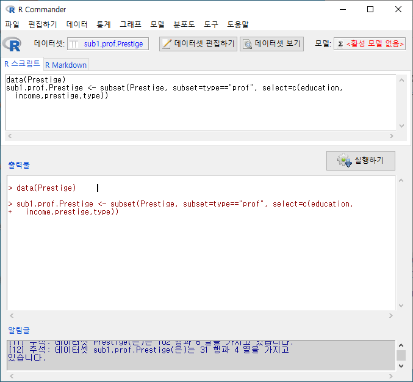


> `subset(데이터셋이름, subset=조건, select=선택된변수목록)`

### 활성 데이터셋 정렬하기.../ Active Data set > Sort active data set...

데이터셋의 행의 순서를 조정할 수 있다. 이 기능은 특정 변수(들)을 선택하여 증가/감소 등의 순서로 행의 순서를 조정하는 기능이다. 보통 데이터셋에서 필요 변수(사례들)를 선택하여 하위셋을 만들고, 이후 내용적인 이해를 위하여 이 기능을 사용한다. 

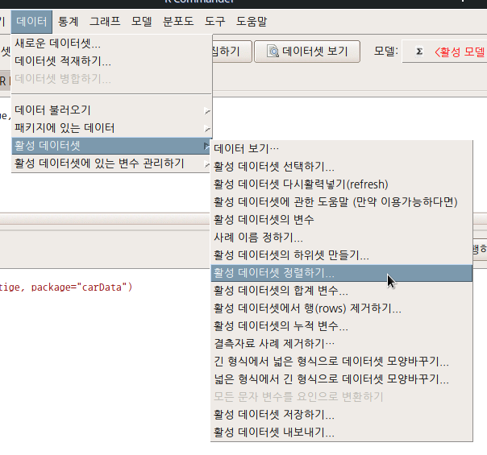

새롭게 정렬할 변수(들)을 선택하고, 증가/감소 등의 방향을 결정한 후, 새로운 데이터셋의 이름을 입력하게 된다. 입력하지 않으면 현재 사용중인 데이터셋의 이름을 덮어쓰는 위험이 있다. 경험적으로 나의 경우는 데이터셋.sort1, 데이터셋.sort2 등으로 새로운 데이터셋의 이름을 정한다.

 

직종의 권위에 대한 인식의 높낮이를 기준으로 자료를 정렬해보자. prestige 변수를 선택하고, <방향 정렬하기>에서 감소하기를 선택하고, <새로운 데이터셋 이름>에서 Prestige.sort1 이라고 입력한다.

 
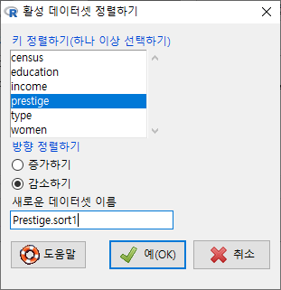

출력창에 함수의 용례를 확인할 수 있다. 정렬의 기준 변수를 선택하고, order() 함수와 높은 순서로 정렬하는 인자인 'decreasing=TRUE'를 사용한다. 새로운데이터셋 <- with(활성데이터셋, 활성데이터셋[order(기준변수이름, decreasing=TRUE), ]) 등의 함수 용례를 보게된다: 

 
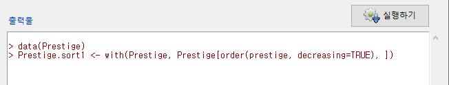

R Commander의 상단에 있는 R 아이콘 옆에 <데이터셋: Prestige.sort1>이라고 활성데이텃 이름이 바뀐 것을 보게될 것이다. 어떻게 데이터셋이 정렬되었는지 보려면 <데이터셋 보기> 버튼을 누른다.


두개 이상의 변수를 선택할 경우는 추가 대화창에서 정렬 키의 순서를 결정할 수 있다. 직업의 권위가 높은 순서로, 교육 연수가 높은 순서로 정렬해보자. 

 
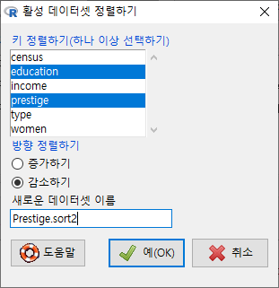

기준(key)이 되는 변수가 하나일 때와 달리, 둘 이상의 변수를 선택할 때는 <정렬 키 다시 순서정하기> 창이 등장한다. 앞서 만든 기준을 위하여 prestige를 1로, education을 2로 순서를 바꿔보자.


R Commander의 화면에서 활성 데이터셋이 Prestige.sort2로 바뀐다. 그리고 출력창에 새로운 함수 용례가 다음과 같이 등장할 것이다. 새로운데이터셋 <- with(활성데이터셋, 활성데이터셋[order(기준변수1이름, 기준변수2이름, decreasing=TRUE), ]) 


<데이터셋 보기>를 눌러서 정렬의 결과를 살펴보자. prestige 변수의 사례 값이 68.8인 것이 두개 있다. mining.engineers, gov.administrators 인데, 둘째 기준변수인 education의 높은 순서로 정렬되어 있다. 각각 14.64, 13.11 이다. 앞서 기준변수가 prestige 하나였던 데이터셋과 정렬을 비교해보자. 상단의 Prestige.sort1 데이터셋에는 gov.administrators가 mining.engineers보다 위에 있는 것을 확인할 수 있다. 

 


### 활성 데이터셋의 합계 변수... / Active data set > Aggregate variables in active data set...

 


데이터셋의 변수에는 수치형과 범주형, 문자형 등이 있다. 범주형 변수, 보통 R에서 factor(요인)형이라 부르는 변수를 기준으로 수치형 값들을 묶을 수 있다. 이 기능을 이해하기 위해서는 사용자가 수치형/요인형/문자형 등의 데이터유형에 대하여 알고 있어야 한다.

 

대화창에서 <Aggregate by (하나 이상 선택) > 에 등장하는 변수는 요인형 변수이며, 이 변수의 개별 요인형 사례를 기준으로 나머지 변수들의 정보가 묶이게 된다. 아래 화면의 type 변수는 요인형 변수이며, 나머지 변수는 수치형 변수인 것이다.  <평균/합/다른 (지정하기)>의 옵션에서 선택할 수 있다. <합계 데이터셋 이름>은  'AggregateData'로 지정되어 있으나, 사용자가 임의로 바꿔서 사용할 수 있다.

 


예(OK)를 누르면, AggregatedData라는 데이터셋이 생성된다. <데이터셋 보기> 를 통해서 내부를 살펴보면, 직업 유형 (type)별로 직업의 권위에 대한 인식(prestige)의 평균 값이 보인다.


하나 이상의 수치형 변수를 선택해보자. Prestige 데이터셋에서 세개의 변수, education, income, prestige 를 선택하고 예(OK) 버튼을 누르자.


 

<데이터셋 보기> 버튼을 눌러 AggregatedData 내부를 살펴보면, 직업 유형 (type) 별로, 교육 연수(education), 연 수입(income), 권위 인식(prestige)의 평균 값이 확인할 수 있다.


아래 입력창은 두개의 합계 데이터셋을 만든다. AggregatedData, AggregatedData1인데, aggregate() 함수가 사용되는 것을 알 수 있다.


> 합계데이터셋 <- aggregate(수치형변수 ~ 요인형변수, data=활성데이터셋, FUN=mean)

### 활성 데이터셋에서 행(rows) 제거하기.../ Active data set > Remove row(s) from active data set...

 

활성 데이터셋에서 행을 제거하는 기능이다. 대화창이 열리면 사용자는 제거할 행의 정보를 알고 있는 상황에서 제거를 위한 행을 지정해야 한다. 색인 또는 행의 이름, 행의 일련번호 등을 알고 있어야 한다. 초보자에게는 쉽지 않은 기능이다.

 
 
 

예를 들어 100개의 사례가 일련번호로 지정되어 있다고 가정하자. 1번을 제거하기 위해서는 1을 입력하면 되고, 90번을 제거하기 위해서는 90을 입력하면 되고, 11번에서 20번까지 묶음을 제거하려면 11:20을 입력하면 된다. 만약 1, 11:20, 90을 한꺼번에 제거하려면 어떻해야할까. 1, 11:20, 90을 넣으면 오류문이 출력된다. 오류문을 살펴보면 쉼표(,)가 두 개 찍혀있는 것을 보게될 것이다. 1 11:20 90 으로 입력하면 작동할 것이다. 빈공간(스페이스)이 쉼표 기능을 한다.

 

예를 들어, Prestige 데이터셋은 6개의 변수와 102개의 사례가 있다. 91번부터 102번까지 12개의 사례를 제거하려고 한다. 다음과 같이 '91:102'를 <제거할 색인 또는 인용된 행(row) 이름> 에 입력한다.

 
 


출력창을 살펴보자. 다음과 같은 형식이다:

새로운데이터셋 <- 활성데이터셋[-c(제거시작행번호: 제거마지막행번호), ]

출력창 아래를 보면 알림글에서 사례의 갯수가 90개로 바뀌었음을 알 수 있다.

 

 

이렇게 제거할 행을 지정하면, 행의 일련번호가 바뀌는 것을 기억해야 한다. <새로운 데이터셋 이름>으로 데이터셋을 지정하는 것이 필요하다. 이름을 입력하지 않으면 기존 활성 데이터셋 이름을 덮어쓰는 위험이 있다.

 

한편, Prestige 데이터셋의 type 변수에 값이 입력되지 않은 것이 있다. newsboys, babysitters, farmers 라는 사례명을 가진 행의 type 변수 칸에는 <NA> 으로 되어있다.


 

babysitters, farmers라는 두개의 사례를 제거해보자. 이 경우는 앞서서 행의 번호를 입력한 것과 달리 "babysitters", "farmers"라고 입력해야 한다.

 
 


다소 생소하고 복잡해 보이는 방식으로 명령문을 입력해야 한다. 논리적으로 보면, 데이터셋의 사례 이름들 중에서 제거하고자 하는 사례 이름들을 찾아서 데이터셋에서 삭제하라는 뜻이다.


> 새로운데이터셋 <- 활성데이터셋[!(rownames(활성데이터셋) %in% c("제거사례이름1", "제거사례이름2")), ]


Prestige.sub1 데이터셋에서 babysitters, farmers 두개의 사례를 제거했기 때문에, 알림글의 지시문을 보면 사례수는 90개에서 88개로 줄어들었음을 확인할 수 있다.

### 활성 데이터셋의 누적변수.../ Active data set > Stack variables in active data set...

 


변수에는 수치형 변수와 요인(범주)형 변수, 문자형 변수 등이 있다. 수치형 변수이름을 요인화시켜 데이터셋을 재배열화시키는 것이 이 기능이다. <누적 데이터셋 이름>, <변수 이름>, <요인 이름> 에 미리 추천된 내용이 입력되어 있으나 사용자가 임의로 새롭게 지정할 수 있다. 일반적으로 변수이름을 바꾸기도 한다.

 


재배열된 데이터셋에서 선택된 수치형 변수들은 요인화된 새로운 변수의 요인 이름으로 변하기 때문에 일반적으로 데이터셋의 사례가 크게 증가한다. 변수를 2개 선택하면 2배, 3개 선택하면 3배로 행의 길이가 길어진다. 위의 화면에서 변수 두개, education, income을 선택하고 나머지를 기본설정 그대로 유지하고 예(OK) 버튼을 누른다. 아래 화면처럼 변경 사항들이 등장한다. R 아이콘 옆에<데이터셋: StackedData>으로 활성 데이터셋이 변경되고, 알림글에 StackedData 데이터셋의 행과 열 정보가 등장한다. 

 


> 새로운데이터셋 <- stack(활성데이터셋[, c("선택된수치형변수1", "선택된수치형변수2")])
> names(새로운데이터셋) <- c("새로운변수이름1", "새로운변수이름2(요인형변수)")

 

<데이터셋 보기> 버튼을 누르면 어떤 형식으로 데이터셋이 재구성되는지 확인할 수 있다.


**Q1) `stack()` 함수를 이용하여 만든 누적변수는 어떤 분석에 사용되나요?**

- 만약 두개 연도의 정보가 여러개의 변수로 저장되어 있다고 가정해보겠습니다. 동일 정보대상에 대한 두개 연도의 정보를 비교하고자 할 때, 두개의 연도별 변수를 하나의 변수로 만들고, 각 연도를 요인형으로 변화시켜 분석하는 것입니다. 

- 유사하게, 남녀 등의 성별로 두개의 변수들이 구성되어 있거나, 1학년~3학년 등으로 중고등학교 학년의 변수들이 있을때, 남녀별-학년별 등으로 수치형 정보의 흐름을 살펴보고, 또 비교분석하고자 할 때 활용되는 데이터의 형식 변경 기능입니다.

### 결측자료 사례 제거하기.../ Active data set > Remove cases with missing data...

데이터셋에 결측자료가 포함되는 경우가 흔하다.  [Count missing observations](https://rcmdr.tistory.com/84)
 


관측 결측치 셈하기 Statistics > Summaries > Count missing observations 데이터셋을 구성하는 사례에 값이 입력되지 않은 결측치가 있는 경우가 있다. 어떤 변수에 관측값이 없는 결측치가 있는지를 확인할


분석을 앞두고 결측자료(결측데이터)를 어떻게 처리할 것인가가 중요한 경우도 많다. 결측데이터(결측자료)를 제거하는 기능이다. 결측자료가 많은 상황에서 모든 결측자료를 제거하면 사례의 수가 크게 감소하는 위험이 발생하기도 한다. 그래서 결측자료를 제거하기전에 분석에 필요한 하위셋을 먼저 만드는 것을 추천한다.

 


분석에 사용될 하위셋을 만들고, 결측자료를 제거할 때 <모든 변수 포함하기>/<변수 (하나 이상 선택)>을 결정해야 한다. 선택 이후 새로운 데이터셋 이름을 지정하는 것을 추천한다. 

 


출력창의 정보를 보면 na.omit() 함수가 사용된다. 결측치 4개가 제거된다. 행의 수가 102개에서 98개로 축소된다.

 


> 새로운데이터셋 <- na.omit(활성데이터셋)

 

만약, 데이터셋에서 분석에 포함되는 변수 선정이 분명하고, 선정된 변수들 안에 있을 수 있는 결측치를 제거하고자 할 때는 <모든 변수 포함하기> 대신 <변수 (하나 이상 선택) >에서 변수들을 선택하면 된다.


 

출력창을 보면, <모든 변수 포함하기> 의 명령문보다 복잡하다.


> 새로운데이터셋 <- na.omit(활성데이터셋[ , c("선택변수1", "선택변수2", "선택변수3", "선택변수4")])


### 긴 형식에서 넓은 형식으로 데이터셋 모양바꾸기.../ Active data set > Reshape data set from long to wide format...


 

간혹, ID를 갖는 주체(subject, 주로 사람 또는 집단의 개체)가 반복적으로 사례 값을 갖는 데이터가 있다. 또는 시간의 경과/어떤 사건 전후에 따른 변화값을 갖는 개체들을 다루는 분야에서는 흔한 데이터 형식일 수 있다. 

 

carData 패키지에 포함된 OBrienKaiser, OBrienKaiserLong 데이터를 살펴보자.

- [OBrienKaiser 데이터셋 요약정보](https://rcmdr.kr/95)
- [OBrienKaiserLong 데이터셋 요약정보](https://rcmdr.kr/96 )

먼저  OBrienKaiserLong 데이터를 살펴보자. id 변수를 보면 개체 번호(subject)가 반복됨을 알 수 있다. phase 변수는 pre, post, fup가 hour 변수는 1, 2, 3, 4, 5가 반복된다.

 


전체 240개의 사례는 16개의 개체, 각 개체별 3개의 단계 (pre, post, fup), 각 단계별 5개의 시간대(1, 2, 3, 4, 5)의 score를 1 ~ 11까지 갖는다. 개체 1 ~ 5는 control 집단으로, 개체 6 ~ 9는 A 처방 집단, 개체 10 ~ 16는 B 처방 집단이며, 개체는 여성과 남성 각각 8명씩이다.

 

새롭게 만드는 변형된 데이터셋의 이름은 활성데이터셋이름Wide로 기본 설정되어있다. OBrienKaiserLong 데이터셋에서 개체를 나타내는 id 변수를 <Subject ID 변수(하나선택)>으로, 변화되는 값을 갖는 요인형 정보 hour, phase를 <Within-subjects 요인 (하나 또는 그 이상 선택)>으로, 변화되는 값인 score를 <상황에 의해 다양화되는 변수 (하나 또는 그 이상 선택)>에서 선택한다.

 

R Commander 맨 아래에 있는 알림글을 살펴보면,

- 주석: 데이터셋 OBrienKaiserLong(은)는 240 행과 6 열을 가지고 있습니다.
- 주석: 데이터셋 OBrienKaiserLongWide(은)는 16 행과 17 열을 가지고 있습니다.

라는 정보를 확인할 수 있다. treatment, gender 변수는 그대로 사용되지만, score별로 hour.phase의 요인 값이 표기되는 형식으로 변수가 15개 생성된다. score.hour(1~5).phase(pre, post, fup) 순서가 되겠다.

 

### 넓은 형식에서 긴 형식으로 데이터셋 모양바꾸기.../ Active data set > Reshape data set from wide to long format...

 


먼저, 첨부된 [carData 패키지에서 OBrienKaiser 패키지를 활성화](https://rcmdr.kr/95)하자.

Data > Read data set from an attached package... 메뉴를 통해서 carData 패키지선택 후 [OBrienKaiser 데이터셋을 찾아 선택](https://rcmdr.kr/37)할 수 있다.


OBrienKaiser 데이터셋은 다음처럼 16개의 행과 17개의 열로 구성되어 있다:

 

17개의 변수에서 pre.(1, 2, 3, 4, 5), post.(1, 2, 3, 4, 5), fup.(1, 2, 3, 4, 5) 등이 15개의 변수를 구성하고 있다.


아래 메뉴창에서 <within-subjects 행(row) 요인 이름: >에 pre, post, fup을 포괄하는 phase를, <within-subjects 열(column) 요인 이름: >에 1, 2, 3, 4, 5를 포괄하는 hour를 넣자.


<최대 5수준까지 각 within-subjects 요인의 수준 이름을 지정하기> 아래의 행(row) 이름에 pre, post, fup을 넣고, 열(column) 이름에 1, 2, 3, 4, 5을 넣는다. 사례가 담길 곳에는 pre.1, pre.2, pre.3, pre.4, pre.5, post.1, post.2, post.3, post.4, post.5, fup.1, fup.2, fup.3, fup.4, fup.5 을 차례로 찾아 넣는다. 만약 잘못 입력되어 중복이름이 포함되면, 오류: 이중의 행(row) 수준 이름이 있습니다: 라는 오류문을 알림글에서 보게 될 것이다.

 


선택기능 메뉴창을 열고, OBrienKaiserLong1이라고 데이터셋 이름을 넣자. 그리고, <반응변수: >에 score라고 입력하자. carData 패키지에 있는 OBrienKaiserLong과 동일한 구조를 만들고 데이터셋 내부를 비교하기 위함이다.

 

OBrienKaiserLong1의 데이터셋 내부는 다음과 같은 구성이다:

 

[OBrienKaiserLong 데이터셋 요약정보](https://rcmdr.tistory.com/96)

### 모든 문자 변수를 요인으로 변환하기 / Active data set > Convert all character variables to factors

 

메뉴창의 기능이 비활성화되어 있다. 어느 데이터셋이 활성화되었음에도 이 기능이 비활성화되어 있다면, 이 데이터셋에는 문자 변수가 없다는 뜻이다. 예를 들어, carData 패키지에 있는 Prestige 데이터셋에는 문자변수가 없다. 이 경우, <모든 문자 변수를 요인으로 변환하기> 기능이 비활성화 상태에 있다.

 
str() 함수를 이용하여 Prestige 변수의 내부 구조를 살펴보면, 변수 유형에 int, num, factor가 있지만, chr (character)는 없다.

 


임의로 character 변수를 생성해보자. Prestige 데이터셋의 요인형 type 변수를 문자형으로 변환시킨후 R Commander의 인식 과정을 살펴보자.

> Prestige$문자형변수이름 <- as.character(Prestige$요인형변수)

그리고, 다시 한번 str(Prestige)로 추가된 문자형 변수가 담긴 데이터셋의 내부 구조를 살펴보자. type.chr 라는 문자형 변수의 정보가 마지막에 보일 것이다. 입력창에 다음과 같이 입력한다:

  

활성화된 데이터셋에 문자형 변수가 포함된 경우, <모든 문자 변수를 요인으로 변환하기> 기능이 활성화된다.

  

strings2factors() 함수를 사용한다.  마지막 변수 type.chr의 변수 유형을 살펴보라.

  

### 활성 데이터셋 저장하기.../ Active data set > Save active data set...

 


활성데이터셋을 저장하는 기능이다. 데이터셋과 관련된 여러 작업(하위셋, 결측자료 제거, 누적/합계 등으로 데이터셋 변형 등)을 마친 후 사용하게된다. 대화창에서 저장위치를 결정하고 이름을 정한다. 확장자는 .RData 이다.

 


`save()` 함수를 사용한다. Linux 환경에서는아래화면처럼 경로명을 사용한다.

> save("활성데이터셋이름", file="경로/Prestige.RData") 

```{r save-code, eval = FALSE}
save(..., list = character(),
     file = stop("'file' must be specified"),
     ascii = FALSE, version = NULL, envir = parent.frame(),
     compress = isTRUE(!ascii), compression_level,
     eval.promises = TRUE, precheck = TRUE)

```


### 활성 데이터셋 내보내기.../ Active data set > Export active data set...


작업을 마친/ 또는 다른 업무를 위하여 일시적으로 작업한 자료를 하드디스크에 저장하는 경우가 흔하다. .RData로 자료를 저장할 수 있고, 공동작업자와 공유할 수 있지만, 행여 R을 사용하지 않는 분석가/사용자에게 자료를 보내야 하는 경우가 있다. 이 때 사용하는 기능이다.

 

자료를 텍스트 형식으로 저장하는 경우 다른 도구 사용자(예, 엑셀, PSPP 등)가 쉽게 불러와서 추가 작업을 할 수 있을 것이다. 변수, 행, 문자 등에 대하여 지정하는 옵션이 있다. 결측값 표현 방식도 정할 수 있다. 중요한 것은 필드 구분자이다. 쉼표(,)를 기준으로하는 필드는 .csv로 파일이 저장되고, 여백-탭-세미콜론 등으로 필드 구분자를 지정하면 .txt로 저장된다.

 
 

 


쉼표(',')를 필드 구분자로 사용하는 경우, 내보내는 데이터셋의 확장자는 .csv로 저장된다.

 

 

write.table() 함수를 사용한다.

> write.table(활성데이터셋, "경로/파일이름.확장자, sep="필드구분자", col.names=, row.names=, quote=, na="결측치표시") 


신경써야 할 것이 하나 더 있다. 대화창에는 등장하지 않지만, 현재 작업하는 컴퓨터의 인코딩 방식으로 자료가 내보내진다. 이 경우 윈도우-맥 애플-리눅스 등의 이기종간 자료 교환에는 인코딩 호환 문제가 발생할 수 있다. Linux는 utf-8, Windows는 cp949를 기본 인코딩으로 사용한다.

```{r write-table, eval = FALSE}
write.table(x, file = "", append = FALSE, quote = TRUE, sep = " ",
            eol = "\n", na = "NA", dec = ".", row.names = TRUE,
            col.names = TRUE, qmethod = c("escape", "double"),
            fileEncoding = "")
```


또 하나, 불편한 점이 있다. <행 이름 쓰기>와 관련된 것이다. <행 이름 쓰기>를 하고 저장한 파일에는 변수이름이 한자리 앞으로 오는 문제가 있다. 행 이름 위의 빈 칸에 첫 변수 이름이 쓰여지기 때문이다. 엑셀이나 다른 도구에서 행 이름 위에 있는 변수 이름을 이동시켜야 하는 불편함이 있다. 그렇다고 행 이름을 안쓰는 것도 문제가 될 수 있다. 일련번호는 상관없겠으나 사례 이름이 삭제되면 정보량이 축소되기 때문이다. 그래서 사례이름을 추가적인 변수명으로 사용하는 꼼수가 흔한 상황이다.

## 활성 데이터셋 변수 관리 / Manage variables in active data set

### 변수를 다시 코딩하기.../ Recode variables...


기존 변수를 이용하여 새로운 변수를 만들 수 있다. R Commander에서 이 기능은 일반적으로 수치형 변수를 요인형으로 바꾸는데 사용된다. <(각각의) 새로운 변수를 요인으로 만들기>에 선택이 되어 있는 것은 요인형으로 만드는 과정이다.


물론 수치형 변수의 사례값들을 다른 값으로 변환시킬수도 있다. 이 기능을 이해하기 위해서는 <"다시 코딩하기" 지시문 입력하기>에 대한 정확한 사용법을 익히는 것이 필수적이다. 초보자에게는 쉽지 않다. 하지만, 논리적으로 이해한다면 차후에 큰 어려움은 없을 것이다.

 


예를 들어 연령과 같은 수치 정보를 담은 변수가 있다고 하자.

10세 구간으로 바꾸려고 할 때, 10대, 20대, 30대, 40대, 50대, 60대, 70대 이상 등으로 사용할 수 있다. 때로는 65세이상으로 마지막 구간을 사용할 수 있다. 태어난 후 10세가 아닌 아이들을 배제시키기도 한다. 선거와 같은 정치적인 이슈에 대한 입장에서 20대 이상부터 시작하기도 한다. 이 경우 수치형 정보를 구간으로 바꾸어 요인화 시키는 과정이 필요하다.

 

때로는 소득과 관련하여 상-중-하 등의 3구간으로 나누는 것도 흔하다. 아래의 예와 같이 사용할 수 있다.

```{r recode-variable, eval = FALSE}
1:10000 = "low"
10001:20000 = "middle"
20001:max(데이터셋$변수) = "high" 
else = NA

```

Prestige 데이터셋에 있는 수치형 변수 education의 구간을 만들어 사례값들을 넣고 요인형로 변수로 만들고자 한다. 아래와 같이 <'다시 코딩하기' 지시문 입력하기>에 입력할 수 있다. 1부터 6까지는 elementary로, 6.01에서 9까지는 middle로 , 9.01에서 12까지는 high로, 12.01에서 16까지 univ라는 구간명을 만들어 넣을 수 있다.


주의점으로, '다시코딩하기'지시문에 오직 큰 따옴표(" ")를 사용해야 한다. 작은 따옴표를 사용하면 알림글에 오류가 뜬다:  오류: '다시코딩하기'지시문에 오직 큰 따옴표(" ") 사용하기

 

Prestige 데이터셋에 있는 수치형 변수 education, income을 구간을 정해서 나누고 요인형으로 바꿔서 education.level, income.level 이라고 변수명을 만든 명령문의 출력 결과이다. 


### 새로운 변수 계산하기.../ Compute new variable...

 


활성 데이터셋에 있는 변수들을 활용하여 새로운 변수를 생성하는 많은 방법이 있다. <Compute new variable...>은 일반적으로 수치형 사례를 갖고 있는 변수(들)을 사칙연산, log, 제곱근 등의 계산기법을 활용하여 새롭게 만드는 것이다. 계산에 의해서 새롭게 생성되는 사례들을 새로운 변수이름으로 저장할 수 있다. variable 이라는 추천된 변수 이름이 있지만, 사용자가 직접 지정할 수 있다.

Prestige 데이터셋에 있는 income 변수를 log를 이용하여 변환해보자. 


다음과 같은 명령문으로, income.log라는 변수가 새롭게 생성된다.

> Prestige$income.log <- with(Prestige, log(income))

### 관찰 수를 데이터셋에 더하기 / Add observation number to data set

 

데이터프레임 형식의 데이터셋은 행과 열로 구성된다. 1부터 행의 길이에 해당되는 값을 일련번호 식으로 맨 앞부터 붙인 사례값을 가진 변수를 만드는 기능이다. 변수이름은 ObsNumber로 자동 정해진다.

> Prestige$ObsNumber <- 1:102
 

이렇게 일련번호를 가진 변수(ObsNumber)는 어떻게 활용될 수 있을까. 특정 사례(행)에 지정된 고유값을 변수로 전환하고, $ObsNumber를 행의 고유값으로 사용할 수도 있다. 이 작업은 데이터셋을 .csv, .txt 등으로 내보낼 때 활용되기도 한다.

 

### 변수 표준화하기.../ Standardize variables...

 


활성데이터셋에 있는 수치형 변수들은 서로 다른 기준의 값들을 가질 것이다. 정수형 값도 있을 수 있다. 크기도 다를 수 있다. 만약 크기와 기준이 다른 수치형 변수들을 결합해서 분석 작업을 진행할 경우, 영향력 순위를 확인하는데 불편할 수 있다. 

 

예를 들어서, 시험과목 중에서 어느 것이 난이도가 높은가를 알려면 평균점수를 확인할 것이고, 같은 점수라 하더라도 어느 과목점수가 더 높은가를 확인하려면, 이른바 상대평가를 하려면 척도 계산을 해야할 것이다. 변수 표준화하기는 척도 함수를 사용하여 상대화된 기준으로 사례 값을 재조정하는 기능이다. 대화창에서 수치형 변수를 선택하고 변수를 표준화하면, 기존의 변수명 앞에 Z가 붙는, Z.변수라는 새로운 표준화 값을 갖는 변수가 생성된다.

 

Prestige 데이터셋에서 교육연수(education)와 수입(income)이 직업의 권위에 대한 사회적 인식(prestige)에 어떤 영향을 미치는가에 대한 문제의식에 대한 통계학적 접근을 위하여 세개의 수치형 변수를 표준화하려고 한다.


```{r variable-standardize, eval=FALSE}
Prestige <- local({
  .Z <- scale(Prestige[,c("education","income","prestige")])
  within(Prestige, {
    Z.prestige <- .Z[,3]
    Z.income <- .Z[,2]
    Z.education <- .Z[,1] 
  })
})
```
 

R Commander에 있는 <데이터셋 보기> 버튼을 눌러 Prestige 데이터셋의 내부를 살펴보자. Z.prestige, Z.income, Z.education 이라는 세개의 변수가 생성되었음을 알 수 있다.


### 수치 변수를 요인으로 변환하기.../ Convert numeric variable to factor...


수치 변수를 요인으로 전환해야 하는 경우가 흔하다. 남성을 1, 여성을 2로 입력한 엑셀 자료를 불러오는 경우, 1과 2를 요인으로 재지정해야 남성, 여성의 의미를 담은 변수로 활용할 수 있다. 일반적으로 이런 변수를 명목변수(nominal variable)이라고 하지만, R에서는 factor (variable)로 부른다. 간혹 요인분석에 익숙한 사용자가 factor와 factor analysis를 헷갈려하는 경우가 있기도 하다.

수치 변수인가? 요인 인가? 변수의 유형에 대한 이해가 필요한 이유는 실용적으로 볼 때, 시각화와 연결된 작업때문이다. 줄여 말하면, 수치 변수로 표현할 수 있는 시각화와 요인으로 표현할 시각화 기법이 다르다고 할 수 있다. 어려운가? 간단히 예를 들면, 히스토그램은 수치 변수의 시각화 기법이다. 그러나, 막대 차트는 요인의 시각화 기법이다. 수치 변수는 더할 수 있고, 요인은 셀 수 있다.

먼저 datasets 패키지에 있는 [airquality 데이터셋](https://rcmdr.tistory.com/100)을 활성화시키자.


작업창에는 '다중 변수를 위한 새로운 변수 이름 또는 접미사: <변수와 똑같음>' 이라는 조건입력칸이 있다. 변수 이름을 덮어쓰면서, 바뀐 변수 유형을 기억하기도 하지만, 나는 흔히 _f를 추가한다. 원래의 수치 변수 옆에 _f가 붙어있는 요인을 만들어 그 차이를 기억하는 방식이다.


> 데이터셋 <- with(데이터셋, {요인형변수이름 <- as.factor(수치형변수) })

```{r numeric-to-factor, eval = FALSE}
airquality <- within(airquality, { month.f <- as.factor(Month) })
```


참고로, 간혹 다음의 오류 지시문 "수준의 숫자 ( ) (이)가 너무 넓습니다"이 아래 알림글에 나올 수 있다. 이것은 요인화로 만들어지는 수준의 갯수가 너무 많다는 의미이다. 그래서 요인 수준 이름을 일일이 넣을 추가 작업창을 R Commander에서 만들 수 없다는 뜻이다. 작업창의 요인 수준에서 "수준 이름 사용하기"를 선택 (기본선택사항)해서 이와 같은 오류 지시문이 나오는 경우, 그 아래에 있는 "숫자 사용하기" 선택을 하면 된다.

아래 출력창에서 airquality 데이터셋의 Month 변수와 month.f 변수를 비교해보자. Month 변수는 수치형 변수로서 최소, 평균, 최대 값을 갖고 있는 반면에, month.f 변수는 5에 31, 7에 31, 9에 30 등의 갯수를 갖고 있다.


### 문자 변수를 요인으로 변환하기.../ Convert character variables to factors...


활성화된 데이터셋이 있는 경우에도 <문자 변수를 요인으로 변환하기...> 기능이 비활성화되어있는 때가 있다. 이 상황은 활성화된 데이터셋에 문자 변수가 없는 경우이다.

문자 변수를 갖고 있는 데이셋을 만들어(또는 불러와) 이 기능을 활성화시키자. carData 패키지의 Prestige 데이터셋을 Prestige.csv 파일로 내보냈다고 하자.

[Export active data set...](https://rcmdr.tistory.com/52)


참고로 이 블로그에 Prestige.csv 파일을 올려놓았다. 바로 내려받아 사용할 수 있다.

[Prestige_csv](https://rcmdr.tistory.com/98)

이 파일을 <데이터 불러오기> 기능을 통하여 다시 불러보자. 갖고 있는 어떤 .csv파일을 불러오는 것과 같은 사례로 이해할 수 있다. 이 경우는 Data > 데이터 불러오기 > TXT 파일, 클립보드 또는 URL에서... 의 기능을 사용하는 것이다.

[from text file, clipboard, or URL...](https://rcmdr.tistory.com/29)

1. 불러올 데이터셋 파일의 이름은 Prestige.csv, 저장될 데이터셋 객체의 이름을 Prestige_csv라고 하자.
1. <문자 변수를 요인으로 변환하기>에 있는 클릭을 제거하자.
1. 필드 구분자를 <쉼표 [,]>로 선택하자.
1. 그리고 새롭게 열리는 디렉토리 창에서 Prestige.csv 파일을 찾아 선택하자.


Prestige 데이터셋과 달리, Prestige_csv 데이터셋의 type 변수는 요인이 아닌 문자형이다.


문자형 변수가 포함된 Prestige_csv 데이터셋이 활성화되면, <문자 변수를 요인으로 변환하기...> 기능이 활성화된다.


문자형 변수 목록에 type 변수가 보인다. <다중 변수를 위한 새로운 변수 이름 또는 접미사>에 변환시킬문자형변수.f를 넣고, 기존 type 변수와 비교해보자. 예(OK) 버톤을 누른다.


활성데이터셋 <- within(활성데이터셋, { 새로운변수이름 <- as.factor(변환시킬문자형변수) })

Prestige_csv <- within(Prestige_csv, { type.f <- as.factor(type) })
출력창 아래에 있는 type 변수와 type.f 변수를 비교해보자. type.f 변수는 요인형으로 전환되어 있다.


### 수치 변수 구간만들기.../ Bin a numeric variable...


수치 변수를 촘촘히 연결된 연속형 변수라고 생각해보자. 선 그래프로 시각화 할 수 있을 것이다. 연속적인 값들을 구간으로 나누어 쪼개어 배치하는 기법이 필요할 수 있다. 흔히 연령을 연령대로 만드는 작업이 이것에 속한다.

구간을 만드는 작업창에는 몇 몇 검토 사항의 조건들을 묻는 내용이 있다.
1. 몇 개의 구간을 만들 것인가?
2. 구간 수준의 이름을 어떻게 정할 것인가?
3. 구간화 작업을 넓이로, 계산치로, 군집화로 할 것인가?

몇 개의 구간을 만들 것인가라는 질문에 답을 결정하려면, 아마도 이 수치형 변수의 요약적 특징을 미리 알고 있어야 할 것이다. 그리고, 구간화 작업에서 동일-넓이 구간이 기본 선택사항인데, 다른 선택을 하려면, 데이터에 대한 이해와 높은 분석적 통찰력이 요구될 것이다.

carData 패키지에 있는 Prestige 데이터셋의 수입(연봉)을 뜻하는 income 변수를 구간으로 쪼개자. income 변수는 수치형 변수이다. 102개의 income 변수의 사례 요약은 다음과 같다:


income.bin1, income.bin2, income.bin3 등 세개의 income 변수 구간화 작업을 하자. 구간의 수는 3개로, 수준 이름은 lower, middle, upper로 정하자. 구간화 기법은 bin1은 동일-넓이 구간, bin2는 동일-계산치 구간, bin3는 Natural breaks(K-평균 군집화에서)을 각각 선택하자.


아래 출력창에서 각각의 구간화 인자 method와 세 변수의 요인 갯수를 살펴보라.


<데이터셋 보기> 버튼을 눌러 Prestige 데이터셋에서 income.bin1, income.bin2, income.bin3의 요인들을 살펴보라.


### 요인 수준 재정렬하기.../ Reorder factor levels...

 

carData 패키지의 Prestige 데이터셋을 이용해서 <요인 수준 재정렬하기> 기능을 사용해보자. Prestige 데이터셋에 있는 직업유형을 나타내는 type 변수는 bc, prof, wc라는 요인 수준을 갖고 있다. blue collar, white collar, professional 블루칼라, 화이트칼라, 전문직 등을 나타낸다. 그런데, bc, prof, wc는 순서가 있는 요인 수준이 아니다. 요인의 알파벳 순서대로 1, 2, 3 등이 부여된 요인 수준이다.

 

첫째로 bc, wc, prof로 수준의 순서를 바꿔보자. 먼저 type1으로 요인형 변수의 이름을 새롭게 정해보자.

 

bc에 1, wc에 2, prof에 3을 넣는다.

 

그렇다면, 둘째로 bc, wc, prof 순서를 정해놓고 각각 1, 2, 3을 지정해서 요인 수준을 정해보자. 정확히는 bc < wc < prof 순서를 정해놓고, 각각 1, 2, 3을 부여하는 것이다. type2라는 요인형 변수로 지정한다.

 

 

str() 함수를 이용하여, type, type1, type2 변수의 구조를 살펴보자. 그리고 factor() 함수의 용례를 다시 살펴보라. levels, ordered 라는 인자가 의미하는 것을 알게될 것이다.

 
```{r factor-reorder, eval = FALSE}
Prestige$type1 <- with(Prestige, factor(type, levels=c('bc','wc','prof')))

Prestige$type2 <- with(Prestige, factor(type, levels=c('bc','wc','prof'), ordered=TRUE))

str(Prestige$type)
str(Prestige$type1)
str(Prestige$type2)

```


 


### 사용하지 않은 요인 수준 누락시키기.../ Drop unused factor levels...

 


carData 패키지에 있는 Prestige 데이터셋에는 type 이라는 요인형 변수가 있다. bc, prof, wc 라는 수준을 갖고 있다.  blue collar, professional, white collar를 뜻한다. 블루칼라와 화이트칼라 그룹의 수입(연봉), 학력(교육연수), 직업권위를 뜻하는 income, education, prestige 라는 변수의 정보를 비교하고자 한다. 먼저 prof 수준을 데이터셋에서 제거해야 할 것이다.

 
 


참고로, <하위셋 표현식>을 보다 꼼꼼히 살펴보라

```{r drop-levels-ox, eval = FALSE}

Prestige.sub1 <- subset(Prestige, subset=type !="prof")       [O]

Prestige.sub1 <- subset(Prestige, subset=type=!prof)          [X]
Prestige.sub1 <- subset(Prestige, subset=type=!"prof")        [X]
```
 

아래 출력창에서 Prestige 데이터셋의 type, Prestige.sub1 데이터셋의 type 요약 정보를 비교해보라. Prestige 데이터셋의 type 변수에는 prof 수준을 가진 31개의 사례가 사라졌지만, prof 수준은 아직 남아있다.

 


Prestige.sub1의 type 변수에서 사용되지 않는 수준인, 다른말로 사례를 갖고 있는 않는 수준인 prof를 제거하자. 그래서 bc, wc 두개의 수준을 비교하는 정보를 만들고, 분석한다고 하자. <수준을 누락시킬 요인 (하나 이상 선택)>에서 type을 선택하고, 예(OK) 버튼을 누른다.

 

그리고 아래 화면에서 OK 버튼을 누른다.

 

```{r drop-levels, eval = FALSE}
Prestige.sub1 <- within(Prestige.sub1, {
  type <- droplevels(type) 
})

```


출력창에서 사용하지않는 요인 수준이 있는 변수정보와 누락시킨 이후의 변수정보를 찾아 비교해보라. type변수에 사례가 없는 prof 수준이 제거된 후 bc와 wc 두개 요인만 보일 것이다.

 

### 요인 대비 정의하기.../ Define contrasts for a factor...


 


요인형 변수의 특징을 수리적으로 다루기 위해서 행렬(매트릭스) 형식으로 재구성하는 경우가 빈번하다. 변수 내부의 기준 수준을 정하거나, 개별 수준들의 특징(사례 갯수, 거리)을 기준으로 행렬을 만드는데 활용되는 선택사항들을 결정한다. Prestige 데이터셋에는 직업 유형을 뜻하는 type 이라는 요인형 변수가 있다. <요인 대비 설정하기> 기능은 요인형 변수에만 해당된다. 다음의 화면에서 선택할 수 있다.

 

### 변수이름 다시 짓기.../ Manage variables in active dataset > Rename variables...


 


변수의 이름을 바꿔야할 때 사용하는 기능이다. 이름을 바꿀 변수를 선택하고 예(OK) 단추를 누르면, 다음 창이 뜨는데 여기에서 생각한 새로운 변수 이름을 입력하면 된다.


 

 
 

> names(데이터셋이름)[변수번호] <- c("새로운변수이름1", "새로운변수이름2", "새로운변수이름3") 등으로 함수가 사용된다.

```{r factor-rename, eval = FALSE}
names(Prestige)[c(1, 2, 4)] <- c("교육연수", "수입", "직업권위")

```

 

R Commander 화면에서 <데이터셋 보기> 버튼을 누르면, 다음과 같이 변수 이름이 바뀐 데이터셋 정보를 보게된다.

 

### 데이터셋에서 변수 지우기.../ delete variables from data set...

 


잘못 작업된 변수 또는 분석에 필요없는 변수를 삭제하는 기능이다. 삭제하고자 하는 변수를 선택하고 예(OK) 버튼을 누른다.

 


삭제하기전에 다시 한번 확인하는 질문을 받는다. 예(OK) 버튼을 누른다.


출력창에 아래와 같은 명령문의 내용을 보게 될 것이다. 알림글에는 2개의 변수가 삭제되었음을 알리는 주석이 등장한다.


> 데이터셋 <- within(데이터셋, {삭제될변수 <- NULL })

