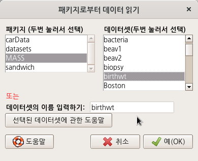

# 데이터셋 / `datasets`

## Prestige - `carData > Prestige`


```{r dataset-prestige, eval = FALSE}
data(Prestige, package="carData")
```


```{r dataset-prestige-help, eval = FALSE}
help("Prestige")
```

carData 패키지에 있는 Prestige 데이터셋을 `.csv`로 저장하여 내보낼 수 있다.

[다운로드](data/Prestige.csv)

참조: [활성 데이터셋 내보내기...](https://rcmdr.tistory.com/52)


## Moore - `carData > Moore`


```{r moore-dataset, eval = FALSE}
data(Moore, package="carData")
```


```{r moore-help, eval = FALSE}
help("Moore")
```

상기 명령 실행을 통해서 `Moore` 데이터셋에 대한 상세 정보를 얻을 수 있다.

```{r moore, echo = FALSE, results = "asis"}
# R 패키지 도움말을 R 마크다운 문서에 삽입하는 방법
# https://stackoverflow.com/questions/26480559/r-markdown-file-include-help-information
static_help <- function(pkg, topic, out, links = tools::findHTMLlinks()) {
  pkgRdDB = tools:::fetchRdDB(file.path(find.package(pkg), 'help', pkg))
  force(links)
  tools::Rd2HTML(pkgRdDB[[topic]], out, package = pkg,
                 Links = links, no_links = is.null(links))
}
tmp <- tempfile()
static_help("carData", "Moore", tmp)
out <- readLines(tmp)
headfoot <- grep("body", out)
cat(out[(headfoot[1] + 1):(headfoot[2] - 1)], sep = "\n")
```


## OBrienKaiser - `carData > OBrienKaiser`

`carData` 패키지에 있는  `OBrienKaiser` 데이터셋이다. `carData` 패키지는 `Rcmdr` 패키지가 호출될 때 자동으로 함께 호출되기 때문에 **R Commander**에서 `carData` 패키지에 포함된 데이터셋들을 자유롭게 호출할 수 있다. 

[Read data set from an attached package...](https://rcmdr.kr/37)

OBrienKaiser 데이터셋은 R Commander에서 활성 데이터셋으로 이용할 수 있다. 그러나 '통계 > 요약 > 활성데이터셋' 기능은 사용할 수 없다. 다음과 같은 오류문을 Rgui 창에서 보게된다.

 
> Error in sprintf(gettextRcmdr("There are %d variables in the data set %s.\nDo you want to proceed?"),  : 
>  '%d'는 유효하지 않은 포맷입니다; 문자형 객체들에는 포맷 %s를 사용해주세요


입력창에 str(OBrienKaiser) 함수를 입력하고 실행하여 OBrienKaiser 데이터셋의 구조를 살펴보자.


입력창에 `summary(OBrienKaiser)` 함수를 입력하고 실행하여 요약 정보를 살펴보자.


```{r obrien-help, echo = FALSE, results = "asis"}
# R 패키지 도움말을 R 마크다운 문서에 삽입하는 방법
# https://stackoverflow.com/questions/26480559/r-markdown-file-include-help-information
static_help <- function(pkg, topic, out, links = tools::findHTMLlinks()) {
  pkgRdDB = tools:::fetchRdDB(file.path(find.package(pkg), 'help', pkg))
  force(links)
  tools::Rd2HTML(pkgRdDB[[topic]], out, package = pkg,
                 Links = links, no_links = is.null(links))
}
tmp <- tempfile()
static_help("carData", "OBrienKaiser", tmp)
out <- readLines(tmp)
headfoot <- grep("body", out)
cat(out[(headfoot[1] + 1):(headfoot[2] - 1)], sep = "\n")
```


## OBrienKaiserLong - `carData > OBrienKaiserLong`

`OBrienKaiserLong` 데이터셋은 `carData` 패키지에 포함되어 있다. 
`carData` 패키지는 `Rcmdr` 패키지가 호출될 때 자동으로 함께 호출되기 때문에, `OBrienKaiserLong` 데이터셋을 R Commander에서 메뉴기능을 통해서 활성데이터셋으로 불러올 수 있다.

통계> 요약 > 활성 데이터셋 메뉴를 통하여 OBrienKaiserLong  데이터셋의 요약정보를 확인할 수 있다.


`summary()` 함수를 이용한 것을 알 수 있다.


`str()` 함수를 활용하여 입력창에 직접 `str(OBrienKaiserLong)`을 입력하고 실행하여, 출력창에 다음과 같이 `OBrienKaiserLong` 데이터셋의 구조적 정보도 확인할 수 있다.


R Commander 화면에서 <데이터셋 보기> 버튼을 누르면 다음과 같은 내부 구성을 볼 수 있다:


```{r obrien-long, eval = FALSE}
head(OBrienKaiserLong, 1) # first subject
```


```{r obrien-help-long, echo = FALSE, results = "asis"}
# R 패키지 도움말을 R 마크다운 문서에 삽입하는 방법
# https://stackoverflow.com/questions/26480559/r-markdown-file-include-help-information
static_help <- function(pkg, topic, out, links = tools::findHTMLlinks()) {
  pkgRdDB = tools:::fetchRdDB(file.path(find.package(pkg), 'help', pkg))
  force(links)
  tools::Rd2HTML(pkgRdDB[[topic]], out, package = pkg,
                 Links = links, no_links = is.null(links))
}
tmp <- tempfile()
static_help("carData", "OBrienKaiserLong", tmp)
out <- readLines(tmp)
headfoot <- grep("body", out)
cat(out[(headfoot[1] + 1):(headfoot[2] - 1)], sep = "\n")
```


## airquality - `datasets > airquality`


R이 시작될 때, datasets 패키지가 자동으로 호출된다. 따라서 R Commander를 실행할 때, datasets 패키지는 첨부 패키지화되어 메뉴창을 통해서 내부 데이터셋을 찾고 불러올 수 있다.

메뉴창에서 순서대로 데이터 > 패키지에 있는 데이터 > 첨부된 패키지에서 데이터셋 읽기... 를 선택하면 다음과 같은 창이 등장한다.


출력창을 보면, airquality라는 데이터셋에는 6개의 변수가 있고, 각 변수는 수치형 정보를 담고 있다.


Month 변수는 최소 5에서 최대 9로 값이 있는데, 정확히는 5월부터 9월까지일 것이다. 한달 한달을 뜻하는 월(month)은 5월이 9월보다 크다고 할 수 없고, 5월, 6월, 7월, 8월, 9월 등으로 개체화되어 분리된다. 다시 말하면, 요인형 변수가 되어야 한다는 뜻이다.

그럼 왜, airqualty 데이터셋의 Month 변수는 수치형으로 되어 있을까. 원자료를 R의 데이터셋으로 불러오는 과정에서 해당 변수의 요인화과정이 생략되었을 것이다.

```{r airquality-help, echo = FALSE, results = "asis"}
# R 패키지 도움말을 R 마크다운 문서에 삽입하는 방법
# https://stackoverflow.com/questions/26480559/r-markdown-file-include-help-information
static_help <- function(pkg, topic, out, links = tools::findHTMLlinks()) {
  pkgRdDB = tools:::fetchRdDB(file.path(find.package(pkg), 'help', pkg))
  force(links)
  tools::Rd2HTML(pkgRdDB[[topic]], out, package = pkg,
                 Links = links, no_links = is.null(links))
}
tmp <- tempfile()
static_help("datasets", "airquality", tmp)
out <- readLines(tmp)
headfoot <- grep("body", out)
cat(out[(headfoot[1] + 1):(headfoot[2] - 1)], sep = "\n")
```


## Bfox - `carData > Bfox`


```{r dataset-bfox, eval = FALSE}
data(Bfox, package="carData")
```


Bfox 데이터셋이 활성화되었다면, 도움말 기능을 통하여 데이터셋의 정보를 확인할 수 있다.


```{r Bfox-help, echo = FALSE, results = "asis"}
# R 패키지 도움말을 R 마크다운 문서에 삽입하는 방법
# https://stackoverflow.com/questions/26480559/r-markdown-file-include-help-information
static_help <- function(pkg, topic, out, links = tools::findHTMLlinks()) {
  pkgRdDB = tools:::fetchRdDB(file.path(find.package(pkg), 'help', pkg))
  force(links)
  tools::Rd2HTML(pkgRdDB[[topic]], out, package = pkg,
                 Links = links, no_links = is.null(links))
}
tmp <- tempfile()
static_help("carData", "Bfox", tmp)
out <- readLines(tmp)
headfoot <- grep("body", out)
cat(out[(headfoot[1] + 1):(headfoot[2] - 1)], sep = "\n")
```

## sleep - `datasets > sleep`


```{r dataset-sleep, eval = FALSE}
data(sleep, package="datasets")
summary(sleep)
str(sleep)

```

데이터셋의 내부는 다음과 같다:


```{r sleep-help, echo = FALSE, results = "asis"}
# R 패키지 도움말을 R 마크다운 문서에 삽입하는 방법
# https://stackoverflow.com/questions/26480559/r-markdown-file-include-help-information
static_help <- function(pkg, topic, out, links = tools::findHTMLlinks()) {
  pkgRdDB = tools:::fetchRdDB(file.path(find.package(pkg), 'help', pkg))
  force(links)
  tools::Rd2HTML(pkgRdDB[[topic]], out, package = pkg,
                 Links = links, no_links = is.null(links))
}
tmp <- tempfile()
static_help("datasets", "sleep", tmp)
out <- readLines(tmp)
headfoot <- grep("body", out)
cat(out[(headfoot[1] + 1):(headfoot[2] - 1)], sep = "\n")
```


## DavisThin - `carData > DavisThin`


```{r dataset-davis, eval = FALSE}
help("DavisThin")
```

```{r DavisThin-help, echo = FALSE, results = "asis"}
# R 패키지 도움말을 R 마크다운 문서에 삽입하는 방법
# https://stackoverflow.com/questions/26480559/r-markdown-file-include-help-information
static_help <- function(pkg, topic, out, links = tools::findHTMLlinks()) {
  pkgRdDB = tools:::fetchRdDB(file.path(find.package(pkg), 'help', pkg))
  force(links)
  tools::Rd2HTML(pkgRdDB[[topic]], out, package = pkg,
                 Links = links, no_links = is.null(links))
}
tmp <- tempfile()
static_help("carData", "DavisThin", tmp)
out <- readLines(tmp)
headfoot <- grep("body", out)
cat(out[(headfoot[1] + 1):(headfoot[2] - 1)], sep = "\n")
```


## USArrests - `datasets > USArrests`


```{r usarrest, eval = FALSE}
data(USArrests, package="datasets")
```


R Commander 화면 상단에서 <데이터셋 보기> 버튼을 누르면 아래와 같은 내부 구성을 확인할 수 있다.


```{r usarrest-help-dataset, eval = FALSE}
help("USArrests")
```


```{r usarrest-help, echo = FALSE, results = "asis"}
# R 패키지 도움말을 R 마크다운 문서에 삽입하는 방법
# https://stackoverflow.com/questions/26480559/r-markdown-file-include-help-information
static_help <- function(pkg, topic, out, links = tools::findHTMLlinks()) {
  pkgRdDB = tools:::fetchRdDB(file.path(find.package(pkg), 'help', pkg))
  force(links)
  tools::Rd2HTML(pkgRdDB[[topic]], out, package = pkg,
                 Links = links, no_links = is.null(links))
}
tmp <- tempfile()
static_help("datasets", "USArrests", tmp)
out <- readLines(tmp)
headfoot <- grep("body", out)
cat(out[(headfoot[1] + 1):(headfoot[2] - 1)], sep = "\n")
```

## birthwt - `MASS > birthwt`



```{r birthwt, eval = FALSE}
data(birthwt, package="MASS")

```


birthwt 데이터셋이 활성화된 후, <데이터셋 보기> 버튼을 누르면 아래와 같이 내부 구성을 볼 수 있다:


```{r birthwt-help-cmd, eval = FALSE}
help("birthwt")
```


```{r birthwt-help, echo = FALSE, results = "asis"}
# R 패키지 도움말을 R 마크다운 문서에 삽입하는 방법
# https://stackoverflow.com/questions/26480559/r-markdown-file-include-help-information
static_help <- function(pkg, topic, out, links = tools::findHTMLlinks()) {
  pkgRdDB = tools:::fetchRdDB(file.path(find.package(pkg), 'help', pkg))
  force(links)
  tools::Rd2HTML(pkgRdDB[[topic]], out, package = pkg,
                 Links = links, no_links = is.null(links))
}
tmp <- tempfile()
static_help("MASS", "birthwt", tmp)
out <- readLines(tmp)
headfoot <- grep("body", out)
cat(out[(headfoot[1] + 1):(headfoot[2] - 1)], sep = "\n")
```


## Friendly - `carData > Friendly`


```{r data-friendly, eval = FALSE}
data(Friendly, package="carData")
```


```{r data-friendly-help, eval = FALSE}
help("Friendly")
```

```{r friendly-help, echo = FALSE, results = "asis"}
# R 패키지 도움말을 R 마크다운 문서에 삽입하는 방법
# https://stackoverflow.com/questions/26480559/r-markdown-file-include-help-information
static_help <- function(pkg, topic, out, links = tools::findHTMLlinks()) {
  pkgRdDB = tools:::fetchRdDB(file.path(find.package(pkg), 'help', pkg))
  force(links)
  tools::Rd2HTML(pkgRdDB[[topic]], out, package = pkg,
                 Links = links, no_links = is.null(links))
}
tmp <- tempfile()
static_help("carData", "Friendly", tmp)
out <- readLines(tmp)
headfoot <- grep("body", out)
cat(out[(headfoot[1] + 1):(headfoot[2] - 1)], sep = "\n")
```

## Cowles - `carData > Cowles`


```{r dataset-cowles, eval = FALSE}
data(Cowles, package="carData")
```


```{r dataset-cowles-help, eval = FALSE}
help("Cowles")
```

```{r Cowles-help, echo = FALSE, results = "asis"}
# R 패키지 도움말을 R 마크다운 문서에 삽입하는 방법
# https://stackoverflow.com/questions/26480559/r-markdown-file-include-help-information
static_help <- function(pkg, topic, out, links = tools::findHTMLlinks()) {
  pkgRdDB = tools:::fetchRdDB(file.path(find.package(pkg), 'help', pkg))
  force(links)
  tools::Rd2HTML(pkgRdDB[[topic]], out, package = pkg,
                 Links = links, no_links = is.null(links))
}
tmp <- tempfile()
static_help("carData", "Cowles", tmp)
out <- readLines(tmp)
headfoot <- grep("body", out)
cat(out[(headfoot[1] + 1):(headfoot[2] - 1)], sep = "\n")
```

## Adler - `carData > Adler`


데이터 > 패키지에 있는 데이터 > 첨부된 패키지에서 데이터셋 읽기... 기능을 선택하면, 위와 같은 메뉴 창을 보게된다.

carData를 선택하여 두번 클릭하면, 오른쪽에 carData 패키지에 내장된 데이터셋 목록이 등장한다. Adler 데이터셋을 선택한다.


```{r adler, eval = FALSE}
data(Adler, package="carData")  # Adler 데이터셋 활성화시키기
help("Adler", package="carData")# 도움말파일 열기
```


```{r adler-help, echo = FALSE, results = "asis"}
# R 패키지 도움말을 R 마크다운 문서에 삽입하는 방법
# https://stackoverflow.com/questions/26480559/r-markdown-file-include-help-information
static_help <- function(pkg, topic, out, links = tools::findHTMLlinks()) {
  pkgRdDB = tools:::fetchRdDB(file.path(find.package(pkg), 'help', pkg))
  force(links)
  tools::Rd2HTML(pkgRdDB[[topic]], out, package = pkg,
                 Links = links, no_links = is.null(links))
}
tmp <- tempfile()
static_help("carData", "Adler", tmp)
out <- readLines(tmp)
headfoot <- grep("body", out)
cat(out[(headfoot[1] + 1):(headfoot[2] - 1)], sep = "\n")
```

## warpbreaks - `datasets > warpbreaks`


```{r warpbreaks, eval = FALSE}
data(warpbreaks, package="datasets") # 데이터셋 불러오기	
help("warpbreaks")                   # 데이터셋 도움말 보기
summary(warpbreaks)                  # 데이터셋 통계 요약 보기

```


R Commander 화면 상단 우측에 있는 <데이터셋 보기> 버튼을 누른다. 아래와 같이 warpbreaks 데이터셋의 내부 구성을 볼 수 있다.


```{r warpbreaks-help, echo = FALSE, results = "asis"}
# R 패키지 도움말을 R 마크다운 문서에 삽입하는 방법
# https://stackoverflow.com/questions/26480559/r-markdown-file-include-help-information
static_help <- function(pkg, topic, out, links = tools::findHTMLlinks()) {
  pkgRdDB = tools:::fetchRdDB(file.path(find.package(pkg), 'help', pkg))
  force(links)
  tools::Rd2HTML(pkgRdDB[[topic]], out, package = pkg,
                 Links = links, no_links = is.null(links))
}
tmp <- tempfile()
static_help("datasets", "warpbreaks", tmp)
out <- readLines(tmp)
headfoot <- grep("body", out)
cat(out[(headfoot[1] + 1):(headfoot[2] - 1)], sep = "\n")
```

