# 분포 / `distribution`

## 난수생성기 시드(seed) 생성기... / Distributions > Set random number generator seed...

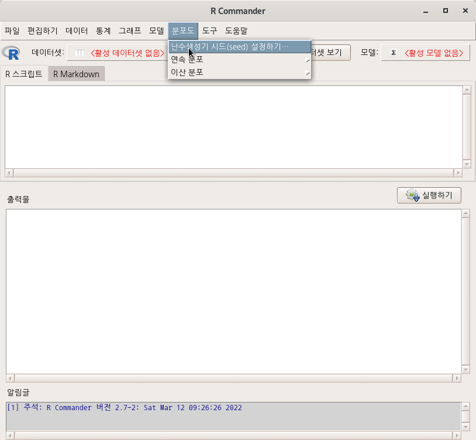


번호 하나를 선택한다. 그 번호는 앞으로 생성되는 난수 값들을 기억한다.


```r
set.seed(9723)
```

## 분포도

### 연속 분포 > 정규 분포 > 정규 분위수.../ Distributions > Continuous distributions > Normal distribution > Normal quantiles...

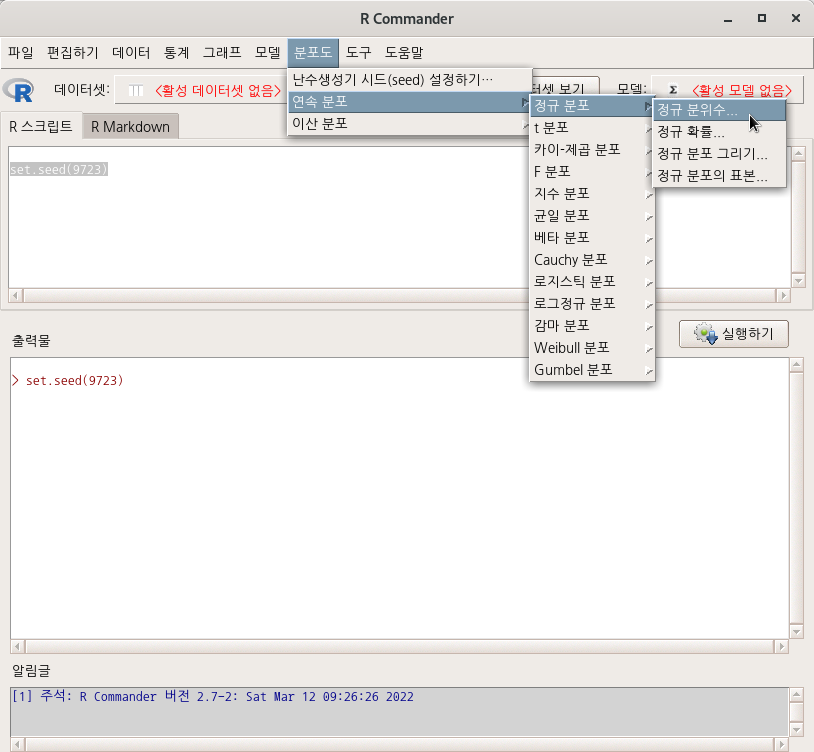


확률을 넣고, 분포도의 (꼬리) 방향을 정해주면, 분위수가 계산된다. <확률>을 95%(.095)로 선택해보자. <낮은쪽 꼬리/높은쪽 꼬리> 선택에 따라 어떻게 값이 변하는지 살펴보자.

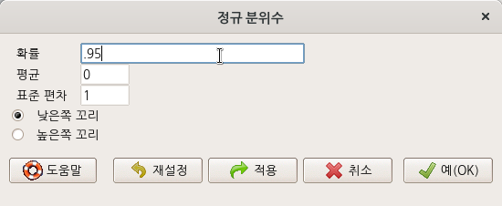


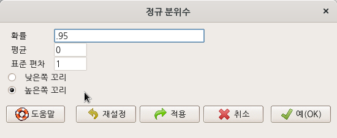


```r
qnorm(c(.95), mean=0, sd=1, lower.tail=TRUE)
```

```
## [1] 1.644854
```

```r
qnorm(c(.95), mean=0, sd=1, lower.tail=FALSE)
```

```
## [1] -1.644854
```

아래 화면에서 95% 확률로 <낮은쪽 꼬리/높은쪽 꼬리> 방향의 값을 확인할 수 있다.

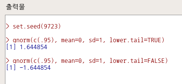

### 연속 분포 > 정규 분포 > 정규 확률.../ Distributions > Continuous distributions > Normal distribution > Normal probabilities...

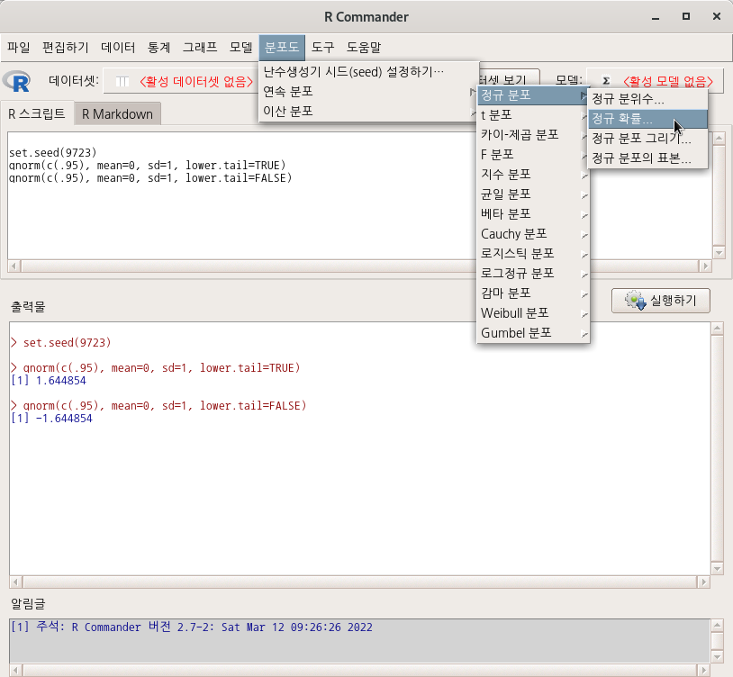


사례 값을 넣고, 분포도의 (꼬리) 방향을 정해주면 확률이 계산된다.

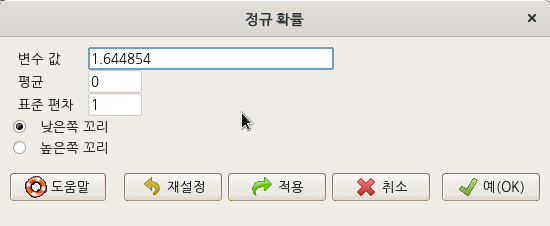


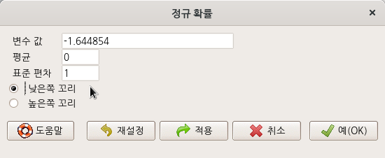

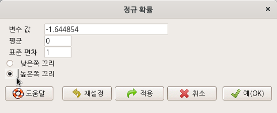


```r
pnorm(c(1.644854), mean=0, sd=1, lower.tail=TRUE)
```

```
## [1] 0.95
```

```r
pnorm(c(1.644854), mean=0, sd=1, lower.tail=FALSE)
```

```
## [1] 0.04999996
```

```r
pnorm(c(-1.644854), mean=0, sd=1, lower.tail=TRUE)
```

```
## [1] 0.04999996
```

```r
pnorm(c(-1.644854), mean=0, sd=1, lower.tail=FALSE)
```

```
## [1] 0.95
```

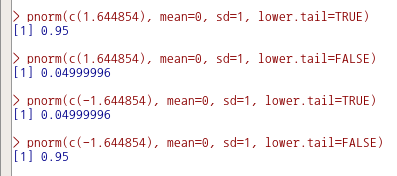


### 연속 분포 > 정규 분포 > 정규 분포 그리기... / Distributions > Continuous distributions > Normal distribution > Plot normal distribution...

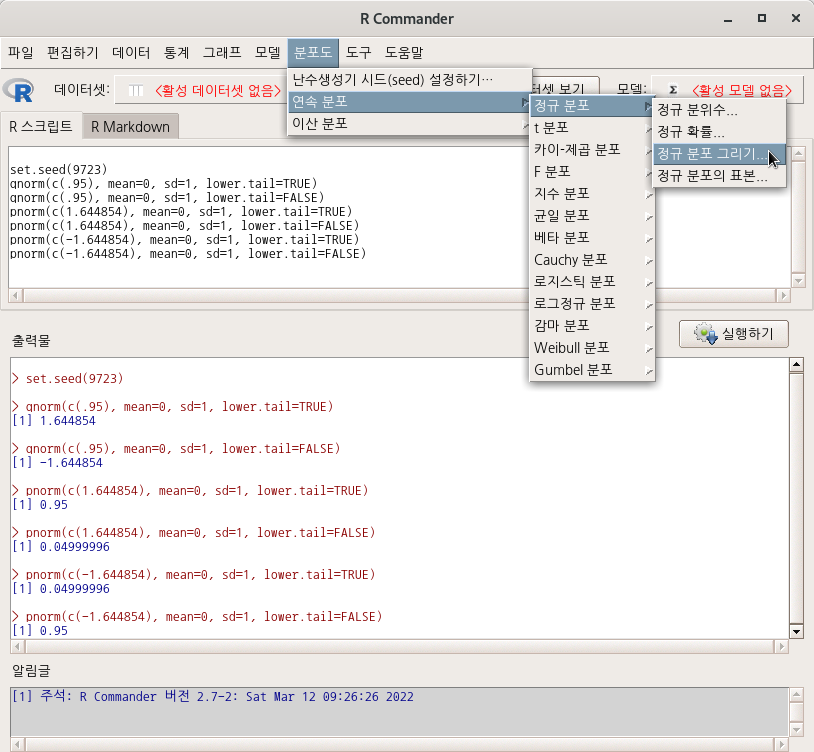

<밀도 함수 그리기 (Plot density function)>를 선택하고 <x-값>을 선택한 상황에서 몇 몇 사례를 만들어본다.

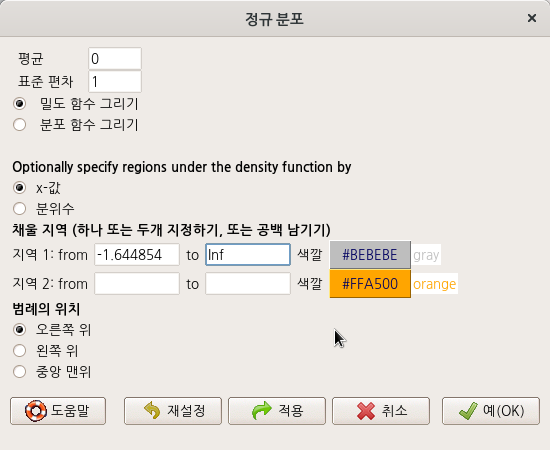


```r
local({
  .x <- seq(-3.291, 3.291, length.out=1000)  
  plotDistr(.x, dnorm(.x, mean=0, sd=1), cdf=FALSE, xlab="x", ylab="Density", 
  main=paste("Normal Distribution:  Mean=0, Standard deviation=1"), regions=list(c(-1.644854, Inf)), 
  col=c('#BEBEBE', '#FFA500'), legend.pos='topright')
})
```

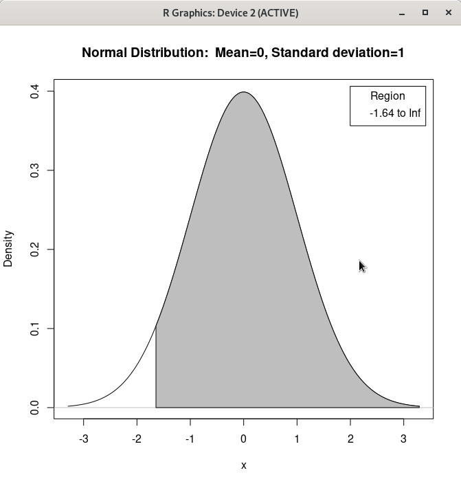

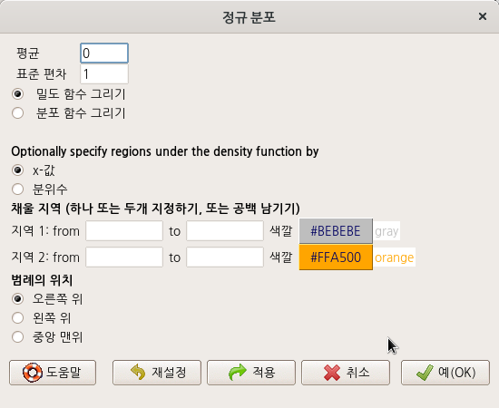

```r
local({
  .x <- seq(-3.291, 3.291, length.out=1000)  
  plotDistr(.x, dnorm(.x, mean=0, sd=1), cdf=FALSE, xlab="x", ylab="Density", 
  main=paste("Normal Distribution:  Mean=0, Standard deviation=1"))
})
```


```r
local({
  .x <- seq(-3.291, 3.291, length.out=1000)  
  plotDistr(.x, dnorm(.x, mean=0, sd=1), cdf=FALSE, xlab="x", ylab="Density", 
  main=paste("Normal Distribution:  Mean=0, Standard deviation=1"), regions=list(c(1.96, Inf), c(-Inf, 
  -1.96)), col=c('#BEBEBE', '#FFA500'), legend.pos='topright')
})
```

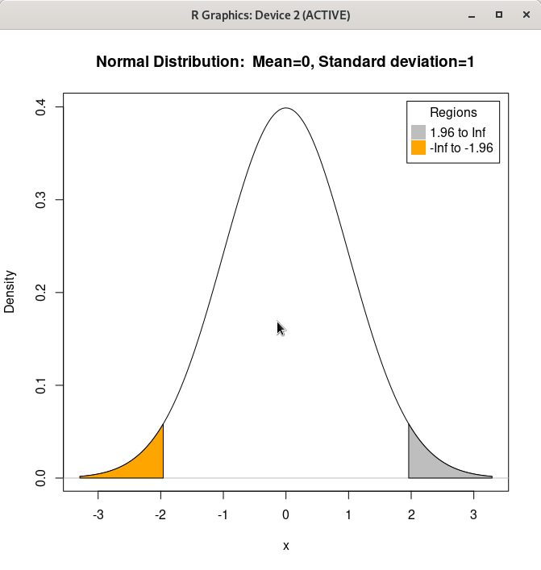

<밀도 함수 그리기 (Plot density function)>를 선택하고 <분위수>를 선택한 상황에서 몇 몇 사례를 만들어본다.

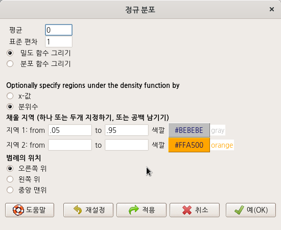

<분위수>에 입력할 수 있는 범위는 0에서 1까지의 확률이다. 이 범위 안에 들어오는 숫자는 아래 명령문 내부 regions에서 보이듯이 분위수로 전환된다.


```r
local({
  .x <- seq(-3.291, 3.291, length.out=1000)  
  plotDistr(.x, dnorm(.x, mean=0, sd=1), cdf=FALSE, xlab="x", ylab="Density", 
  main=paste("Normal Distribution:  Mean=0, Standard deviation=1"), regions=list(c(-1.64485362695147, 
  1.64485362695147)), col=c('#BEBEBE', '#FFA500'), legend.pos='topright')
})
```


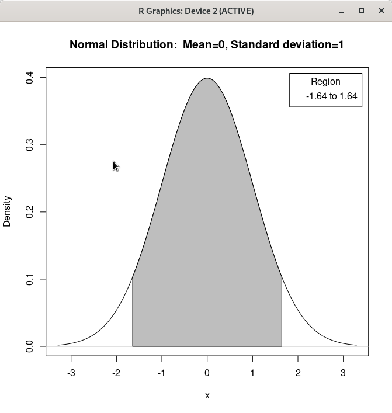

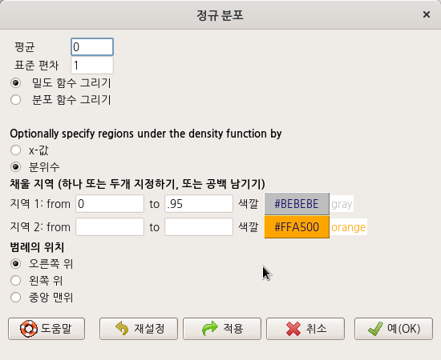


```r
local({
  .x <- seq(-3.291, 3.291, length.out=1000)  
  plotDistr(.x, dnorm(.x, mean=0, sd=1), cdf=FALSE, xlab="x", ylab="Density", 
  main=paste("Normal Distribution:  Mean=0, Standard deviation=1"), regions=list(c(-Inf, 
  1.64485362695147)), col=c('#BEBEBE', '#FFA500'), legend.pos='topright')
})
```


```r
local({
  .x <- seq(-3.291, 3.291, length.out=1000)  
  plotDistr(.x, dnorm(.x, mean=0, sd=1), cdf=FALSE, xlab="x", ylab="Density", 
  main=paste("Normal Distribution:  Mean=0, Standard deviation=1"), regions=list(c(-Inf, 
  1.64485362695147), c(2.32634787404084, Inf)), col=c('#BEBEBE', '#FFA500'), legend.pos='topright')
})
```


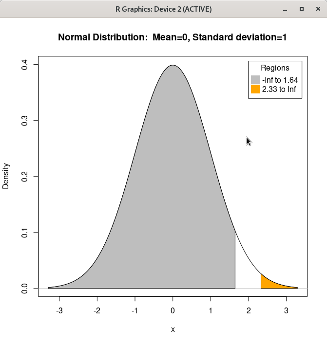


### 연속 분포 > 정규 분포 > 정규 분포의 표본.../ Distributions > Continuous distributions > Normal distributions > Sample from normal distribution...

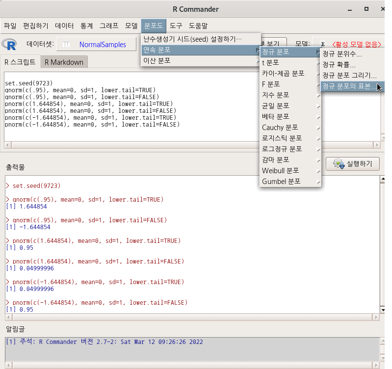

<정규 분포의 표본> 창에는 다양한 선택 기능이 있다. 표본의 수 (행)과 관찰 수 (열)에 표본 범위를 넣자. '데이터셋의 이름 입력하기'에는 원하는 이름을 넣을 수 있다. 나는 set.seed(번호)를 연상시키는 번호를 입력하기도 한다.


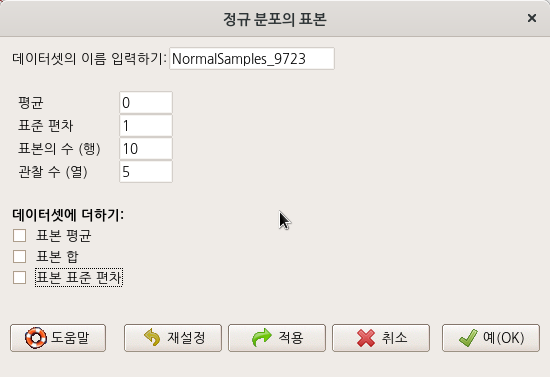


```r
set.seed(9723)
NormalSamples_9723 <- as.data.frame(matrix(rnorm(10*5, mean=0, sd=1), ncol=5))
rownames(NormalSamples_9723) <- paste("sample", 1:10, sep="")
colnames(NormalSamples_9723) <- paste("obs", 1:5, sep="")
```

[Set random number generator seed...](https://rcmdr.tistory.com/158) 참고

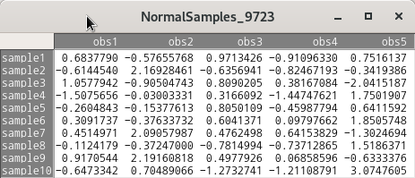

## 이산분포 / Discrete distributions


