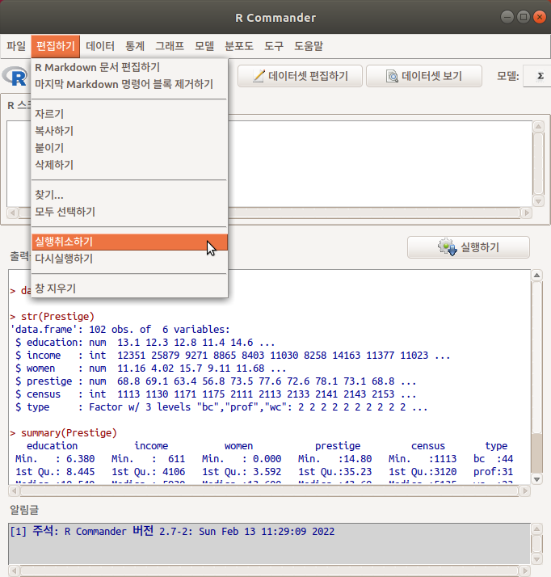
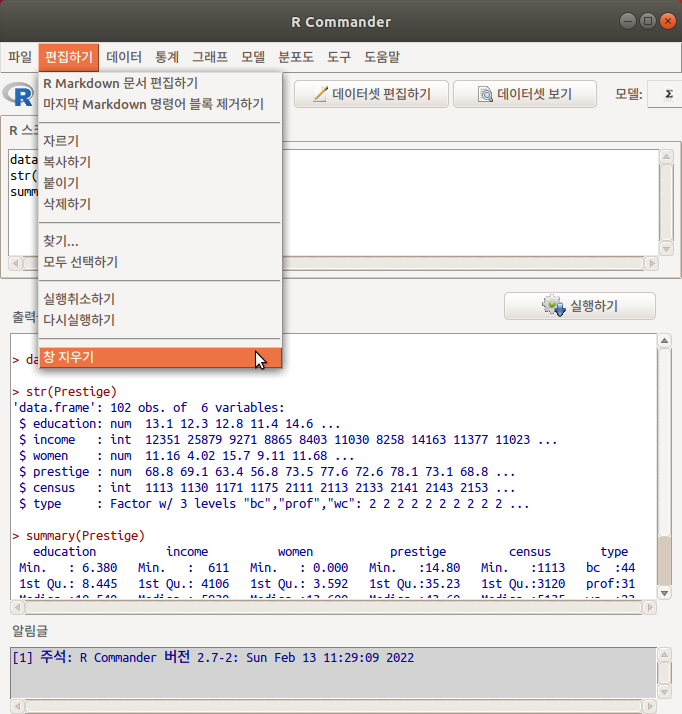
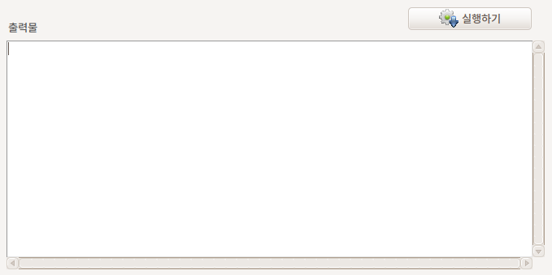

# 편집 / Edit

## Edit/Edit R Markdown document

## 마지막 Markdown 명령어 블록 제거하기 / Edit > Remove last Markdown command block


(이 기능의 효과를 솔직히 모르겠다)

## 자르기 / Edit > Cut

## 복사하기 / Edit > Copy

## 붙이기 / Edit > Paste

## 삭제하기 / Edit > Delete

## 찾기 / Edit > Find...

스크립트 창에서 원하는 문자열의 위치를 찾는다.  긴 스크립트인 경우, 효과적으로 사용할 수 있다.

## 모두 선택하기 / Edit > Select all

스크립트창의 내용 모두를 선택할 수 있다.

## 뒤돌리기 / Edit > Undo

바로 앞 단계의 작업으로 되돌아간다.

 

입력창의 내용이 지워졌다고 가정하자. (가슴이 철렁할 것이다) 어떤 내용을 입력했는지 기억하기 어렵고, 다시 입력하는데 불편함을 느낄 것이다. 이 때 <실행취소하기> 기능을 사용할 수 있다. 앞선 화면에서 지워진 입력창의 내용이 이 기능을 이용하면 다시 되살아난다:

 
 

간혹, 복잡해진 출력창을 지우려다가 입력창을 지우는 경우가 있을 수 있다. 마우스의 커서가 있는 곳이 지워지기 때문이다. 이 때 <실행취소하기> 기능을 이용하여 잘못 지워진 창의 내용을 되살릴 수 있다.

## 다시하기 / Edit > Redo

Undo 명령으로 앞 단계로 (후퇴하여) 되돌아간 상태에서 다시 앞의 단계로 전진하기 위하여 사용한다. Undo는 계속 뒤로 돌아가는 명령이며, Redo는 계속 앞으로 되돌아 나아가는 명령이다.

## 창 지우기 / Edit > Clear window

 



입력창 또는 출력창이 복잡해 보일 경우, 그래서 그 창을 지우고 다시 새롭게 입력창에서 작업하거나, 출력창으로 보고 싶을 때 사용하는 기능이다. 입력된 스크립트를 정돈하여 저장하거나, 출력물을 정돈하여 출력파일을 만들 때 활용된다.

 

예를 들어, 데이터셋을 불러오고, 데이터의 내부구조를 살펴보고, 요약정보를 보고자 한다면 다음과 같은 스크립트를 입력하고 또 출력해서 보게될 것이다:


```r
data(Prestige) # car 패키지의 Prestige 데이터셋 불러오기

str(Prestige)  # Prestige 데이터셋의 내부구조 보기

summary(Prestige) # Prestige 데이터셋 요약정보 보기
```


이 때, <창 지우기> 기능을 사용하면 창에 기록된 내용이 지워진다.



 

 

지워지는 창은 마우스의 커서가 있는 곳이다. 입력창에 마우스 커서가 있는 경우에 <창 지우기>를 하면 입력창이 지워지고, 출력창에 마우스 커서가 있는 경우에 <창 지우기>를 하면 출력창이 지워진다.
