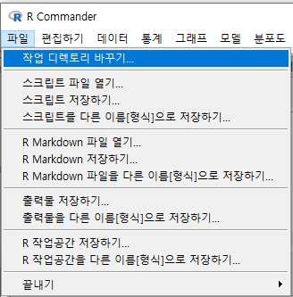
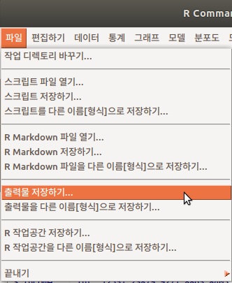
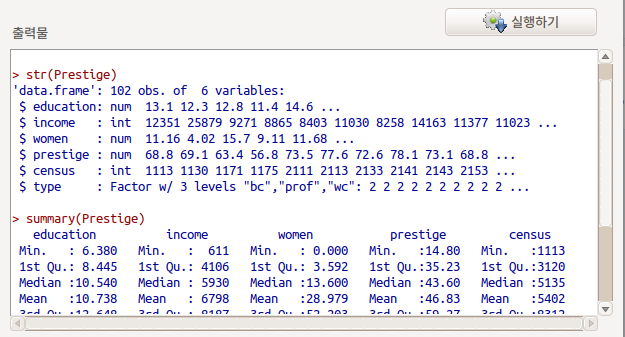
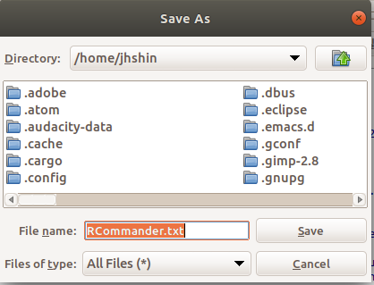
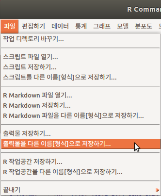

# 파일 / `File`

## 작업 디렉토리 바꾸기.../ File > Change working directory...

 

R이 시작되는 곳, 불러올 데이터가 보관되는 곳, 그리고 데이터를 저장할 곳이 다른 경우가 흔히 발생한다. 흔히 '경로' 변경과 관련된 일인데, 일일이 수작업으로 입력하기가 불편하다. GUI 환경에서 R 작업을 할 때, 효과적인 영역이다.

- MS-Windows 경우, user > 문서 경로부터 화면이 시작된다.

관련된 함수는 `getwd()`, `setwd()` 등이 있다.

## 스크립트 파일 열기.../ File > Open script file...


`.R` 형식의 스크립트 파일을 만드는 것은 R을 사용하는 데이터과학자의 일반적인 활동이다. 때로는 길게, 때로는 짧게 .R 파일들을 만든다. 저장된 파일을 다시 불러서 추가적인 작업을 하거나, 코드를 고치거나, 때로는 다른 사용자가 만든 .R 파일을 불러와 작업을 하는 것이 흔하다.

`.R` 파일은 일반적으로 문서 편집기로 작업을 할 수 있다. **R Commander**는 입력창과 출력창을 나눠서 작업이 가능하기 때문에, 입력창을 문서 편집기처럼 활용해서 .R 파일을 작업할 수 있다.


## 스크립트 저장하기.../ File > Save script...


R Commander의 입력창에서 작업한 내용을 .R 파일 형식으로 저장한다. 저장하는 작업공간을 선택 또는 변경할 수 있다.

RCommander.R이 기본설정으로 스크립트 이름이 나온다. 원하는 이름으로 변경하여 사용하자.

## 스크립트 다른 이름으로 저장하기.../ File > Save script as...

작업한 스크립트 파일을 다른 이름으로 저장한다.  기본으로 설정된 파일 이름은 RCommander.R이다. 이름을 원하는 것으로 변경한다.

## Open R Markdown file...

R의 Reproducible Research 분야에서 온라인 웹보고서용으로 최근 크게 부각되는 형식이 Markdown이다. 제작된 R Markdown 파일을 불러오는데 사용하는 기능이다.

## R Markdown 파일 저장하기.../ File > Save R Markdown file..

R Markdown 파일을 (원하는 위치에) 저장한다.

## R Markdown 파일을 다른 이름으로 저장하기.../ File > Save R Markdown file as...

R Markdown file을 열고 작업한 뒤에, 새로운 이름으로 변경하여 원하는 위치에 저장한다.

## 출력물 저장하기.../ File > Save output...

 


출력창에 다음과 같은 내용들이 있다고 가정하자:


  


출력창에 나온 결과 값들을 파일로 저장한다. 이 파일은 기본설정으로 RCommander .txt 형식으로 되어있는데, 이름을 자유롭게 변경하여 저장할 수 있다.

 


RCommander.txt라는 이름으로 출력물을 파일로 저장하였다고 가정하자. 텍스트파일을 열고 편집할 수 있는 편집기를 열고 살펴보면 다음과 같이 저장된 것을 볼 것이다:


```r
library(carData)

data("Prestige")

str(Prestige)
```

```
## 'data.frame':	102 obs. of  6 variables:
##  $ education: num  13.1 12.3 12.8 11.4 14.6 ...
##  $ income   : int  12351 25879 9271 8865 8403 11030 8258 14163 11377 11023 ...
##  $ women    : num  11.16 4.02 15.7 9.11 11.68 ...
##  $ prestige : num  68.8 69.1 63.4 56.8 73.5 77.6 72.6 78.1 73.1 68.8 ...
##  $ census   : int  1113 1130 1171 1175 2111 2113 2133 2141 2143 2153 ...
##  $ type     : Factor w/ 3 levels "bc","prof","wc": 2 2 2 2 2 2 2 2 2 2 ...
```

```r
summary(Prestige)
```

```
##    education          income          women           prestige    
##  Min.   : 6.380   Min.   :  611   Min.   : 0.000   Min.   :14.80  
##  1st Qu.: 8.445   1st Qu.: 4106   1st Qu.: 3.592   1st Qu.:35.23  
##  Median :10.540   Median : 5930   Median :13.600   Median :43.60  
##  Mean   :10.738   Mean   : 6798   Mean   :28.979   Mean   :46.83  
##  3rd Qu.:12.648   3rd Qu.: 8187   3rd Qu.:52.203   3rd Qu.:59.27  
##  Max.   :15.970   Max.   :25879   Max.   :97.510   Max.   :87.20  
##      census       type   
##  Min.   :1113   bc  :44  
##  1st Qu.:3120   prof:31  
##  Median :5135   wc  :23  
##  Mean   :5402   NA's: 4  
##  3rd Qu.:8312            
##  Max.   :9517
```

저장할 파일의 이름을 결정하고, 파일로 저장한 이후에 <출력물 저장하기...> 기능은 출력물을 계속 업데이트해서 저장하는데 반복적으로 사용한다.

## 출력물을 다른 이름으로 저장하기.../ File > Save output as...




출력 결과를 다른 이름으로 원하는 위치에 저장할 수 있다. 기본 설정된 파일 이름은 RCommander.txt 인데, 이름을 바꿔서 저장한다. 

 


자료처리와 분석과정에서 여러 개의 출력물을 만드는 것이 일반적이다. 하나의 파일에 길고 많은 양의 출력파일을 만들기도 하지만, 분석과정에서 다양하게 분류될 수 있는 분석범주들을 구성할 때가 흔히 발생하기 때문이다. 출력물을 원하는 곳에 원하는 이름으로 저장하는데 쓰이는 기능으로 자주 활용된다.


## R 작업공간 저장하기.../ File > Save R workspace...


작업공간에서 만든/생성된 하나 이상의 객체를 원하는 이름의 파일로 저장할 수 있다. .RData 파일 형식인데, 이름을 만들어 원하는 위치에 파일을 저장할 수 있다.


메뉴에 Data > load data set... 이 있다. 이 기능을 통하여 저장된 R 작업공간의 객체들을 다시 불러올 수 있다.

 
## R 작업공간을 다른 이름으로 저장하기.../ File > Save R workspace as...


R 작업공간의 이름을 바꿀 수 있다. 이름을 바꾼다는 것은 앞서 생산한 작업공간 파일(.RData)을 불러들여서 추가 작업을 진행한 것을 뜻할 것이다.

## 나가기 > Commander와 R에서 / File > Exit > From Commander and R

 

- Exit?
- Save script file?
- Save R Markdown file?
- Save output file? 등의 추가 질문을 받는다.


File 메뉴에 있는  기능들과 동일하다. 사용자로 하여금 '시간과 노력을 들여 작업한 내용을' 저장없이 잃어버리는 것을 환기시키기 위하여 제공된다.

* 터미날의 쉘 환경으로 돌아간다. 그런데 아쉬운 점이 하나 발생한다. 다시 R과 R Commander를 실행할 경우, 새로운 쉘을 이용해야 한다. 기존 쉘 환경에서는 입력내용이 화면에 출력되지 않는다. 예를 들어, From Commander and R을 실행하여 R을 종료한 다음, 다시 R을 실행하려고 'R'을 쉘에 입력하면, 화면에 'R'이 보이지 않는다. 하지만, R은 실행된다. 또 R 프롬프트에서도 입력이 되지 않는다.

## 나가기 > Commander에서 / File > Exit > From Commander

 

- Exit?
- Save script file?
- Save R Markdown file?
- Save output file? 등의 추가 질문을 받는다.


File 메뉴에 있는  기능들과 동일하다. 사용자로 하여금 '시간과 노력을 들여 작업한 내용을' 저장없이 잃어버리는 것을 환기시키기 위하여 제공된다.

Commander에서 나가면 R 프롬프트 상태가 된다. 다시 R Commander를 부르기 위해서 `library(Rcmdr)`, `require(Rcmdr)` 등은 작동하지 않는다. 대신 **`Commander()`**를 사용한다.

  

