# 모형 / `models`

## 활성 모델 선택하기.../ Select active model...

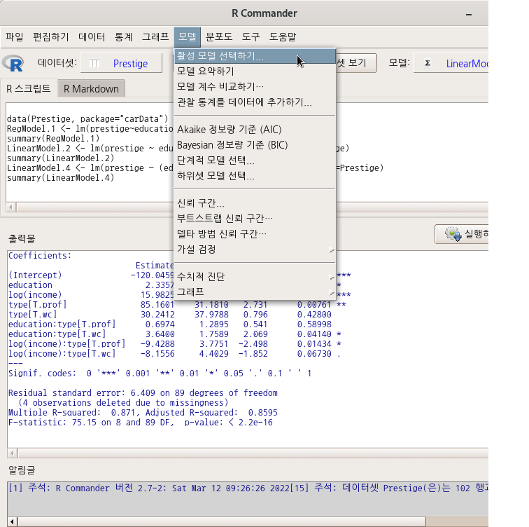

R Commander 상단에는 메뉴 목록이 있다. 오른쪽 끝부분에 <모델: 모델이름>이 활성화되면 데이터셋으로 분석 모델을 만들었다는 의미가 된다. 그런데, 여러개의 모델을 만들면서 다양한 각도로 분석적 통찰력을 키우는 경우가 일반적이다. R Commander에서는 분석과정에서 만들어진 여러개의 모델을 메모리에 상주시키고, 상황에 맞게 활용할 준비를 갖춘다. 아래의 명령문 프롬프트 창은 세개의 모델이 있음을 알린다. carData 패키지의 Prestige 데이터셋을 이용하여, 선형회귀, 선형모델 기법을 통하여 education(교육연수), income(연소득)이 prestige(직업의 사회적 권위)에 어떤 영향을 미치는가, 또 직업유형별로 차이가 있는가를 분석한다고 가정하자.


```r
data(Prestige, package="carData") # prestige 데이터셋 불러오기
RegModel.1 <- lm(prestige~education+income, data=Prestige) # 선형회귀모델1
summary(RegModel.1)
LinearModel.2 <- lm(prestige ~ education + log(income), data=Prestige)# 선형모델1
summary(LinearModel.2)
LinearModel.4 <- lm(prestige ~ (education + log(income))*type, data=Prestige)# 선형모델2
summary(LinearModel.4)
```

<활성 모델 선택하기...>기능을 선택하면 아래와 같은 모델 목록창이 등장한다. 목록에서 하나를 선택한다.

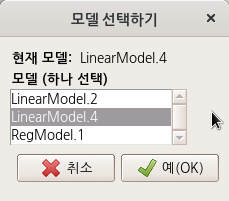


## 모델 요약하기 / Summarize model

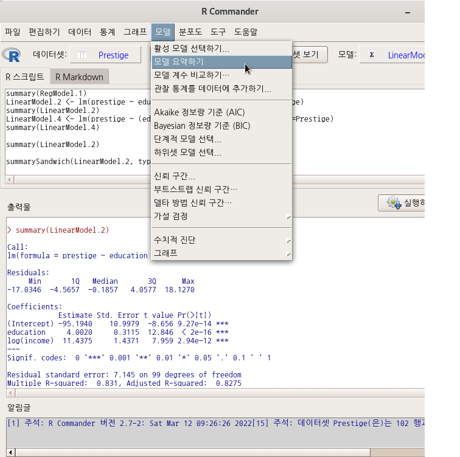


모델을 만들고, 모델의 요약 정보를 확인할 때 일반적으로 summary() 함수를 사용한다.

carData 패키지의 Prestige 데이터셋으로 선형회귀, 선형모델을 만들었다고 하자. 이 과정에서 다음 사례와 같은 요약 정보가 생산된다:


```r
summary(LinearModel.2)
```


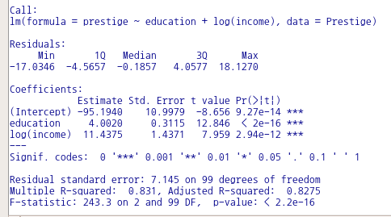

여러개의 모델이 있고, 특정 모델의 요약정보를 다시 확인하고자 할 때 사용하는 기능이다.

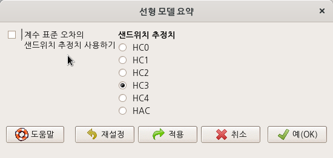

<계수 표준 오차의 샌드위치 추정치 사용하기>에 선택이 되어 있는 경우는 summary() 함수 대신 summarySandwich() 함수가 사용된다.

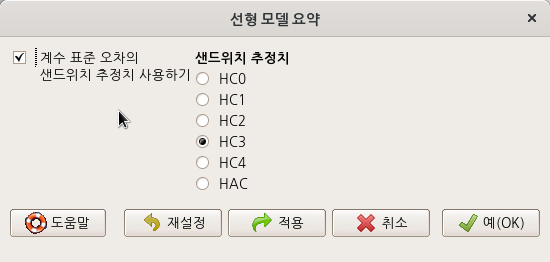


```r
summarySandwich(LinearModel.2, type="hc3")
```


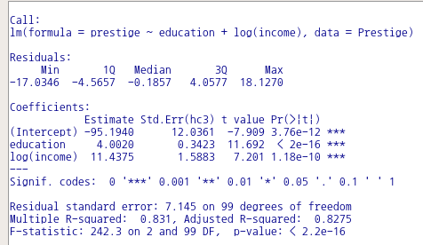


## 모델 계수 비교하기.../ Compare model coefficients...

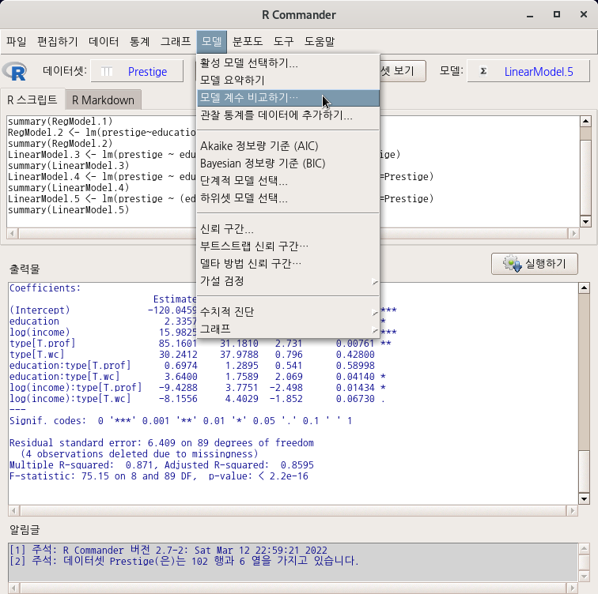

두개 이상의 모델을 선택하고 그 안에 포함된 계수(coefficients)를 비교하는 기능이다.

 

carData 패키지에 있는 Prestige 데이터셋을 이용하여 income(연수입)과 education(교육연수)가 prestige(직업의 사회적 권위)에 미치는 영향에 대하여 분석한다고 가정하자. 최적의 모델을 찾기 위해서는 먼저 여러개의 모델을 만들어야 한다. 이 경우, 만들어진 여러개의 모델을 비교하는 과정에서 영향력이 통계적으로 지지되는 변수들을 찾고 또 그 계수에 대한 꼼꼼한 점검을 해야하는 경우가 많다.

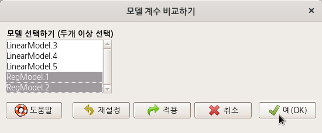


```r
compareCoefs(RegModel.1, RegModel.2)
```


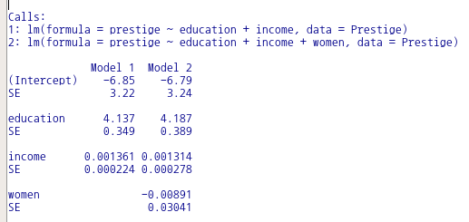

모델 세개를 선택해보자.

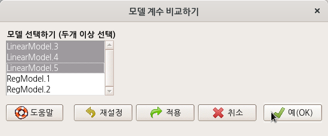


```r
compareCoefs(LinearModel.3, LinearModel.4, LinearModel.5)
```
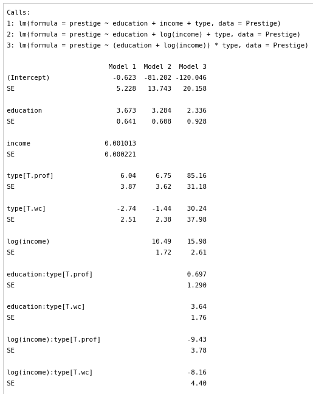

모델의 계수를 비교하는 과정에서, 설명변수가 반응변수에 영향을 미치는가에 대한 통계적인 근거를 찾게된다. zvals, pvals, se 등의 인자에 대한 사용을 통하여 보다 정교한 비교 결과를 만들 수 있다.


```r
compareCoefs(RegModel.1, RegModel.2, zvals=TRUE, pvals=TRUE)
```

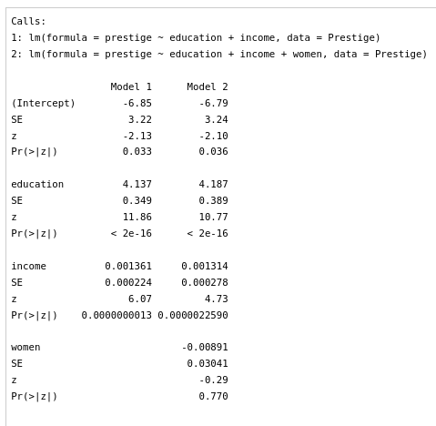

## 관찰 통계를 데이터에 추가하기.../ Add observation statistics to data...

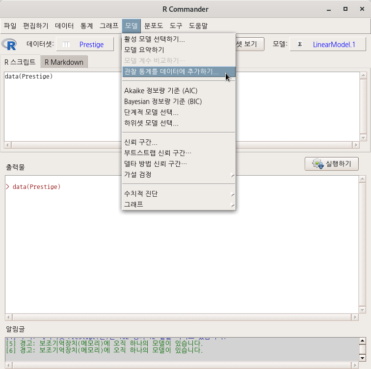


데이터셋을 활성화시킨 다음, 그 데이터셋으로 모델을 만들었다고 생각하자. 예를 들어, carData 패키지의 Prestige 데이터셋으로 선형 모델을 만들었고, 그 모델을 LinearModel.1이라고 하자.

그럼, R Commander의 화면 메뉴 기능에서 '모델 > 관찰 통계를 데이터에 추가하기...' 기능이 활성화된다. 해당 메뉴 기능을 선택하면 아래와 같은 선택 창이 등장한다. 이 통계치들은 lm() 함수를 이용하여 모델을 생성하는 과정에서 함께 연산된 값들이며, 이 값들을 Prestige 데이터셋에 추가할 것인가를 질문받게 된다.

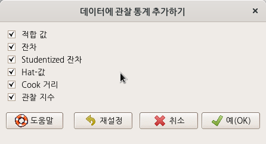

R Commander 화면에서 <데이터셋 보기>를 선택하면 관찰 통계치가 추가되어 있음을 아래와 같이 알 수 있다:

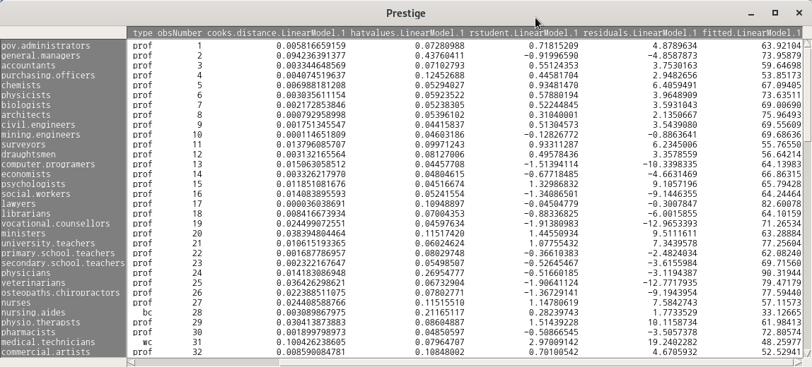


```r
data(Prestige)         # 데이터셋 불러오기
summary(LinearModel.1) # 모델 만든후 요약정보 보기
Prestige<- within(Prestige, {
  fitted.LinearModel.1 <- fitted(LinearModel.1)
  residuals.LinearModel.1 <- residuals(LinearModel.1)
  rstudent.LinearModel.1 <- rstudent(LinearModel.1)
  hatvalues.LinearModel.1 <- hatvalues(LinearModel.1)
  cooks.distance.LinearModel.1 <- cooks.distance(LinearModel.1)
  obsNumber <- 1:nrow(Prestige) 
})
```


## Akaike Information Criterio..

## Bayesian Information Criter..

## Stepwise model selection...

## Subset model selection..

## Confidence intervals...

## Bootstrap confidence interv..

## Delta method confidence int..

## 가설 검정 / Hypothesis tests

### 분산분석표.../ ANOVA table...


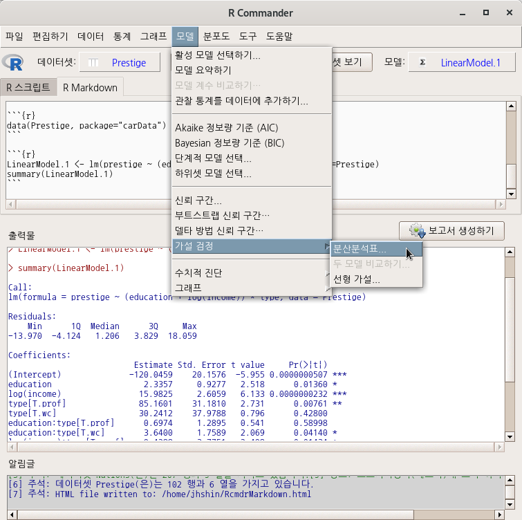


[Statistics > Fit models > Linear model... (통계 > 적합성 모델 > 선형 모델...)](https://rcmdr.tistory.com/131) 기능을 통하여 LinearModel.1라는 모델을 만들었다고 하자. 위의 화면 상단에 <모델: LinearModel.1>이라고 보일 것이다. 


Models > Hypothesis tests > ANOVA table... (모델 > 가설 검정 > 분산분산표...) 기능은 앞선 모델 만들기 작업 위에서 후속적으로 가능함을 명심하자.

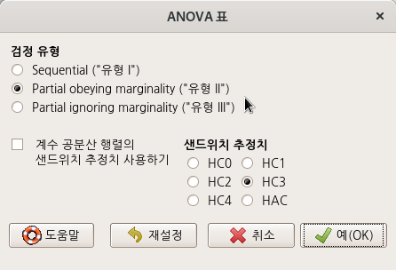


```r
Anova(LinearModel.1, type="II")
```


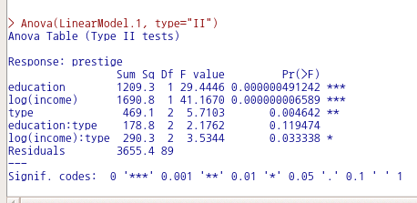


## Numerical diagnostics

## 그래프 / Graphs

### 효과 그림.../ Effect plots...

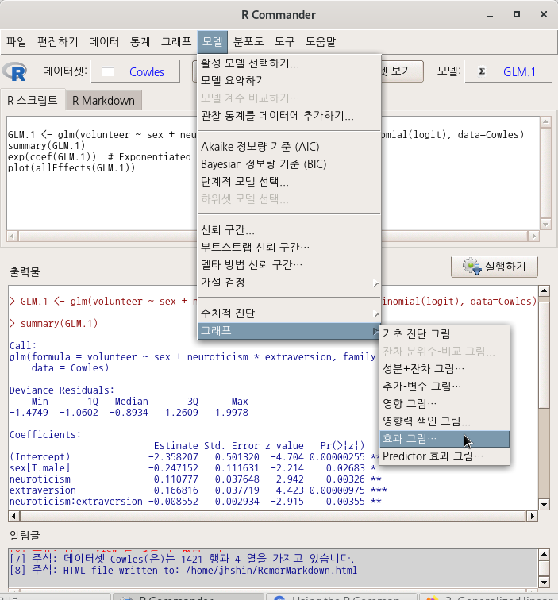


'모델 > 그래프 > 효과 그림...' 기능은 미리 모델이 만들어져야 이용할 수 있다. 만들어진 모델은 아래와 같이 R Commander 상단에서 확인할 수 있다. carData 패키지의 Cowles 데이터셋으로 만든 GLM.1 모델을 활용하는 것이다.

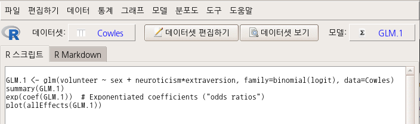

<모델 효과 그림(들)> 창 중간에 있는 <예측변수 (하나 이상 선택)> 기능에서 sex, neuroticism, extraversion 세 변수를 모두 선택해보자.

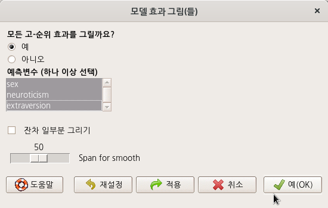


```r
plot(allEffects(GLM.1))
```


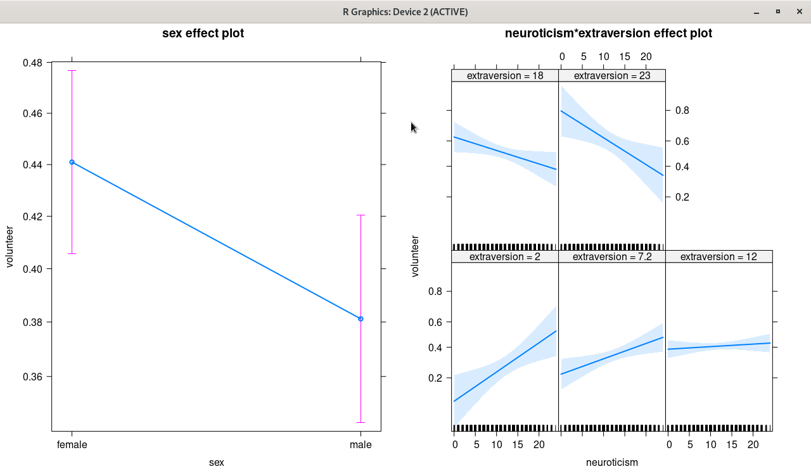

carData 패키지의 Prestige 데이터셋을 이용하여 연습해보자. 아래와 같이 prestige (직업의 사회적 권위)에 대한 education (교육연수), income (연수입), women (여성 참여율)의 영향력을 type (직업유형)별로 살펴보는 모델을 만들었다고 가정하자.


```r
data(Prestige, package="carData")
LinearModel.1 <- lm(prestige ~ education + income + women + type, data=Prestige)
summary(LinearModel.1)
```

아래와 같이 LinearModel.1의 요약 정보가 출력될 것이다.

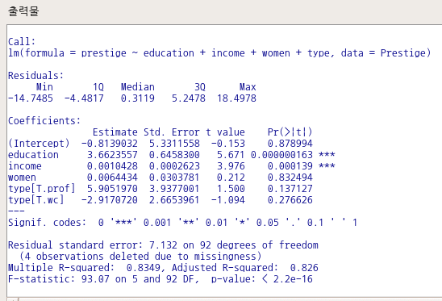

이러한 LinearModel.1의 효과 그림을 시각화 할 수 있다. <모델 효과 그림(들)> 창의 <예측변수(하나 이상 선택)> 기능에서 네개의 변수를 모두 선택해보자. 그리고 예(OK) 버튼을 누른다.

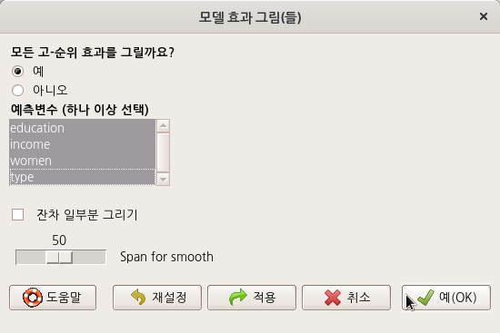


```r
plot(allEffects(LinearModel.1))
```

아래와 같이 그래픽 장치 창에 선택된 변수 네개의 효과 그림이 등장할 것이다.

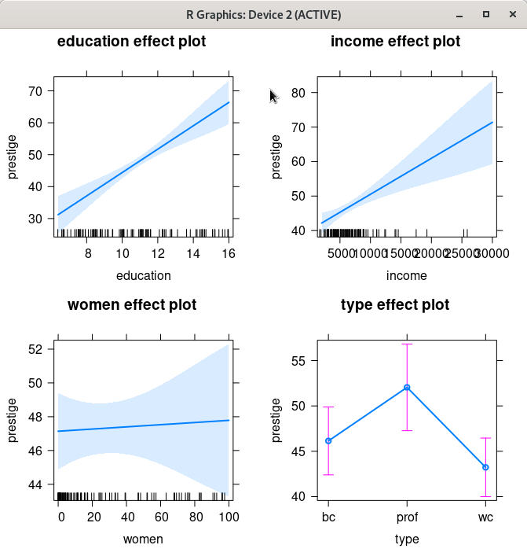

한편, <잔차 일부분 그리기> 기능을 선택해보자. 

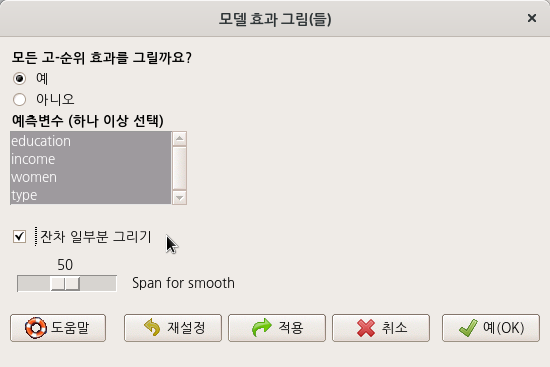

그래픽 장치 창에 잔차들이 플롯으로 표시된다. 표시된 잔차의 분포를 보면서 추가로로 통찰력을 키울 수 있다.

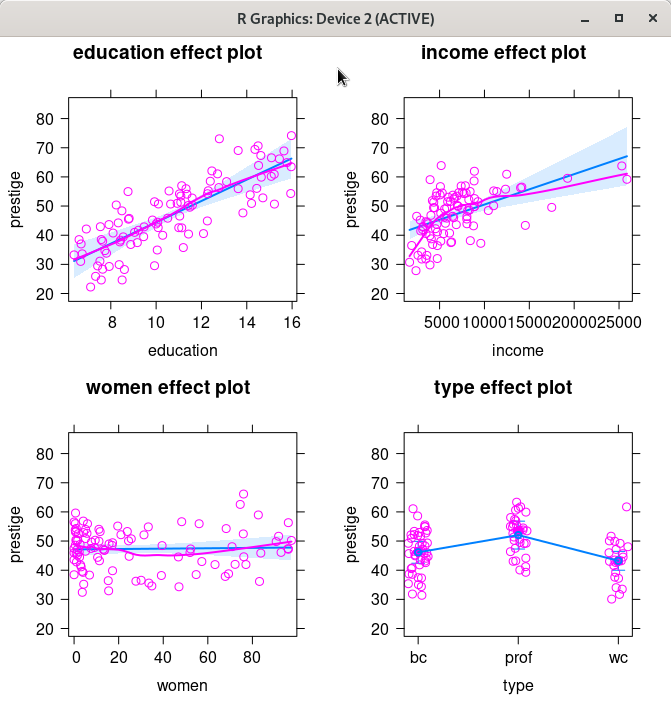


