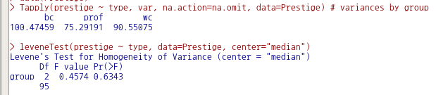

# 통계 / Statistics {#statistics}

## 요약 / Summaries

 


활성 데이터셋이 없는 경우, 통계 분석의 대상이 없기 때문에 하위 기능의 메뉴가 음영 처리되어 있다. 활성 데이터셋이 있는 경우 아래와 같이 음영 처리가 사라지고, 하위 기능을 선택할 수 있게 된다:

 

### 활성 데이터셋 / Active Data set

 


Prestige라는 데이터셋을 불러와서 자료처리와 분석용으로 활성화시켰다고 가정하자. Prestige 데이터셋의 요약정보를 보고자 할때, <활성 데이터셋> 기능을 선택한다:


```r
data(Prestige)

summary(Prestige)
```

```
##                          education.income.women.prestige.census.type
##  accountants,12.77,9271,15.7,63.4,1171,prof    : 1                  
##  aircraft.repairmen,10.1,7716,0.78,50.3,8582,bc: 1                  
##  aircraft.workers,8.78,6573,5.78,43.7,8515,bc  : 1                  
##  architects,15.44,14163,2.69,78.1,2141,prof    : 1                  
##  athletes,11.44,8206,8.13,54.1,3373,NA         : 1                  
##  auto.repairmen,8.1,5795,0.81,38.1,8581,bc     : 1                  
##  (Other)                                       :96
```

 


### 수치적 요약.../ Numeric summaries...


<수치적 요약...> 메뉴를 선택하면 하위 창이 나온다:

 


 

데이터 창과 통계 창이 있다. 통계 창을 보려면 데이터 옆에 있는 통계 창을 선택하면 된다:

 


다시 데이터 창으로 와서 prestige 라는 변수의 수치적 요약 정보를 보고자 한다. prestige 변수를 선택하고, 오른쪽 아래의 예(OK) 버튼을 선택한다: 

 


입력 창과 출력 창을 살펴보자. 통계 창의 선택사항들에 변경을 주지 않은 상태에서 Prestige 라는 데이터셋의 prestige 변수의 수치적 정보는 다음과 같다: 

 

### 빈도 분포... / Frequency distributions...

 


type 변수를 선택하고 예(OK)를 누른다. Prestige 데이터셋의 type 변수의 빈도를 보는 명령문이 다음과 같이 입력창에 기록되고 출력창에 빈도 정보가 출력된다:

 


---

Q1> Prestige의 변수는 여러개가 있습니다. 그중에서 왜 type만 선택 창에 나오나요?


type 변수는 factor 유형입니다. 빈도는 factor 유형의 변수만 셀 수 있기 때문입니다.


```r
> str(Prestige) # Prestige 데이터셋의 변수 유형 살펴보기
```

### 관측 결측치 셈하기 / Count missing observations

 


데이터셋을 구성하는 사례에 값이 입력되지 않은 결측치가 있는 경우가 있다. 어떤 변수에 관측값이 없는 결측치가 있는지를 확인할 때 사용하는 기능이다.

 


Prestige 데이터셋의 type 변수에 결측치가 4개가 있음을 확인한다.

### 통계표.../ Table of statistics...

 


통계표(Table of statistics)는 요인(factor) 변수 유형별로 수치형(numeric, integer) 변수의 통계량을 계산하여 출력한다. Prestige 데이터셋에서 직업 유형의 type 변수를 요인에서 선택하고, 직업 유형별로 권위(prestige)의 통계량 중에서 기본 설정으로 선택된 평균값의 통계표를 선택하고, 예(OK) 버튼을 누른다.

 


 

직업 유형(bc, prof, wc)별로 평균값을 계산하여 출력한다. 출력창을 보면 Tapply() 함수를 사용함을 알 수 있다. 

### 상관 행렬.../ Correlation matrix...


상관 행렬은 두개 이상의 변수를 선택해야 한다. Prestige 데이터셋에서 교육수준과 연봉(수입)의 관계에 대한 관심에서 이 두 변수를 선택하고, 예(OK) 버튼을 누른다. 


출력 창을 보면, cor() 함수가 사용되었음을 알 수 있다.

### 상관 검정.../ Correlation test...

 


상관 검정은 두 변수를 구성하는 사례값들 사이에 어떤 방향의 관계성이 있는지를 통계학적으로 확인하고자 할 때 사용한다. 아래는Prestige 데이터셋에서 교육수준과 수입(연봉) 사이에 어떤 관계성이 있는지를 확인하고자 한다. education과 income 변수를 선택하고, 예(OK) 버튼을 누른다.

 
 


상관의 유형 중에서 Pearson product-moment (피어슨 적률상관), 대립 가설에는 양측이 기본으로 설정되어 있다. 이 설정을 바탕으로 상관 검증의 결과를 출력하면 아래와 같다:

 

cor.test() 함수를 활용한다.

### 정규성 검정.../ Test of normality...

 


수치형(numeric, integer) 변수들 중에서 하나를 선택한다. 기본 설정에 Shapiro-Wilk의 정규성 검정법이 선택되어 있다. 수입(연봉)의 사례들이 정규 분포를 이루고 있는가를 확인하고자, 변수 income을 선택하고 예(OK) 버튼을 누른다.


normalityTest()를 사용한다.


```r
normalityTest(~education, test="shapiro.test", data=Prestige)
```


## 분할표 / Contingency tables

### 분할표 / Contingency tables


분석대상인 데이터셋에 요인형 변수가 한개 있거나, 하나도 없는 경우 분할표 메뉴의 오른쪽에 있는 <이원표>, <다원표> 기능은 불활성 음영 표시로 나타난다. 두개 이상의 요인형 변수가 있는 경우, 예를 들어 car 패키지에 포함된 Moore 데이터셋이 활성 데이터셋이 되는 경우 불활성 음영 표시가 사라진다.


요인형 변수가 세개 이상 있는 경우, <다원표> 까지 활성화된다. 아래의 화면을 보면, partner.status, fcatetory 두개의 변수가 요인(factor)형이다. <이원표>는 활성화된 반면에, <다원표> 기능이 아직 활성화되지 않았다면, 요인형 변수가 두개 뿐인 데이터셋임을 간접적으로 알려준다.

 


### 이원표.../ Two-way table


두개 이상의 요인형 변수를 가지고 있는 Moore 데이터셋을 활성화시키면, <이원표>의 음영이 사라지고 사용할 수 있는 기능이 된다.


행 변수와 열 변수에 요인형 변수 하나씩을 선택한다.


데이터 창과 함께 통계 창이 있다. 통계 창을 선택하면 다음과 같은 화면에 다양한 선택 기능을 선택할 수 있다. 다른 선택으로 출력 내용의 변화를 주지 않을 경우, 데이터 창으로 돌아가서 예(OK) 버튼을 누른다.


다음과 같은 출력물을 볼 수 있다. 행 변수에 partner.status, 열 변수에 fcategory를 선택한 경우의 출력물이다.


행 변수에 fcategory, 열 변수에 partner.status를 선택한 경우의 출력물이다.


프롬프트의 입력 스크립트를 살펴보면, xtabs() 함수를 사용하는 것이 보인다.

## 평균 / Means

### 일-표본 t-검정... / Single-sample t-test...


datasets 패키지에 있는 [sleep 데이터셋](https://rcmdr.tistory.com/132)을 활용해보자.

<일-표본 t-검정...> 기능을 선택하면, 아래와 같은 선택 창으로 넘어간다.

sleep 데이터셋에서 일-표본 t-검정으로 점검할 수 있는 변수는 extra 하나가 보인다. 예(OK) 버튼을 누르자.


```r
with(sleep, (t.test(extra, alternative='two.sided', mu=0.0, conf.level=.95)))
```


<대립 가설>에 관련된 선택사항에 변화를 주지 않았다. 아래 명령문과 같은 결과를 얻는다.


```r
t.test(extra ~ 1, data = sleep)
```


### 독립 표본 t-검정.../ Independent samples t-test...


datasets 패키지에 있는 [sleep 데이터셋](https://rcmdr.tistory.com/132)을 활용해보자. 활성화시키자.

sleep 데이터셋의 수치형 변수 extra에 대하여 2개의 수준을 가진 요인형 집단인 group 변수의 t-검정을 한다.


<선택기능> 창에는 1그룹과 2그룹의 차이를 비교하는 <대립 가설>, <신뢰 수준>, <등분산> 의 선택 사항이 있다. 일단 기본 선택 들을 사용하자.


t.test(extra~group, alternative='two.sided', conf.level=.95, var.equal=FALSE, data=sleep)
alternative 이하의 선택 사항들은 기본 설정을 사용하였기에 다음과 같은 결과를 갖는다.


```r
t.test(extra ~ group, data = sleep)
```


참고로 group1 과 group2의 사례들을 상자그림(boxplot)을 이용하여 비교해보자.


한편, 비교하는 두 집단의 분산의 차이가 없다는 것을 먼저 확인한 경우에 진행하는 t-검정도 있을 수 있다. 통계 > 분산 > 이-분산 F-검정의 결과를 바탕으로 [독립-표본 t-검정](https://rcmdr.tistory.com/136)을 진행하는 사례이다.


<선택기능> 창에서 <등분산을 가정합니까?>에 '예'를 선택한다.


```r
t.test(extra~group, alternative='two.sided', 
	conf.level=.95, var.equal=TRUE, data=sleep)
```


### Paired t-검정.../ Paired t-test...


datasets 패키지에 포함된 sleep 데이터셋에는 extra라는 수치형 변수가 포함되어 있다. 수치형 변수가 하나만 있는 경우는 Paired t-검정을 사용할 수 없다. 10명이 각각 2개의 약을 복용한 후 group1, group2라는 집단 안에서 수면 시간의 변화를 측정한 데이터셋이다. reshape(), reshapeL2W() 등의 함수를 사용하여 extra라는 수치형 변수를 group1 , group2 별로 두개의 수치형 변수로 변환시켜야 한다. 변환이 되면 <Statistics : Means : Paired t-test> 기능이 활성화된다.


extra 변수를 두개의 집단 X1, X2 로 이미 나눈 상황이다. X1과 X2를 각각 <첫째 변수>와 <둘째 변수>에 선택하자.


<선택기능>창 추가 선택 사항들이 있다. 기본 선택을 이용하자.


```r
with(sleepWide, (t.test(X1, X2, alternative='two.sided', conf.level=.95, paired=TRUE)))
```

아래의 함수 사용과 같은 결과를 얻는다.


```r
t.test(Pair(X1, X2) ~ 1, data = sleepWide)
```


### 일원 분산 분석.../ One-way ANOVA...


datasets 패키지에 있는 [sleep 데이터셋](https://rcmdr.tistory.com/132)을 활용해보자.


<집단 (하나 선택)>에 요인형 변수 group을, <반응 변수 (하나 선택)>에 수치형 변수 extra를 선택한다. 통계 > 분산 > 이-분산 F-검정을 통하여 비교되는 두 집단의 extra 변수의 사례 분포는 등분산임을 알고 있는 상황이다.

- [Two variances F-test...](https://rcmdr.tistory.com/136)


```r
AnovaModel.1 <- aov(extra ~ group, data=sleep)
summary(AnovaModel.1)
with(sleep, numSummary(extra, groups=group, statistics=c("mean", "sd")))
```


일원 분산 분석의 명령문 작성과 분석 결과는 아래와 같다.


추가로  carData 패키지의 Prestige 데이터셋을 이용하여 일원 분산 분석을 연습해보자. Prestige 데이터셋에는 type 이라는 요인형 변수가 있다. 그러나 앞서 연습한 sleep 데이터셋의 group 변수처럼 요인 수준이 두개가 아니라 요인의 수준이 셋이다. 직업의 사회적 권위에 대한 직업 유형별 (bc, prof, wc) 평균의 차이가 있는가를 점검한다.


```r
AnovaModel.3 <- aov(prestige ~ type, data=Prestige)
summary(AnovaModel.3)
with(Prestige, numSummary(prestige, groups=type, statistics=c("mean", "sd")))
```

직업유형 (bc, prof, wc)에 따른 직업의 사회적 권위는, 각 유형별 평균을 비교할 때, 차이가 있다는 결과를 얻는다.


### 다원 분산 분석.../ Multi-way ANOVA...


다중 분산 분석 (Multi-way ANOVA)은 두개 이상의 요인형 변수들의 작용으로 하나의 수치형 변수에 영향을 주었는가를 점검하는 통계기법이다.


```r
data(Adler, package="carData")
help("Adler", package="carData")

AnovaModel.1 <- lm(rating ~ expectation*instruction, data=Adler, contrasts=list(expectation 
  ="contr.Sum", instruction ="contr.Sum"))
Anova(AnovaModel.1)
Tapply(rating ~ expectation + instruction, mean, na.action=na.omit, data=Adler) # means
Tapply(rating ~ expectation + instruction, sd, na.action=na.omit, data=Adler) # std. deviations
xtabs(~ expectation + instruction, data=Adler) # counts
```


## 비율 / Proportions

### 일-표본 비율 검정.../ Single-sample proportion test...


carData 패키지에 있는 Chile 데이터셋을 활용한다. 요인형 변수 vote를 변형시켜 vote.f 변수를 새롭게 코딩하고 사용하도록 하자.


```r
data(Chile, package="carData")
Chile <- within(Chile, {
  vote.f <- Recode(vote, '"Y" = "yes"; "N" = "no"; else = NA', as.factor=TRUE)
})
```


<선택기능> 창에 표시되어 있는 기본 설정을 그대로 사용하자.


```r
local({
  .Table <- xtabs(~ vote.f , data= Chile )
  cat("\nFrequency counts (test is for first level):\n")
  print(.Table)
  prop.test(rbind(.Table), alternative='two.sided', p=.5, conf.level=.95, correct=FALSE)
})
```

출력창에 나오는 결과는 아래와 같다:


## 분산 / Variance

### 이-분산 F-검정.../ Two variances F-test...


datasets 패키지에 포함된 [sleep 데이터셋](https://rcmdr.tistory.com/132)을 활용해보자.

<이-분산 F-검정> 메뉴창에서 요인형 변수 group을 <집단 (하나 선택)>에, 수치형 변수 extra를 <반응 변수 (하나 선택)>으로 결정하자. Two variances F-test (이-분산 F-검정)은 두 개의 집단 비교로 반응 변수의 분산을 점검하는 기법이다.


```r
Tapply(extra ~ group, var, na.action=na.omit, data=sleep) # variances by group
var.test(extra ~ group, alternative='two.sided', conf.level=.95, data=sleep)
```

alternative 이후 선택 사항들은 기본 선택을 사용하였다. 변화를 준 것은 없다. 따라서 아래의 명령문과 같은 의미이기도 하다.


```r
var.test(extra ~ group, data=sleep)
```

sleep 데이터셋에 있는 extra 변수의 요인 수준 (group1, group2)별 분산은 차이가 있다고 통계적으로 말하기 어렵다는 결론을 얻는다. 줄여서 거칠게 말하면, 두 분산의 차이가 없다고 할 수 있다.


### Bartlett의 검정.../ Bartlett's test...


carData 패키지에서 제공하는 Prestige 데이터셋을 활성화 시키자. Prestige 데이터셋에는 type 이라는 세개의 수준을 가진 요인형 변수가 있다. 그 수준 이름은 bc, prof, wc 이다. 직업유형(type)별로 사회적인 권위가 다른지를 확인하는 문제의식이 있다고 하자. 집단별(직업유형, type)로 직업의 사회적 권위(prestige)에 대한 분산의 차이가 있는지를 통계적으로 살펴본다.


```r
Tapply(prestige ~ type, var, na.action=na.omit, data=Prestige) # variances by group
bartlett.test(prestige ~ type, data=Prestige)
```


### Levene의 검정.../ Levene's test...


carData 패키지에서 제공하는 Prestige 데이터셋을 활성화 시키자. Prestige 데이터셋에는 type 이라는 세개의 수준을 가진 요인형 변수가 있다. 그 수준 이름은 bc, prof, wc 이다. 직업유형(type)별로 사회적인 권위가 다른지를 확인하는 문제의식이 있다고 하자. 집단별(직업유형, type)로 직업의 사회적 권위(prestige)에 대한 분산의 차이가 있는지를 통계적으로 살펴본다. <중앙(센터)>에서 중앙값과 평균을 선택할 수 있다. 중앙값이 기본 설정이다.


```r
Tapply(prestige ~ type, var, na.action=na.omit, data=Prestige) # variances by group
leveneTest(prestige ~ type, data=Prestige, center="median")
```




## 비모수 검정 / Nonparametric tests

### 이-표본 Wilcoxon 검정.../ Two-sample Wilcoxon test...


'통계 > 비모수 검정 > 이-표본 Wilcoxon 검정...' 기능을 이용하기 위해서 데이터셋을 선택하고, 정비해보자. datasets 패키지에 있는 [airquality 데이터셋](https://rcmdr.kr/100)을 선택하고, 그 안에 있는 변수 Month 사례 값들 중에서 5월, 8월에 해당하는 5, 8을 선택한 하위 데이터셋을 만들고, airquality.sub라 이름 붙이자. 그리고, 5, 8을 요인화 시켜서, May, August라고 수준을 만들자.


```r
data(airquality, package="datasets") # airquality 데이터셋 불러오기
airquality.sub <- subset(airquality, subset=Month %in% c(5, 8)) 
                                     # 5월, 8월만 포함하는 하위셋 만들기
summary(airquality.sub)
airquality.sub <- within(airquality.sub, {
  Month.f <- factor(Month, labels=c('May','August'))
})                                   # Month.f라는 요인형 변수 만들기
```

집단 변수인 Month.f는 두개의 수준을 갖고 있고, 이 두개의 수준을 기준으로 Ozone을 비교하는 것이다.


<선택기능> 창에 있는 기본 설정을 우선 그대로 사용해보자. 향후 데이터셋과 변수에 대한 이해력이 높아지면, 다양한 선택을 할 수 있다.


```r
Tapply(Ozone ~ Month.f, median, na.action=na.omit, data=airquality.sub) 
  # medians by group
wilcox.test(Ozone ~ Month.f, alternative="two.sided", data=airquality.sub)
```


### 일-표본 Wilcoxon 검정.../ Single-sample Wilcoxon test...


먼저 '통계 > 비모수 검정 > 쌍-표본 Wilcoxon 검정...'을 살펴보는 것을 추천한다. depression 이라는 데이터셋을 만들고, 변수 first, second, change를 만들었다. change는 second와 first의 차이에 관련 사례 값을 갖는다.

참고: [Paired-samples Wilcoxon test...](https://rcmdr.tistory.com/179)

 
'통계 > 비모수 검정 > 일-표본 Wilcoxon 검정...'은 depression 데이터셋의 change 변수처럼 두 개 변수의 차이를 갖는 (또는 차이가 계산된) 변수를 기준값과 비교하여 차이 검정을 하는 기법이다. 때로는 특정 변수와 기준 값의 비교를 통하여 검정을 하기도 한다.


데이터셋과 변수에 대한 의미적 판단이 깊은 경우 <대립 가설>의 선택을 다양하게 결정할 수 있다. 아래 화면에서 'mu < 0'은 change가 귀무(영) 가설, mu=0.0 일 때 depression 의 변화가 작아졌음을 확인하는 것으로 이해할 수 있다.


```r
with(depression, median(change, na.rm=TRUE))
with(depression, mean(change, na.rm=TRUE))
with(depression, wilcox.test(change, alternative='less', mu=0.0))
```

출력 창에 아래와 같이 검정의 통계적 정보가 제공된다:


### 쌍-표본 Wilcoxon test.../ Paired-samples Wilcoxon test...

 


depression 이라는 이름의 데이터셋을 만들자. first, second, change 라는 세개의 변수를 갖는다고 하자. change 변수는 second와 first의 차이를 사례 값으로 갖는다고 하자. 아래와 같을 것이다.


```r
first <- c(1.83,  0.50,  1.62,  2.48, 1.68, 1.88, 1.55, 3.06, 1.30)
second <- c(0.878, 0.647, 0.598, 2.05, 1.06, 1.29, 1.06, 3.14, 1.29)
change <- second - first  # compute new variable 참조할 것
depression <- data.frame(cbind(first, second, change)) # 세개의 vector를 묶어 데이터프레임으로 전환
```


[Compute new variable...](https://rcmdr.kr/54)
 


<선택기능> 창에 있는 기본 선택 사양을 그대로 사용해보자. <대립 가설>에서 '양쪽(측)'이 선택되어 있다. depression 데이터셋의 second 변수와 first 변수 사이에 순위 차이가 있는가를 살펴보는 것이라 할 수 있다.


```r
with(depression, median(second - first, na.rm=TRUE)) # median difference
with(depression, wilcox.test(second, first, alternative='two.sided', 
  paired=TRUE)) # 양측 검정
with(depression, wilcox.test(second, first, alternative='less', paired=TRUE))
                # 단측 검정 ( 차이 < 0 )
```


<선택 기능> 창에서 <대립 가설>에 '차이 < 0'를 선택하자. second 변수의 사례 값이 first 변수의 사례 값보다 작아졌는지를 점검하는 것이다. (depression이 작아졌다는 것은 개선되었다는 의미로 해석될 수도 있다.)


### Kruskal-Wallis 검정.../ Kruskal-Wallis test...


carData 패키지에 있는 [Friendly 데이터셋](https://rcmdr.tistory.com/153)을 활용한다.


```r
data(Friendly, package="carData")
Tapply(correct ~ condition, median, na.action=na.omit, data=Friendly) # medians by group
kruskal.test(correct ~ condition, data=Friendly)
```


### Friedman 순위-합 검정.../ Friedman rank-sum test...


<Friendman 순위-합 검정...> 기능은 두개 이상의 수치형 변수가 데이터셋에 포함되어 있을때 활성화된다. <Friedman 순위-합 검정...> 기능의 함수적 특징을 이해하기 위하여 먼저 아래와 같이 RoundingTimes라는 데이터셋을 만들어보자.


```r
RoundingTimes <-
data.frame(matrix(c(5.40, 5.50, 5.55,
         5.85, 5.70, 5.75,
         5.20, 5.60, 5.50,
         5.55, 5.50, 5.40,
         5.90, 5.85, 5.70,
         5.45, 5.55, 5.60,
         5.40, 5.40, 5.35,
         5.45, 5.50, 5.35,
         5.25, 5.15, 5.00,
          5.85, 5.80, 5.70,
         5.25, 5.20, 5.10,
         5.65, 5.55, 5.45,
         5.60, 5.35, 5.45,
         5.05, 5.00, 4.95,
         5.50, 5.50, 5.40,
         5.45, 5.55, 5.50,
         5.55, 5.55, 5.35,
         5.45, 5.50, 5.55,
         5.50, 5.45, 5.25,
         5.65, 5.60, 5.40,
         5.70, 5.65, 5.55,
         6.30, 6.30, 6.25),
       nrow = 22,
       byrow = TRUE,
       dimnames = list(1 : 22,
                       c("Round Out", "Narrow Angle", "Wide Angle"))))
summary(RoundingTimes)     # RoundingTimes 데이터셋 보기
```


이 데이터셋을 만드는 이유는 friedman.test()라는 함수의 예제 연습에 포함되어있기 때문이다. RoundingTimes 데이터셋은 아래와 같은 내부 구성을 갖는다:


RoungdingTimes 라는 데이터셋을 만들고, 화면 맨 위에 있는 <Friedman 순위-합 검정...> 기능을 선택하면 추가적인 선택 메뉴 창으로 넘어간다. <Friedman 순위 합 검정> 창에서 <반복-측정 변수 (두개 이상 선택)>에서 세개의 변수를 모두 선택하고, 예(OK) 버튼을 누른다.


```r
local({
  .Responses <- na.omit(with(RoundingTimes, cbind(Narrow.Angle, Round.Out, Wide.Angle)))
  cat("\nMedians:\n") 
  print(apply(.Responses, 2, median)) 
  friedman.test(.Responses)
})
```


```r
help("friedman.test")     # Friedman 순위 합 검정 도움말 보기
example("friedman.test")  # Friedman 순위 합 검정 예제 연습하기
```

## 차원 분석 / Dimensional analysis

### 군집 분석 > k-평균 군집 분석.../ Cluster analysis > k-means cluster analysis...


datasets 패키지에서 제공하는 [USArrests 데이터셋](https://rcmdr.tistory.com/144)을 이용해보자.


데이터셋에 포함된 네개의 변수를 모두 선택한다.


<선택기능> 창에서, 군집의 수를 3개, 초기값의 수를 5번으로, 최대 반복 횟수를 5회로 정해보자. 데이터셋에 추가될 변수 이름이 KMeans가 될 것이다. 아래 있는 선택사항에서 데이터셋에 군집 할당하기를 선택한다.


위 화면에서 선택된 군집 행렬도(Bi-plot)이 아래와 같이 생산된다.


USArrests 데이터셋에 변수 KMeans가 추가될 것이다. R Commander 상단에 있는 <데이터셋 보기> 버튼을 눌러보자. KMeans 변수는 요인형으로 1, 2, 3 이라는 세개의 군집을 표시한다.


아래 화면은 다소 복잡해보일 것이다. 그러나 객체 .cluster가 만들어졌으며, 그 객체안에 있는 $size, $withinss, $tot.withinss, $betweenss 등의 정보를 차례를 보여준다고 생각하자.  그리고 biplot을 생산하고, USArrests 데이터셋에 KMeans라는 변수를 추가하는 것이다.


### 군집 분석 > 위계 군집 분석.../ Cluster analysis > Hierarchical cluster analysis...{#statistics-cluster}


datasets 패키지에 있는 USArrests 데이터셋을 활용해서, 위계 군집 분석을 연습해보자. 
우선 [USArrests 데이터셋](https://rcmdr.kr/144)을 활성화시킨다.


<위계적 군집화> 창에서 아래와 같이 변수 네개를 모두 선택한다. 그리고, 기본으로 추천되는 HClust.1를 군집화 이름으로 사용하자. 


<선택기능> 창에서 기본설정된 사항들을 그대로 사용해보자. <군집화 방법>, <거리 측정>, <덴드로그램 그리기> 등을 살펴본다.


예(OK) 버튼을 누르면, 아래와 같은 그래픽 창이 등장한다.


```r
data(USArrests, package="datasets")
HClust.1 <- hclust(dist(model.matrix(~-1 + Assault+Murder+Rape+UrbanPop, USArrests)) , method= 
  "ward")
plot(HClust.1, main= "Cluster Dendrogram for Solution HClust.1", xlab= 
  "Observation Number in Data Set USArrests", sub="Method=ward; Distance=euclidian")
```

### 군집 분석 > 위계 군집화 요약하기.../ Cluster analysis > Summarizing hierarchical clustering...


['통계 > 차원 분석 > 군집 분석 > 위계 군집 분석'](#statistics-cluster)을 하였다고 하자. 그 다음에는 <위계 군집화 요약하기...> 기능을 사용할 수 있다.

<위계적 군집 요약> 창에서 <군집의 수>를 3으로 변경해보자. <군집 요약 인쇄하기>, <군집 행렬도(Bi-plot)> 등이 선택되어 있는 것을 점검하자.


예(OK) 버튼을 누르면, 아래와 같은 그래픽 창이 등장한다.


 

```r
summary(as.factor(cutree(HClust.1, k = 3))) # Cluster Sizes
by(model.matrix(~-1 + Assault + Murder + Rape + UrbanPop, USArrests), as.factor(cutree(HClust.1, k 
  = 3)), colMeans) # Cluster Centroids
biplot(princomp(model.matrix(~-1 + Assault + Murder + Rape + UrbanPop, USArrests)), xlabs = 
  as.character(cutree(HClust.1, k = 3)))
```


### 군집 분석 > 위계 군집화를 데이터셋에 추가하기.../ Cluster Analysis > Add hierarchical clustering to data set...


 ' 통계 > 차원 분석 > 군집 분석 > 위계 군집 분석...' 기능을 진행했다고 하자. 그 다음에 <위계군집화를 데이터 셋에 추가하기...>를 이용할 수 있다. <군집의 수:>를 3으로 변경하자. 그리고 예(OK) 버튼을 누르면, hclus.label라는 변수가 USArrests 데이터셋에 추가된다.


R Commander 상단에 있는 <데이터셋 보기> 버튼을 눌러보자. 아래와 같이 데이터셋의 내부 구성이 보일 것이다. hclus.label 변수가 추가되어 있음을 확인할 수 있다:


### 척도 신뢰성.../ Scale reliability...


carData 패키지에서 제공하는 DavisThin 데이터셋을 활성화시키자. DavisThin 데이터셋에는 DT1, DT2, DT3, ..., DT7 이라는 7개의 수치형 변수가 있다. 이 변수들은 "drive for thinness" 척도를 구성한다.

 

<척도 신뢰성> 창에서 <변수 (세개 이상 선택)> 기능에서 DT1부터 DT7까지 일곱개의 변수를 선택하고,  예(OK) 버튼을 누른다.


```r
reliability(cov(DavisThin[,c("DT1","DT2","DT3","DT4","DT5","DT6","DT7")], 
	use="complete.obs"))
```


### 주-성분 분석.../ Principal-components analysis...


<주성분 분석> 메뉴 창에서 <변수 (두개 이상 선택)> 에서 4개의 변수를 모두 선택해보자.


<선택기능> 창에서 기본 설정되어 있는 기능을 기억하자.


```r
local({
  .PC <- princomp(~Assault+Murder+Rape+UrbanPop, cor=TRUE, data=USArrests)
  cat("\nComponent loadings:\n")
  print(unclass(loadings(.PC)))
  cat("\nComponent variances:\n")
  print(.PC$sd^2)
  cat("\n")
  print(summary(.PC))
})
```

 


```r
.PC <- princomp(~Assault+Murder+Rape+UrbanPop, cor=TRUE, data=USArrests)
plot(.PC)
```


```r
biplot(.PC)
```


### 요인 분석.../ factor analysis...


## 적합성 모델 / Fit models

### 선형 회귀.../ Linear regression...


carData 패키지에서 제공하는 Prestige 데이터셋을 불러와서 활성화시키자. 그러면, 위의 화면처럼 <선형 회귀...> 기능이 활성화될 것이다. 이 기능을 선택하면 아래와 같이 Prestige 데이터셋의 변수 목록이 등장하며, 회귀분석을 위한 구조적 설계를 시작한다.

 

교육연수(education)와 연소득(income)이 직업의 사회적권위(prestige)에 영향을 미치는가? 어떤 영향을 미치는가? 등의 문제의식을 통계적으로 점검한다고 해보자. 교육연수와 연소득은 설명 변수일 것이며, 직업의 사회적 권위는 이 두개의 설명 변수로부터 영향을 받는 반응 변수가 될 것이다. 한편, <모델 이름 입력하기:>에는 RegModel.1이 자동적으로 추천된다. 여러 개의 모델을 만들어 점검하는 경우, 지속적으로 일련번호가 추가된다. 분석가가 자유롭게 모델 이름을 정할 수 있다.


예(OK) 버튼을 누르면, R Commander 화면 상단에 있는 <모델:>옆에 파란색으로 RegModel.1이 등장한다.


```r
RegModel.1 <- lm(prestige~education+income, data=Prestige)

summary(RegModel.1)
```

R Commander의 출력 창에는 만든 선형 회귀 모델의 결과가 출력된다.


### 선형 모델.../ Linear model...


아래와 같은 <선형 모델> 선택 창에서 변수들을 선택할 수 있다. <통계 : 적합성 모델 : 선형 회귀...> 기능의 <선형 회귀...>창과 달리 선택할 수 있는 변수에 'type [요인]'이 추가되어 있다.

 

carData 패키지에서 제공되는 Prestige 데이터셋에는 요인형 변수 type이 포함되어 있다. <선형 모델> 기능에는 요인형 변수를 함께 넣어서 계산할 수 있고, 표본을 모집단 크기에 비율적으로 맞추고자 사례 값에 가중치를 넣어서 계산하는 <Weights> 선택 기능이 있다. 그리고 변수를 선택하는 것을 뛰어넘어 변수들 사이의 관계성을 수식화 할 수 있는 <모델 공식> 기능이 포함되어 있다.


아래 <선형 모델> 창은 위의 모델 구성식과는 다른 방식을 제안한다. 직업의 사회적 권위 (prestige)에 대한 education + income + women + type 의 영향력을 계산하는 것이 아니라, education + log(income)의 결과와 type의 관계가 prestige 변수에 미치는 영향력을 계산하는 식이다.


```r
LinearModel.1 <- lm(prestige ~ (education + log(income))*type, data=Prestige)
summary(LinearModel.1)
```


### 일반화 선형 모델.../ Generalized linear model...


MASS 패키지에 있는 [birthwt 데이터셋](https://rcmdr.tistory.com/149)을 활용하자.


birthwt 데이터셋을 <일반화 선형 모델> 분석을 위하여 변형시켜서 bwt라는 데이터셋으로 만들자.


```r
bwt <- with(birthwt, {
race <- factor(race, labels = c("white", "black", "other"))
ptd <- factor(ptl > 0)
ftv <- factor(ftv)
levels(ftv)[-(1:2)] <- "2+"
data.frame(low = factor(low), age, lwt, race, smoke = (smoke > 0),
           ptd, ht = (ht > 0), ui = (ui > 0), ftv)
})

options(contrasts = c("contr.treatment", "contr.poly"))
```


bwt 데이터셋을 활성화시키자.


```r
GLM.3 <- glm(low ~ ., family=binomial(logit), data=bwt)
summary(GLM.3)
```


```r
exp(coef(GLM.3))  # Exponentiated coefficients ("odds ratios")
```


```r
## an example with offsets from Venables & Ripley (2002, p.189)
utils::data(anorexia, package = "MASS")

GLM.2 <- glm(Postwt ~ Prewt + Treat + offset(Prewt), 
	family=gaussian(identity), data=anorexia)
summary(GLM.2)
```


```r
data(Cowles, package="carData")
```


```r
GLM.1 <- glm(volunteer ~ sex + neuroticism*extraversion, family=binomial(logit), data=Cowles)
summary(GLM.1)
exp(coef(GLM.1))  # Exponentiated coefficients ("odds ratios")
```


### 다항 로짓 모델.../ Multinomial logit model...


MASS 패키지에 있는 [birthwt 데이터셋](https://rcmdr.kr/149)을 활용해보자. 먼저 birthwt 데이터셋을 활성화 시킨다.


이후 일부 변수의 특징을 변화시켜 bwt라는 새로운 데이터셋을 만들자.아래의 <일반화 선형 모델> 연습 중간에 bwt를 만드는 스크립트가 있다.

참고: [Generalized linear model...](https://rcmdr.tistory.com/150)


아래 화면은 bwt 데이터셋을 활용한 사례이다.


```r
MLM.1 <- multinom(low ~ ., data=bwt, trace=FALSE)
summary(MLM.1, cor=FALSE, Wald=TRUE)
```


