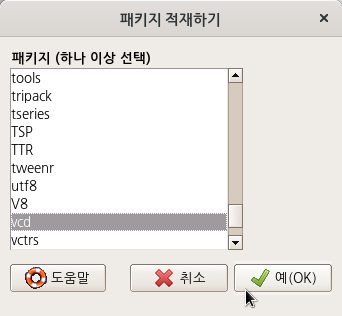
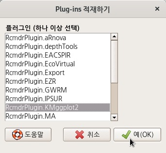
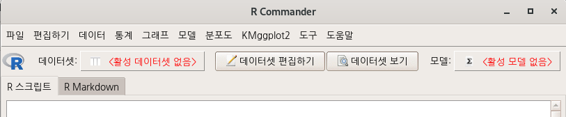
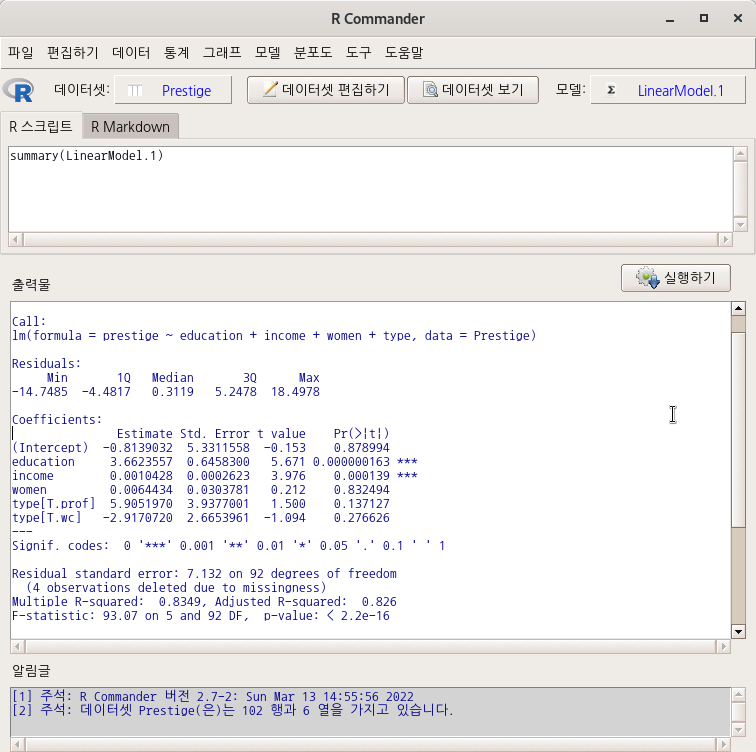

# 도구 / `Tools`


## 패키지 적재하기.../ Load package(s)...`


R에 설치된 패키지 목록 창이 등장한다. 원하는 패키지(들)을 찾아서 선택하고 예(OK) 버튼을 누른다. 아래 화면은 vcd 패키지를 설치하는 사례이다.




```r
library(vcd) # 원하는 패키지 적재하기
```

`vcd` 패키지를 적재(loading) 하는데, `grid` 패키지가 함께 탑재된 것을 출력창에서 확인할 수 있다. 
`grid`는 `vcd` 패키지가 제작되는데 의존한 패키지임을 의미한다. 
어느 패키지가 메모리에 적재되는 과정은 그 패키지가 의존하는 패키지의 자동적인 적재를 동반한다.


## Rcmdr 플러그인 적재하기.../ Load Rcmdr plug-in(s)....`


R Commander는 플러그인을 통하여 많은 기능이 확산되는 생태계를 갖고 있다. Rcmdr 플러그인을 사용하기 위해서는 먼저 RcmdrPlugin.이름 을 가진 패키지가 설치되어 있어야 한다.


```r
install.packages()	# RcmdrPlugin.이름 찾기
```


아래와 같이 여러개의 RcmdrPlugin.이름을 가진 플러그인들이 설치되었다고 가정하자. 그 중에서 RcmdrPlugin.KMggplot2를 설치해보자. 적재할 플러그인을 찾아서 선택하고, 예(OK) 버튼을 누른다.  



Linux 사례 (MX 21)
아래 화면은 플러그인이 적재되기 이전에 새로운 환경이 등장하는 조건을 환기시키는 질문을 담고 있다. R Commander가 사라졌다가 다시 등장하게된다.


새롭게 등장하는 R Commander 화면 상단을 살펴보자. <분포도>와 <도구> 사이에 메뉴 하나가 추가됨을 알 수 있다. 적재된 플러그인이 메뉴 창에 등장한다.



## 선택 기능.../ Options...


<출력물> 창에서 스크립트 창 높이 (줄)과 출력물 창 높이 (줄) 을 조정할 수 있다. 자주 R Commander를 사용하다보면, 하나의 명령문을 실행한 다음 얻게되는 출력물을 출력창에서 한번에 보지 못할 때 불편함을 느낀다. 주로 통계적 모델의 요약 정보를 확인하고자 할 때 발생하는 현상이다.


아래 창은 스크립트 창 높이 (줄)을 7로, 출력물 창 높이 (줄)을 25로 변경한 사례이다.





스크립트 창과 출력 창의 높이를 조정한 결과는 아래와 같은 비율로 나타난다:

## 글꼴(Fonts)

R은 사용 컴퓨터에 내장된 여러 폰트를 사용할 수 있다. R Commander에서 폰트를 고민할 때는 그래프 출력에 어떤 폰트를 사용할까와 화면 출력용으로 어떤 폰트가 좋을까 등일 것이다. 


R Commander에는 <데이터셋 편집하기>, <데이터셋 보기> 등의 버튼이 화면 상단에 있다. 활성데이터셋의 내부를 들여다 볼 때, 편집할 때 사용한다. 그런데 간혹 사전에 기본으로 지정된 폰트의 특징 때문에 데이터셋의 내부 정보들의 형식적 일관성(값의 정렬)이 흐트러져 보이는 경우가 있다. 예를 들어, 리눅스에서 한글용으로 사용하는 나눔고딕은 한글 R Commander환경에서 기본 폰트로 사용되는데 <데이터셋 보기> 버튼을 누르고 내부 정보를 보면 정렬이 일정하지 않는 것을 알 수 있다. 흔히 고정크기를 가진 폰트인가 아닌가에 따른 출력상의 차이라고 한다.

 

사례 값들의 정렬이 일정하지 않아 데이터셋 내부를 보기가 불편하다면, 경험적으로 나는 Courier로 바꿔준다. 일정한 정렬로 변환될 것이다. 

## Tools/Save Rcmdr options...

## Tools/Manage Mac OS X app nap for R.app...

## Tools/Install auxiliary software...


