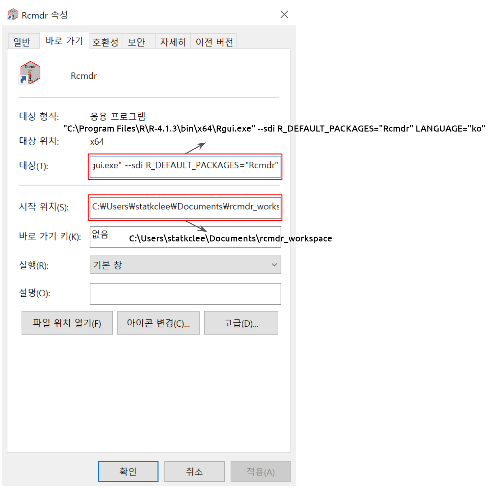
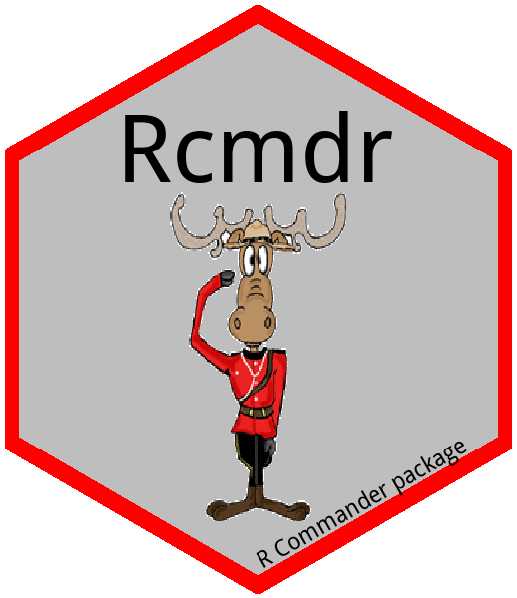
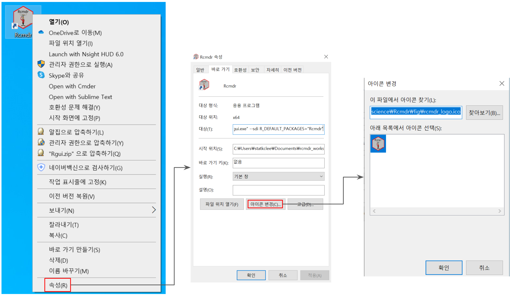
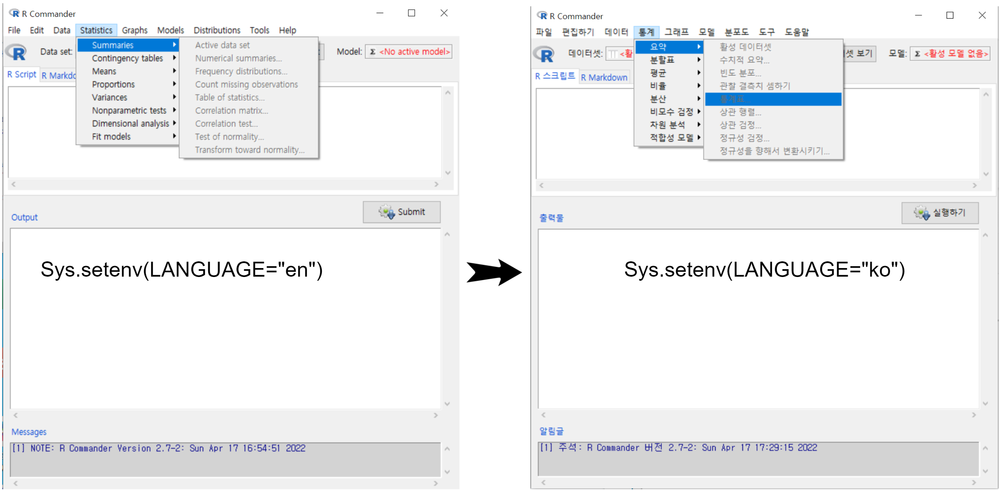

# 설치 / Install {#install}

## 운영체제

### 맥OS

`Rcmdr` 통계 프로그램을 맥에서 설치하는 경우 다음 전제 조건을 충족시키고 순서대로 진행하여 설치작업을 완료한다.

1.  가장 최신 맥OS로 갱신

2.  R 설치 [다운로드](https://www.r-project.org/)

3.  XQuartz 설치 [다운로드](https://www.xquartz.org/)

4.  **재부팅**

5.  `R.app`에서 R 실행

6.  메뉴에서 Packages & Data > Package Installer 이동

    -   `Rcmdr` 검색
    -   `Rcmdr` 선택
    -   `Install Dependecies` 체크박스 클릭
    -   `Install Selected` 클릭

7.  R 명령 프롬프트에서 `library(Rcmdr)` 실행

자세한 사항은 아래 동영상 참조

<iframe width="560" height="315" src="https://www.youtube.com/embed/iapfZ7QSRSA" title="YouTube video player" frameborder="0" allow="accelerometer; autoplay; clipboard-write; encrypted-media; gyroscope; picture-in-picture" allowfullscreen>

</iframe>

### 윈도우즈

1.  R 설치 [다운로드](https://www.r-project.org/)

2.  바탕화면 `R x64 4.*.*` 아이콘 더블클릭 R 실행

    -   R 명령 프롬프트에서 `install.packages("Rcmdr", dep = TRUE)` 실행
    -   `Rcmdr` 패키지를 다운로드 받을 CRAN mirror를 선택 (예를 들어, `0-Cloud [https]`)
    -   R 명령 프롬프트에서 `library(Rcmdr)` 실행

<iframe width="560" height="315" src="https://www.youtube.com/embed/p6hl3jFdjio" title="YouTube video player" frameborder="0" allow="accelerometer; autoplay; clipboard-write; encrypted-media; gyroscope; picture-in-picture" allowfullscreen>

</iframe>

### RStudio 에서 `Rcmdr` 설치

1.  RStudio 설치 [다운로드](https://www.rstudio.com/products/rstudio/download/)

2.  콘솔 창에 `install.packages("Rcmdr")` 입력

3.  우측하단 `Packages` --> `install` --> `Rcmdr` 입력후 `install` 버튼 클릭

4.  `Rcmdr` 실행

    -   콘솔창에 library("Rcmdr") 입력 실행

<iframe width="560" height="315" src="https://www.youtube.com/embed/aXUyG140v48" title="YouTube video player" frameborder="0" allow="accelerometer; autoplay; clipboard-write; encrypted-media; gyroscope; picture-in-picture" allowfullscreen>

</iframe>

## 단축 아이콘 바로 실행

윈도우 운영체제의 경우 바탕화면에 Rcmdr 아이콘을 설치하여 더블클릭으로 바로 실행할 수 있도록 하면 마치 SPSS 를 무료로 사용하는 기분이 들 것이다. 이를 위해서 몇가지 작업을 순차적으로 진행해야 한다.

1.  `Rgui.exe` 실행파일을 바로 실행시킬 수 있는 바탕화면 바로가기 아이콘을 준비한다.

    -   R을 설치하면 `C:\Program Files\R\R-4.1.3\bin` 디렉토리에 `Rgui.exe` 파일이 설치되며 설치단계에 OK 를 하게 되면 바탕화면에 R로고와 함께 `R x64 4.1.3`와 같은 명칭도 함께 부여된다. 여기 **R-4.1.3**은 버전으로 설치시점과 선호에 따라 설치하는 버전 숫자가 달라질 수는 있으나 나머지 과정을 모두 동일하다.

2.  바로가기 아이콘 명칭 변경(`R x64 4.1.3` → `Rcmdr`)과 아이콘을 변경한다. 명칭은 원하는 바로 수정할 수 있다.

    -   예를 들어, `Rcmdr`, `통계 패키지`, `R 커맨더` 등

3.  `Rcmdr` 단축 아이콘을 더블클릭했을 때 R이 뜨는 것이 아니라 `Rcmdr` 통계 패키지 화면을 띄우는 설정

    -   대상(T): `Rgui.exe`가 실행될 때 `Rcmdr` 패키지를 물고 바로 실행되게 하여 통계 패키지를 바로 띄운다.

        -   `"C:\Program Files\R\R-4.1.3\bin\x64\Rgui.exe" --sdi R_DEFAULT_PACKAGES="Rcmdr" LANGUAGE="ko"`

    -   시작위치(S): `Rcmdr` 통계 분석을 할 때 미리 작업공간을 지정한다. 즉, 디렉토리를 설정한다.

        -   시작위치 설정이 필요한 이유는 통계 분석에 필요한 데이터, 분석 결과물(그래프, `.png` 파일 등), 스크립트를 한곳에 관리하기 위함이다.

{width="600"}

### 단축 아이콘 제작과 변경

Rcmdr 아이콘을 다운로드 받는다. 다운로드 받은 Rcmdr 육각형 스티커의 배경을 처리를 위해서 온라인 웹사이트를 무료로 이용한다.

1.  이미지 배경제거: <https://onlinepngtools.com/>
2.  PNG 파일 ICO 변환: <https://icoconvert.com/>

+--------------------------------------+-------------------------+
| Rcmdr 로고                           | Rcmdr 바로가기 ico 파일 |
+:====================================:+:=======================:+
| {width="300"} |  |
+--------------------------------------+-------------------------+

{width="600"}

### 한글 메뉴

`Rcmdr` 기본설정은 영어가 기본으로 되어 있어 `Rcmdr` 설정하면 통계 패키지 메뉴가 영어로 되어 있다. 이를 한글로 변경하고자 한다면 다음 설정을 반영하면 된다.

`Sys.setenv(LANGUAGE="ko")`

매번 `library(Rcmdr)` 실행할 때마다 명령어를 실행하는 것에 어려움이 있기 때문에 상기 설정을 `.Rprofile` 파일에 반영한다.

{width="600"}

즉, `C:\Users\<사용자명>\.Rprofile` 파일을 텍스트 편집기로 열어 상기 내용 `Sys.setenv(LANGUAGE="ko")` 복사하여 붙여넣게 되면 다음번부터 기본 설정으로 한글이 적용되어 `Rcmdr` 통계 패키지 한글 메뉴에서 바로 시작할 수 있게 된다. 바탕화면에 단축아이콘을 설정한 경우 `Rcmdr`이 실행되면서 한글 메뉴 적용이 되도록 `--sdi R_DEFAULT_PACKAGES="Rcmdr" LANGUAGE="ko"` 인수를 추가한다.
