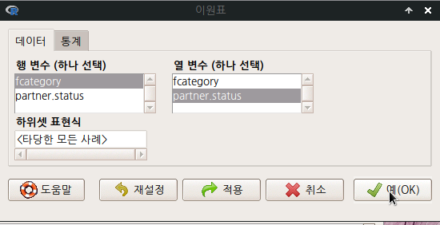

# 통계 / Statistics {#statistics}

## 요약 / Statistics > Summaries

 


활성 데이터셋이 없는 경우, 통계 분석의 대상이 없기 때문에 하위 기능의 메뉴가 음영 처리되어 있다. 활성 데이터셋이 있는 경우 아래와 같이 음영 처리가 사라지고, 하위 기능을 선택할 수 있게 된다:

 

### 활성 데이터셋 / Summaries > Active Data set

 


Prestige라는 데이터셋을 불러와서 자료처리와 분석용으로 활성화시켰다고 가정하자. Prestige 데이터셋의 요약정보를 보고자 할때, <활성 데이터셋> 기능을 선택한다:

```{r statistics-summary}
data(Prestige)

summary(Prestige)
```

 


### 수치적 요약.../ Statistics > Summaries > Numeric summaries...


<수치적 요약...> 메뉴를 선택하면 하위 창이 나온다:

 


 

데이터 창과 통계 창이 있다. 통계 창을 보려면 데이터 옆에 있는 통계 창을 선택하면 된다:

 


다시 데이터 창으로 와서 prestige 라는 변수의 수치적 요약 정보를 보고자 한다. prestige 변수를 선택하고, 오른쪽 아래의 예(OK) 버튼을 선택한다: 

 


입력 창과 출력 창을 살펴보자. 통계 창의 선택사항들에 변경을 주지 않은 상태에서 Prestige 라는 데이터셋의 prestige 변수의 수치적 정보는 다음과 같다: 

 

### 빈도 분포... / Summaries > Frequency distributions...

 


type 변수를 선택하고 예(OK)를 누른다. Prestige 데이터셋의 type 변수의 빈도를 보는 명령문이 다음과 같이 입력창에 기록되고 출력창에 빈도 정보가 출력된다:

 


---

Q1> Prestige의 변수는 여러개가 있습니다. 그중에서 왜 type만 선택 창에 나오나요?


type 변수는 factor 유형입니다. 빈도는 factor 유형의 변수만 셀 수 있기 때문입니다.

```{r type-factor, eval = FALSE}
> str(Prestige) # Prestige 데이터셋의 변수 유형 살펴보기
```

### 관측 결측치 셈하기 / Summaries > Count missing observations

 


데이터셋을 구성하는 사례에 값이 입력되지 않은 결측치가 있는 경우가 있다. 어떤 변수에 관측값이 없는 결측치가 있는지를 확인할 때 사용하는 기능이다.

 


Prestige 데이터셋의 type 변수에 결측치가 4개가 있음을 확인한다.

### 통계표.../ Summaries > Table of statistics...

 


통계표(Table of statistics)는 요인(factor) 변수 유형별로 수치형(numeric, integer) 변수의 통계량을 계산하여 출력한다. Prestige 데이터셋에서 직업 유형의 type 변수를 요인에서 선택하고, 직업 유형별로 권위(prestige)의 통계량 중에서 기본 설정으로 선택된 평균값의 통계표를 선택하고, 예(OK) 버튼을 누른다.

 


 

직업 유형(bc, prof, wc)별로 평균값을 계산하여 출력한다. 출력창을 보면 Tapply() 함수를 사용함을 알 수 있다. 

### 상관 행렬.../ Summaries > Correlation matrix...


상관 행렬은 두개 이상의 변수를 선택해야 한다. Prestige 데이터셋에서 교육수준과 연봉(수입)의 관계에 대한 관심에서 이 두 변수를 선택하고, 예(OK) 버튼을 누른다. 


출력 창을 보면, cor() 함수가 사용되었음을 알 수 있다.

### 상관 검정.../ Summaries > Correlation test...

 


상관 검정은 두 변수를 구성하는 사례값들 사이에 어떤 방향의 관계성이 있는지를 통계학적으로 확인하고자 할 때 사용한다. 아래는Prestige 데이터셋에서 교육수준과 수입(연봉) 사이에 어떤 관계성이 있는지를 확인하고자 한다. education과 income 변수를 선택하고, 예(OK) 버튼을 누른다.

 
 


상관의 유형 중에서 Pearson product-moment (피어슨 적률상관), 대립 가설에는 양측이 기본으로 설정되어 있다. 이 설정을 바탕으로 상관 검증의 결과를 출력하면 아래와 같다:

 

cor.test() 함수를 활용한다.

### 정규성 검정.../ Summaries > Test of normality...

 


수치형(numeric, integer) 변수들 중에서 하나를 선택한다. 기본 설정에 Shapiro-Wilk의 정규성 검정법이 선택되어 있다. 수입(연봉)의 사례들이 정규 분포를 이루고 있는가를 확인하고자, 변수 income을 선택하고 예(OK) 버튼을 누른다.


normalityTest()를 사용한다.


```{r normality-test, eval = FALSE}
normalityTest(~education, test="shapiro.test", data=Prestige)
```


## 분할표 / Contingency tables

### 분할표 / Contingency tables


분석대상인 데이터셋에 요인형 변수가 한개 있거나, 하나도 없는 경우 분할표 메뉴의 오른쪽에 있는 <이원표>, <다원표> 기능은 불활성 음영 표시로 나타난다. 두개 이상의 요인형 변수가 있는 경우, 예를 들어 car 패키지에 포함된 Moore 데이터셋이 활성 데이터셋이 되는 경우 불활성 음영 표시가 사라진다.


요인형 변수가 세개 이상 있는 경우, <다원표> 까지 활성화된다. 아래의 화면을 보면, partner.status, fcatetory 두개의 변수가 요인(factor)형이다. <이원표>는 활성화된 반면에, <다원표> 기능이 아직 활성화되지 않았다면, 요인형 변수가 두개 뿐인 데이터셋임을 간접적으로 알려준다.

 


### 이원표.../ Contingency tables > Two-way table


두개 이상의 요인형 변수를 가지고 있는 Moore 데이터셋을 활성화시키면, <이원표>의 음영이 사라지고 사용할 수 있는 기능이 된다.


행 변수와 열 변수에 요인형 변수 하나씩을 선택한다.




데이터 창과 함께 통계 창이 있다. 통계 창을 선택하면 다음과 같은 화면에 다양한 선택 기능을 선택할 수 있다. 다른 선택으로 출력 내용의 변화를 주지 않을 경우, 데이터 창으로 돌아가서 예(OK) 버튼을 누른다.


다음과 같은 출력물을 볼 수 있다. 행 변수에 partner.status, 열 변수에 fcategory를 선택한 경우의 출력물이다.


행 변수에 fcategory, 열 변수에 partner.status를 선택한 경우의 출력물이다.


프롬프트의 입력 스크립트를 살펴보면, xtabs() 함수를 사용하는 것이 보인다.

## 평균 / Means

### 일-표본 t-검정... / Means > Single-sample t-test...


datasets 패키지에 있는 [sleep 데이터셋](https://rcmdr.tistory.com/132)을 활용해보자.

<일-표본 t-검정...> 기능을 선택하면, 아래와 같은 선택 창으로 넘어간다.

sleep 데이터셋에서 일-표본 t-검정으로 점검할 수 있는 변수는 extra 하나가 보인다. 예(OK) 버튼을 누르자.


```{r ttest-sleep, eval = FALSE}
with(sleep, (t.test(extra, alternative='two.sided', mu=0.0, conf.level=.95)))
```


<대립 가설>에 관련된 선택사항에 변화를 주지 않았다. 아래 명령문과 같은 결과를 얻는다.

```{r ttest-sleep-alternative, eval = FALSE}
t.test(extra ~ 1, data = sleep)
```


### 독립 표본 t-검정.../ Means > Independent samples t-test...


datasets 패키지에 있는 [sleep 데이터셋](https://rcmdr.tistory.com/132)을 활용해보자. 활성화시키자.

sleep 데이터셋의 수치형 변수 extra에 대하여 2개의 수준을 가진 요인형 집단인 group 변수의 t-검정을 한다.


<선택기능> 창에는 1그룹과 2그룹의 차이를 비교하는 <대립 가설>, <신뢰 수준>, <등분산> 의 선택 사항이 있다. 일단 기본 선택 들을 사용하자.


t.test(extra~group, alternative='two.sided', conf.level=.95, var.equal=FALSE, data=sleep)
alternative 이하의 선택 사항들은 기본 설정을 사용하였기에 다음과 같은 결과를 갖는다.

```{r ttest-group, eval = FALSE}
t.test(extra ~ group, data = sleep)
```


참고로 group1 과 group2의 사례들을 상자그림(boxplot)을 이용하여 비교해보자.


한편, 비교하는 두 집단의 분산의 차이가 없다는 것을 먼저 확인한 경우에 진행하는 t-검정도 있을 수 있다. 통계 > 분산 > 이-분산 F-검정의 결과를 바탕으로 [독립-표본 t-검정](https://rcmdr.tistory.com/136)을 진행하는 사례이다.


<선택기능> 창에서 <등분산을 가정합니까?>에 '예'를 선택한다.


```{r ttest-group-conf, eval = FALSE}
t.test(extra~group, alternative='two.sided', 
	conf.level=.95, var.equal=TRUE, data=sleep)
```


### Paired t-검정.../ Means > Paired t-test...


datasets 패키지에 포함된 sleep 데이터셋에는 extra라는 수치형 변수가 포함되어 있다. 수치형 변수가 하나만 있는 경우는 Paired t-검정을 사용할 수 없다. 10명이 각각 2개의 약을 복용한 후 group1, group2라는 집단 안에서 수면 시간의 변화를 측정한 데이터셋이다. reshape(), reshapeL2W() 등의 함수를 사용하여 extra라는 수치형 변수를 group1 , group2 별로 두개의 수치형 변수로 변환시켜야 한다. 변환이 되면 <Statistics : Means : Paired t-test> 기능이 활성화된다.


extra 변수를 두개의 집단 X1, X2 로 이미 나눈 상황이다. X1과 X2를 각각 <첫째 변수>와 <둘째 변수>에 선택하자.


<선택기능>창 추가 선택 사항들이 있다. 기본 선택을 이용하자.


```{r sleepWide-paired-ttest, eval = FALSE}
with(sleepWide, (t.test(X1, X2, alternative='two.sided', conf.level=.95, paired=TRUE)))
```

아래의 함수 사용과 같은 결과를 얻는다.

```{r sleepWide-paired, eval = FALSE}
t.test(Pair(X1, X2) ~ 1, data = sleepWide)
```


### 일원 분산 분석.../ Means > One-way ANOVA...


datasets 패키지에 있는 [sleep 데이터셋](https://rcmdr.tistory.com/132)을 활용해보자.


<집단 (하나 선택)>에 요인형 변수 group을, <반응 변수 (하나 선택)>에 수치형 변수 extra를 선택한다. 통계 > 분산 > 이-분산 F-검정을 통하여 비교되는 두 집단의 extra 변수의 사례 분포는 등분산임을 알고 있는 상황이다.

- [Two variances F-test...](https://rcmdr.tistory.com/136)


```{r anova-test, eval = FALSE}
AnovaModel.1 <- aov(extra ~ group, data=sleep)
summary(AnovaModel.1)
with(sleep, numSummary(extra, groups=group, statistics=c("mean", "sd")))

```


일원 분산 분석의 명령문 작성과 분석 결과는 아래와 같다.


추가로  carData 패키지의 Prestige 데이터셋을 이용하여 일원 분산 분석을 연습해보자. Prestige 데이터셋에는 type 이라는 요인형 변수가 있다. 그러나 앞서 연습한 sleep 데이터셋의 group 변수처럼 요인 수준이 두개가 아니라 요인의 수준이 셋이다. 직업의 사회적 권위에 대한 직업 유형별 (bc, prof, wc) 평균의 차이가 있는가를 점검한다.


```{r anova-test-2, eval = FALSE}
AnovaModel.3 <- aov(prestige ~ type, data=Prestige)
summary(AnovaModel.3)
with(Prestige, numSummary(prestige, groups=type, statistics=c("mean", "sd")))
```

직업유형 (bc, prof, wc)에 따른 직업의 사회적 권위는, 각 유형별 평균을 비교할 때, 차이가 있다는 결과를 얻는다.


### 다원 분산 분석.../ Means > Multi-way ANOVA...


다중 분산 분석 (Multi-way ANOVA)은 두개 이상의 요인형 변수들의 작용으로 하나의 수치형 변수에 영향을 주었는가를 점검하는 통계기법이다.


```{r multiway-anova, eval = FALSE}
data(Adler, package="carData")
help("Adler", package="carData")

AnovaModel.1 <- lm(rating ~ expectation*instruction, data=Adler, contrasts=list(expectation 
  ="contr.Sum", instruction ="contr.Sum"))
Anova(AnovaModel.1)
Tapply(rating ~ expectation + instruction, mean, na.action=na.omit, data=Adler) # means
Tapply(rating ~ expectation + instruction, sd, na.action=na.omit, data=Adler) # std. deviations
xtabs(~ expectation + instruction, data=Adler) # counts

```


